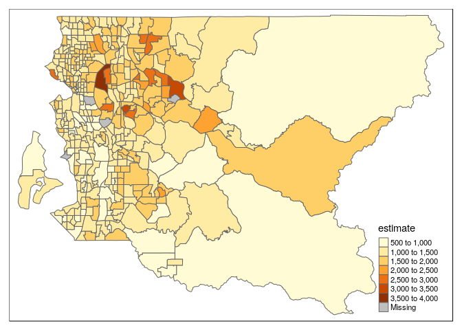
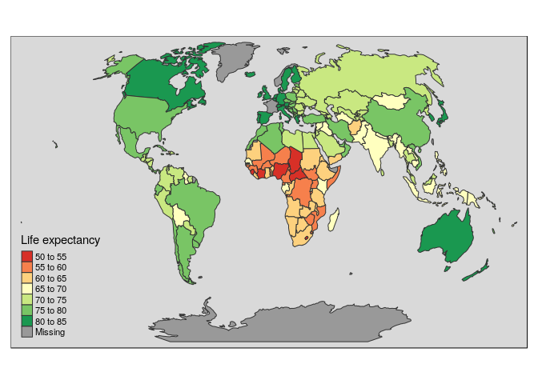
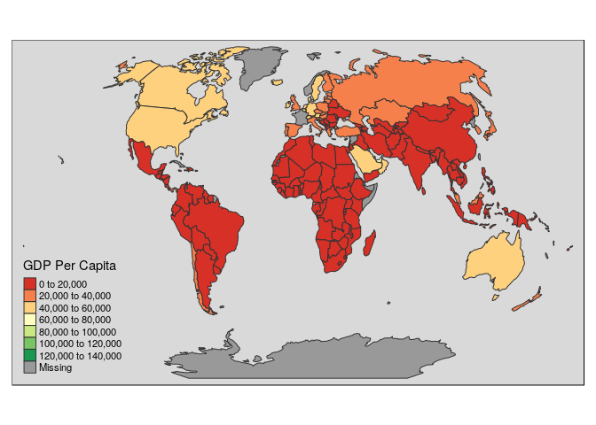
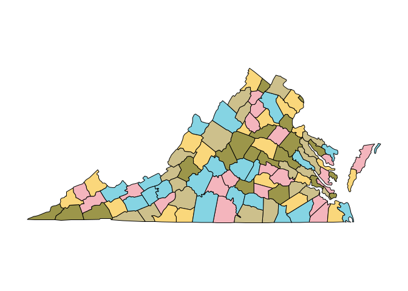

Geospatial Analysis
================
Jesse Cambon
13 August, 2018

Note: Use devtools::install\_github("hrbrmstr/albersusa") to install albersusa

<https://github.com/bhaskarvk/colormap>

c("B23025\_005E", \# labor force size 'B01003\_001E', \# population 'B25056\_001E'), \# rent

<https://github.com/mtennekes/tmap/tree/master/demo/USChoropleth>

<https://mran.revolutionanalytics.com/snapshot/2016-03-22/web/packages/tmap/vignettes/tmap-nutshell.html>

``` r
library(tidyverse)
library(tidycensus) # census data
library(ggplot2)
library(sf) # geospatial methods
library(tmap) # thematic mapping
library(viridis) # color scheme

options(tigris_use_cache = TRUE)
```

``` r
# us_county_income <- get_acs(geography = "county", variables = "B19013_001", geometry = TRUE)
# 
# qtm(us_county_income, fill = "estimate")


# us <- get_acs(geography = "county", 
#               variables = 'B25064_001E', # median gross rent
#               geometry = TRUE) 
# 
# qtm(us, fill = "estimate")


# Rent in Boston
bos <- get_acs(geography = "tract", 
              variables = "B25064_001E",  # median gross rent
              state = "MA", 
              county = c("Suffolk",'Middlesex'), 
              geometry = TRUE)
```

    ## Please note: `get_acs()` now defaults to a year or endyear of 2016.

``` r
qtm(bos, fill = "estimate",fill.title='Median Rent',
    title='Boston Area Rent by Census Tract',
    scale=0.75) +
  tm_layout(inner.margins=c(0,0,.1,0),main.title.position='center',legend.position=c('left','bottom'))
```



``` r
#vars <- load_variables(2016,'acs1') # view census variables
```

<http://www.robinlovelace.net/presentations/spatial-tidyverse.html#11> <https://cran.r-project.org/web/packages/wbstats/vignettes/Using_the_wbstats_package.html>

``` r
#library(maptools)
#library(scales)
library(ggplot2)
library(albersusa) # US country map
library(ggthemes)
library(spData)
```

    ## To access larger datasets in this package, install the spDataLarge
    ## package with: `install.packages('spDataLarge',
    ## repos='https://nowosad.github.io/drat/', type='source'))`

``` r
library(wbstats)
library(tmap)
library(maps)
```

    ## 
    ## Attaching package: 'maps'

    ## The following object is masked from 'package:purrr':
    ## 
    ##     map

``` r
library(wesanderson)

tm_shape(world, projection="wintri") +
        tm_polygons("lifeExp", title=c("Life expectancy"),
          style="pretty", palette='RdYlGn') +
        tm_style('grey') + tmap_mode("plot")
```

    ## tmap mode set to plotting

    ## OGR: Corrupt data
    ## OGR: Corrupt data



    ## OGR: Corrupt data
    ## OGR: Corrupt data

``` r
tm_shape(world, projection="wintri") +
        tm_polygons("gdpPercap", title=c("GDP Per Capita"),
          style="pretty", palette='RdYlGn') +
        tm_style('grey') + tmap_mode("plot")
```

    ## tmap mode set to plotting

    ## OGR: Corrupt data
    ## OGR: Corrupt data



    ## OGR: Corrupt data
    ## OGR: Corrupt data

``` r
map('county', 'virginia', fill = TRUE, col = wes_palette('Moonrise3'))
```


