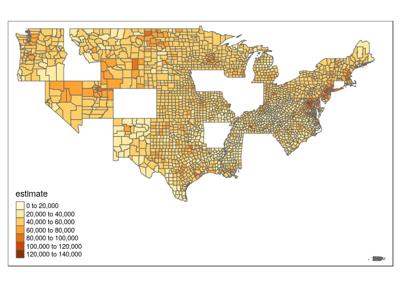
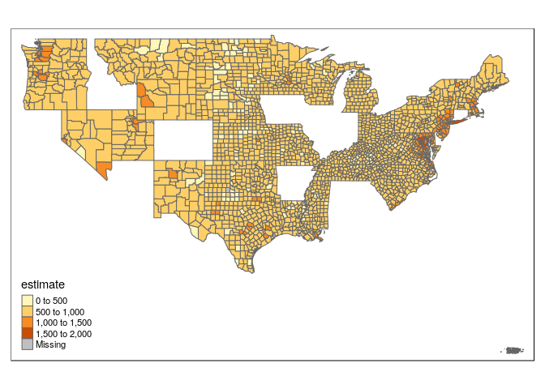
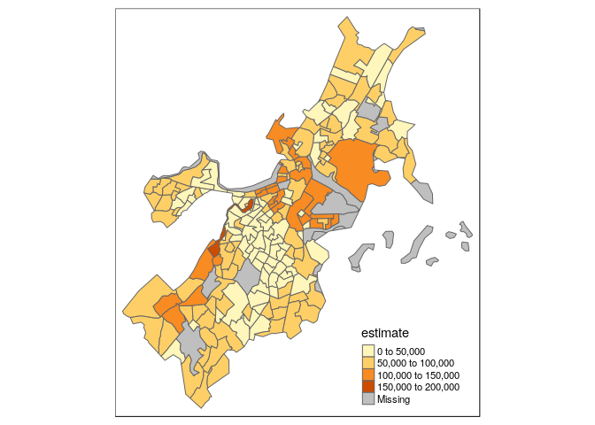

Geospatial Analysis
================
Jesse Cambon
11 August, 2018

Note: Use devtools::install\_github("hrbrmstr/albersusa") to install albersusa

<https://github.com/bhaskarvk/colormap>

c("B23025\_005E", \# labor force size 'B01003\_001E', \# population 'B25056\_001E'), \# rent

<https://github.com/mtennekes/tmap/tree/master/demo/USChoropleth>

``` r
library(tidyverse)
```

    ## ── Attaching packages ──────────────────────────────────────────────────────────────────────────────────────────── tidyverse 1.2.1 ──

    ## ✔ ggplot2 3.0.0     ✔ purrr   0.2.4
    ## ✔ tibble  1.4.2     ✔ dplyr   0.7.4
    ## ✔ tidyr   0.8.0     ✔ stringr 1.3.0
    ## ✔ readr   1.1.1     ✔ forcats 0.3.0

    ## ── Conflicts ─────────────────────────────────────────────────────────────────────────────────────────────── tidyverse_conflicts() ──
    ## ✖ dplyr::filter() masks stats::filter()
    ## ✖ dplyr::lag()    masks stats::lag()

``` r
library(tidycensus) # census data
library(ggplot2)
library(sf)
```

    ## Linking to GEOS 3.6.2, GDAL 2.2.3, proj.4 4.9.3

``` r
library(tmap) # thematic mapping
library(viridis) # color scheme
```

    ## Loading required package: viridisLite

``` r
options(tigris_use_cache = TRUE)

us_county_income <- get_acs(geography = "county", variables = "B19013_001", geometry = TRUE)
```

    ## Please note: `get_acs()` now defaults to a year or endyear of 2016.

``` r
qtm(us_county_income, fill = "estimate")
```



``` r
us <- get_acs(geography = "county", 
              variables = 'B25064_001E', # median gross rent
              geometry = TRUE) 
```

    ## Please note: `get_acs()` now defaults to a year or endyear of 2016.

``` r
qtm(us, fill = "estimate")
```



``` r
bos <- get_acs(geography = "tract", 
              variables = "B19013_001", 
              state = "MA", 
              county = "Suffolk", 
              geometry = TRUE)
```

    ## Please note: `get_acs()` now defaults to a year or endyear of 2016.

``` r
qtm(bos, fill = "estimate")
```



``` r
vars <- load_variables(2016,'acs1')
```

``` r
library(maptools)
```

    ## Loading required package: sp

    ## Checking rgeos availability: TRUE

``` r
library(scales)
```

    ## 
    ## Attaching package: 'scales'

    ## The following object is masked from 'package:viridis':
    ## 
    ##     viridis_pal

    ## The following object is masked from 'package:purrr':
    ## 
    ##     discard

    ## The following object is masked from 'package:readr':
    ## 
    ##     col_factor

``` r
library(ggplot2)
library(albersusa)
library(ggthemes)
library(colormap)

us <- usa_composite()
us_map <- fortify(us, region="fips_state")

gg_usa <- ggplot(us@data, aes(map_id=fips_state,fill=pop_2014)) +
  geom_map(map=us_map, color='#ffffff', size=0.1) + 
  expand_limits(x=us_map$long,y=us_map$lat) +
  theme_map() +  
  theme(legend.position="right") 

gg_usa +
  coord_map("albers", lat0=30, lat1=40) +
  scale_fill_colormap("State Population\n(2014 Estimates)", labels=comma,
                      colormap = colormaps$copper, reverse = T, discrete = F)
```


