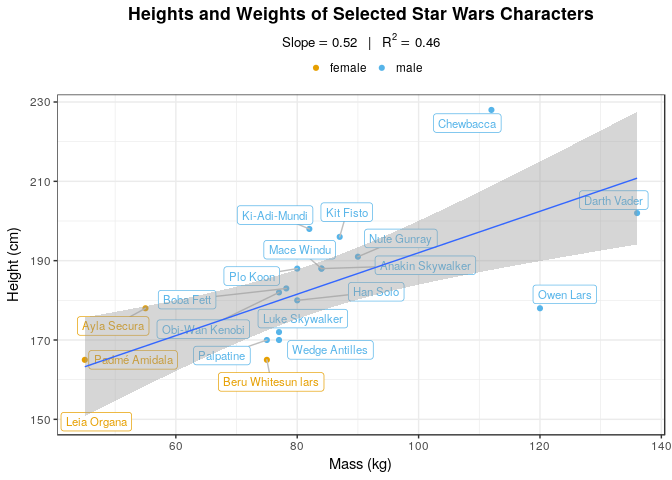
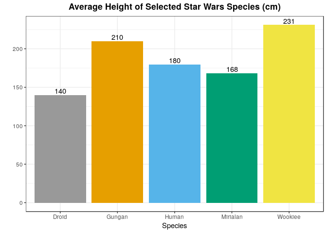
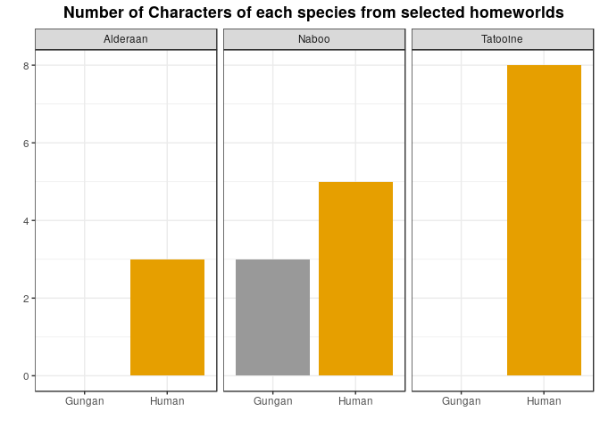
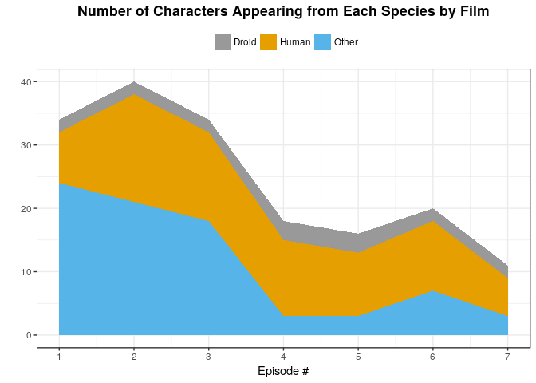
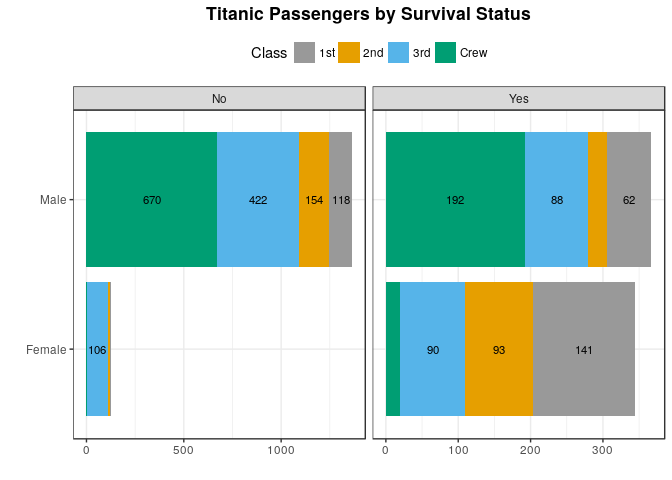
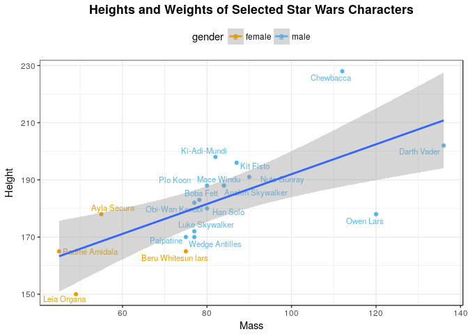

Plot Assortment
================
Jesse Cambon
13 May, 2018

This notebook will demonstrate an assortment of basic ggplots such as bar charts, line charts, and scatter plots.

We will use the inbuilt starwars dataset in tidyverse just for fun.

Libraries and Global Variables
------------------------------

``` r
library(tidyverse)
library(ggrepel) # loads ggplot2 as well
library(treemapify)
library(knitr)
#library(DT)

# Color blind friendly palette from http://www.cookbook-r.com/Graphs/Colors_(ggplot2)/
cbPalette <- c("#999999", "#E69F00", "#56B4E9", "#009E73", "#F0E442", "#0072B2", "#D55E00", "#CC79A7")

film_chron_order = c("The Phantom Menace", "Attack of the Clones", "Revenge of the Sith","A New Hope", 
                     "The Empire Strikes Back", "Return of the Jedi","The Force Awakens")  

# Set default ggplot theme
theme_set(theme_bw()+theme(legend.position = "top",plot.title = element_text(lineheight=1, face="bold",hjust = 0.5)))
```

Data Prep
---------

``` r
# Average height and weight by species

starwars_jac <- starwars %>% group_by(name) %>%
  mutate(num_films=length(unlist(films)),
         height_to_mass_ratio = height / mass) %>%
  ungroup() 

# put each film on a different row
# ie. character-film level dataset
starwars_unnest <- starwars %>%
  unnest(films) %>%
  mutate(films= factor(films,levels=film_chron_order)) %>%
  mutate(episode=as.integer(films)) %>%
  # bucket species
  mutate(species_collapsed=case_when(
    !(species %in% c('Human','Droid')) ~ 'Other',
    TRUE ~ species
  )) %>%
  rename(film=films)

# Number of characters of each species by film
starwars_species_film <- starwars_unnest %>% 
  count(episode,species_collapsed) %>% drop_na() 

# % of characters in each film by gender
starwars_gender_film <- starwars_unnest %>%
  count(episode,gender) %>% drop_na() %>% 
  group_by(episode) %>% 
  mutate(prop=n/sum(n)) %>%
  ungroup() 

# Display in table
kable(starwars_gender_film,digits=2)
```

|  episode| gender        |    n|  prop|
|--------:|:--------------|----:|-----:|
|        1| female        |    4|  0.12|
|        1| hermaphrodite |    1|  0.03|
|        1| male          |   27|  0.84|
|        2| female        |   14|  0.37|
|        2| male          |   24|  0.63|
|        3| female        |    9|  0.28|
|        3| male          |   23|  0.72|
|        4| female        |    2|  0.13|
|        4| hermaphrodite |    1|  0.07|
|        4| male          |   12|  0.80|
|        5| female        |    1|  0.07|
|        5| male          |   12|  0.86|
|        5| none          |    1|  0.07|
|        6| female        |    2|  0.11|
|        6| hermaphrodite |    1|  0.06|
|        6| male          |   15|  0.83|
|        7| female        |    3|  0.30|
|        7| male          |    6|  0.60|
|        7| none          |    1|  0.10|

``` r
species_summ <- starwars_jac %>% group_by(species) %>%
  drop_na(c(height,mass)) %>%
  summarise(average_height=mean(height),
            average_mass=mean(mass),
            count=sum(n())) %>% ungroup() %>%
  mutate(height_to_mass_ratio = average_height / average_mass) %>%
  filter(count!=1) # don't look at species that only have one member

homeworld_summ <- starwars_jac %>%
  count(homeworld,species) %>% drop_na() %>%
  arrange(desc(n)) %>%
  filter(n >= 3)

## Drop missing height and weight values for scatter plot
# Also drop Jabba and Yoda because they are outliers
starwars_ht_wt <- starwars_jac %>% drop_na(c(height,mass,gender)) %>%
  filter(!str_detect(name,'Jabba|Yoda')) %>% 
  filter(num_films >= 3)
```

Create plots
------------

To save any plot as an SVG use this command: ggsave('filename.svg',plot=plotname, device = "svg")

``` r
# Treemap of star wars character mass
ggplot(data=starwars %>% drop_na(mass),
                aes(area=mass,fill=species,label=name)) + 
  theme(legend.title = element_blank(),
      legend.position="none") +
  labs(title='Relative Weights of Star Wars Characters') +
  scale_fill_manual(values=rep(cbPalette,5)) +
  geom_treemap() +
  geom_treemap_text(fontface = "italic", colour = "white", place = "centre",
                    grow = TRUE)
```



``` r
# A simple bar chart - average heights of the species
ggplot(data=species_summ,
          aes(x = species, y=average_height, fill = species)) +
geom_bar(stat='identity',position='dodge') +
scale_fill_manual(values=rep(cbPalette,5)) +
geom_text(aes(label=round(average_height)), vjust=-0.25) +
theme(legend.position="none") +
labs(title='Average Height of Selected Star Wars Species') +
xlab('Species') +
ylab('')
```



``` r
# Take a look at number of each species from each homeworld
ggplot(data=homeworld_summ,
          aes(x = species, y=n,fill = species)) +
facet_grid(~homeworld) +
geom_bar(stat='identity',position='dodge') +
scale_fill_manual(values=rep(cbPalette,1)) +
theme(legend.position="none") +
labs(title='Number of Characters of each species from selected homeworlds') +
xlab('') +
ylab('')
```



``` r
# Number of characters from each species 
ggplot(data=starwars_species_film,
          aes(x = episode, y=n,fill = species_collapsed)) +
geom_area(aes(group=species_collapsed)) +
scale_x_continuous(breaks=c(1:7)) +
scale_fill_manual(values=rep(cbPalette,1)) +
labs(title='Number of Characters Appearing from Each Species by Film') +
theme(legend.title = element_blank()) +
xlab('Episode #') +
ylab('')
```



``` r
# Number of characters from each species 
ggplot(data=starwars_gender_film,
          aes(x = episode, y=prop,color = gender)) +
geom_line() + geom_point() +
  
scale_x_continuous(breaks=c(1:7)) +
scale_y_continuous(labels=scales::percent) + 
scale_fill_manual(values=rep(cbPalette,1)) +
labs(title='Percentage of Characters in Each Film by Gender') +
theme(legend.title = element_blank()) +
xlab('Episode #') +
ylab('')
```



``` r
# Scatter plot of heights and weights 
# Note - group=1 is set in ggplot aes to force geom_smooth to fit
# both groups
ggplot(data=starwars_ht_wt,
          aes(x = mass, y = height, color = gender,group=1)) +
geom_point() +
geom_text_repel(
    data = starwars_ht_wt,
    aes(label = name),
    size = 3,
    nudge_x = 0,
    nudge_y = 0,
    segment.color = NA
  ) +
geom_smooth(method="lm") +
scale_color_manual(values=c(cbPalette[2:3])) +
labs(title='Heights and Weights of Selected Star Wars Characters') +
xlab('Mass') +
ylab('Height')
```



``` r
# Create interactive data table of raw data
# This only works in HTML format so comment it out if knitting to github format 
#datatable(starwars %>% select(-hair_color,skin_color,-birth_year), options = list(pageLength = 10))
```
