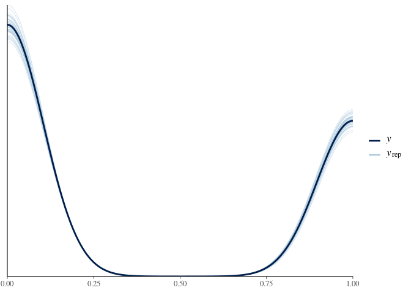

Parsnip
================
Jesse Cambon
13 April, 2020

Experiment with Bayesian modeling techniques on the titianic dataset.

References: \* <https://m-clark.github.io/workshops/bayesian/04_R.html>

## Setup

``` r
library(PASWR) #titanic3 dataset
```

    ## Loading required package: e1071

    ## Loading required package: MASS

    ## Loading required package: lattice

``` r
library(tidyverse)
```

    ## ── Attaching packages ─────────────────────────────────────────────────────────────────────── tidyverse 1.3.0 ──

    ## ✓ ggplot2 3.3.0     ✓ purrr   0.3.3
    ## ✓ tibble  2.1.3     ✓ dplyr   0.8.5
    ## ✓ tidyr   1.0.2     ✓ forcats 0.5.0
    ## ✓ readr   1.3.1

    ## ── Conflicts ────────────────────────────────────────────────────────────────────────── tidyverse_conflicts() ──
    ## x dplyr::filter() masks stats::filter()
    ## x dplyr::lag()    masks stats::lag()
    ## x dplyr::select() masks MASS::select()

``` r
library(rstanarm)
```

    ## Loading required package: Rcpp

    ## rstanarm (Version 2.19.3, packaged: 2020-02-11 05:16:41 UTC)

    ## - Do not expect the default priors to remain the same in future rstanarm versions.

    ## Thus, R scripts should specify priors explicitly, even if they are just the defaults.

    ## - For execution on a local, multicore CPU with excess RAM we recommend calling

    ## options(mc.cores = parallel::detectCores())

    ## - bayesplot theme set to bayesplot::theme_default()

    ##    * Does _not_ affect other ggplot2 plots

    ##    * See ?bayesplot_theme_set for details on theme setting

``` r
options(mc.cores = parallel::detectCores()) # for using multiple cores
```

Data manipulation and imputation

``` r
titanic <- titanic3 %>% as_tibble() %>%
  mutate(sex=str_to_title(sex))

library(mice)
```

    ## 
    ## Attaching package: 'mice'

    ## The following objects are masked from 'package:base':
    ## 
    ##     cbind, rbind

``` r
titanic_imputed <- mice(titanic %>% select(sex,pclass,age), method = 'pmm', maxit=80,seed = 3530,printFlag=F)
```

    ## Warning: Number of logged events: 1

``` r
# Add imputed Data
titanic_imp <- complete(titanic_imputed,5) %>%
  bind_cols(titanic %>% select(survived,age,fare) %>% rename(age_orig=age)) %>%
  mutate(imputed=case_when(is.na(age_orig) ~ 'Imputed', TRUE ~ 'Original'))
```

Fit models

<https://m-clark.github.io/workshops/bayesian/04_R.html#rstanarm>

``` r
stan_fit <- stan_glm(survived ~ sex + pclass + age,data=titanic_imp,
  family=binomial(link="logit"),
  iter=2000, warmup=1000)

# Fit a logistic regression for comparison
log_fit <- glm(survived ~ sex + pclass + age ,family=binomial(link="logit"),data=titanic_imp)
```

``` r
summary(stan_fit,probs=c(.025, .975), digits=3)
```

    ## 
    ## Model Info:
    ##  function:     stan_glm
    ##  family:       binomial [logit]
    ##  formula:      survived ~ sex + pclass + age
    ##  algorithm:    sampling
    ##  sample:       4000 (posterior sample size)
    ##  priors:       see help('prior_summary')
    ##  observations: 1309
    ##  predictors:   5
    ## 
    ## Estimates:
    ##               mean   sd     2.5%   97.5%
    ## (Intercept)  3.074  0.289  2.513  3.645 
    ## sexMale     -2.483  0.146 -2.774 -2.197 
    ## pclass2nd   -1.138  0.211 -1.551 -0.727 
    ## pclass3rd   -2.123  0.203 -2.520 -1.726 
    ## age         -0.025  0.006 -0.036 -0.014 
    ## 
    ## Fit Diagnostics:
    ##            mean   sd    2.5%   97.5%
    ## mean_PPD 0.382  0.016 0.351  0.413  
    ## 
    ## The mean_ppd is the sample average posterior predictive distribution of the outcome variable (for details see help('summary.stanreg')).
    ## 
    ## MCMC diagnostics
    ##               mcse  Rhat  n_eff
    ## (Intercept)   0.007 1.004 1513 
    ## sexMale       0.002 1.000 3646 
    ## pclass2nd     0.005 1.001 2031 
    ## pclass3rd     0.005 1.002 1807 
    ## age           0.000 1.002 2004 
    ## mean_PPD      0.000 1.001 4162 
    ## log-posterior 0.040 1.001 1614 
    ## 
    ## For each parameter, mcse is Monte Carlo standard error, n_eff is a crude measure of effective sample size, and Rhat is the potential scale reduction factor on split chains (at convergence Rhat=1).

``` r
summary(log_fit)
```

    ## 
    ## Call:
    ## glm(formula = survived ~ sex + pclass + age, family = binomial(link = "logit"), 
    ##     data = titanic_imp)
    ## 
    ## Deviance Residuals: 
    ##     Min       1Q   Median       3Q      Max  
    ## -2.4802  -0.6818  -0.4531   0.6825   2.3495  
    ## 
    ## Coefficients:
    ##              Estimate Std. Error z value Pr(>|z|)    
    ## (Intercept)  3.077935   0.288001  10.687  < 2e-16 ***
    ## sexMale     -2.481327   0.147886 -16.779  < 2e-16 ***
    ## pclass2nd   -1.145651   0.209810  -5.460 4.75e-08 ***
    ## pclass3rd   -2.128599   0.199067 -10.693  < 2e-16 ***
    ## age         -0.024740   0.005626  -4.397 1.10e-05 ***
    ## ---
    ## Signif. codes:  0 '***' 0.001 '**' 0.01 '*' 0.05 '.' 0.1 ' ' 1
    ## 
    ## (Dispersion parameter for binomial family taken to be 1)
    ## 
    ##     Null deviance: 1741.0  on 1308  degrees of freedom
    ## Residual deviance: 1237.2  on 1304  degrees of freedom
    ## AIC: 1247.2
    ## 
    ## Number of Fisher Scoring iterations: 4

``` r
pp_check(stan_fit)
```

<!-- -->
