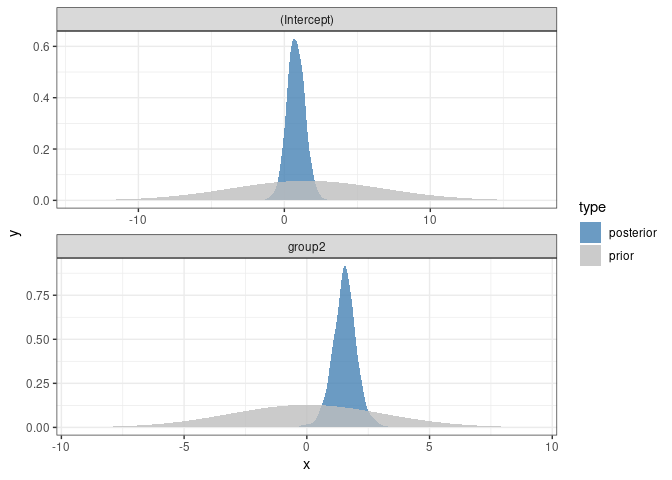
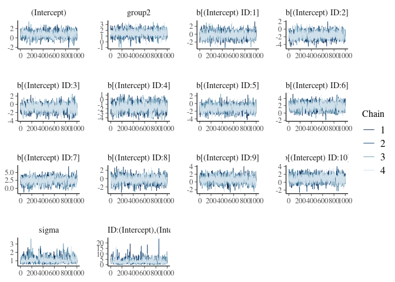
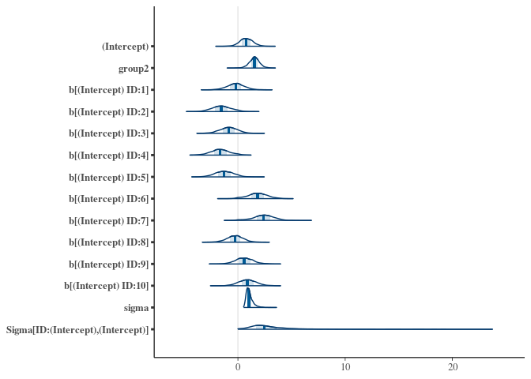
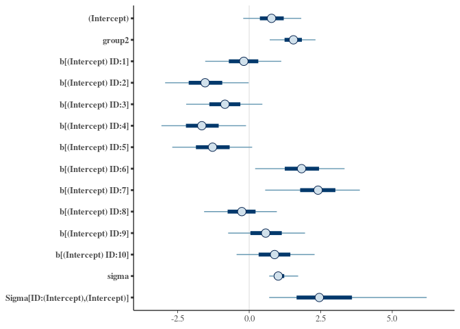
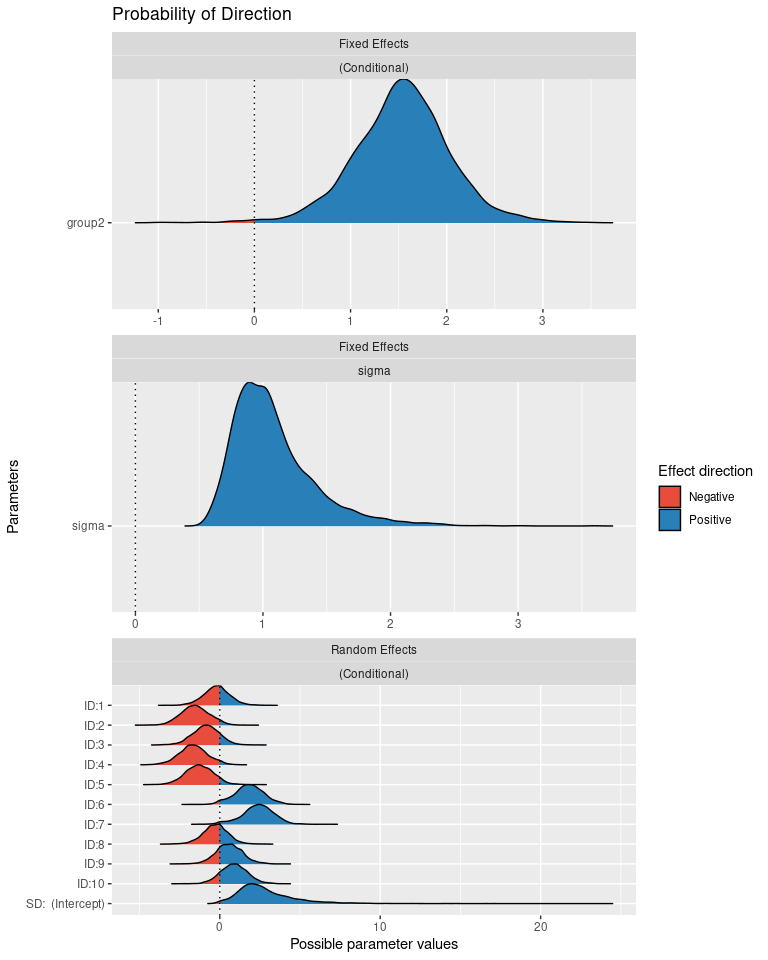
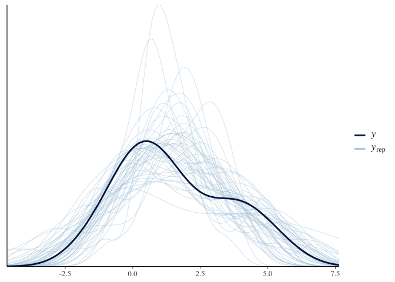
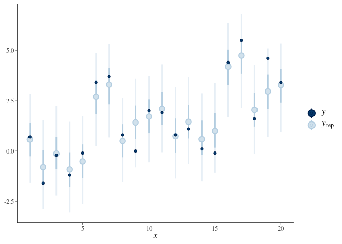
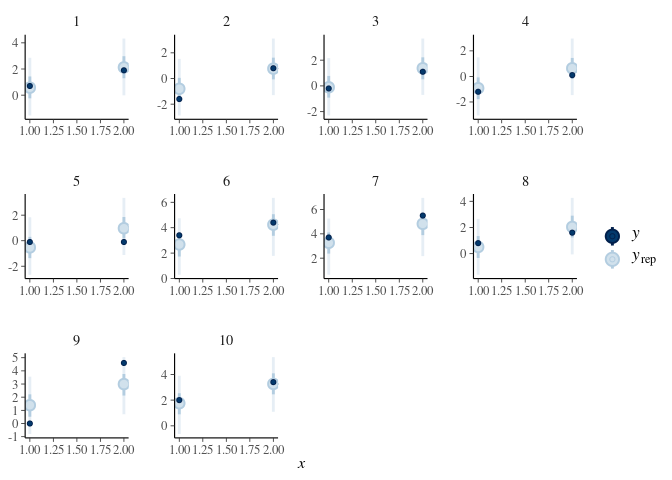

Bayesian Basics
================
Jesse Cambon
06 February, 2021

  - <https://github.com/easystats/see/issues/48>
  - <https://easystats.github.io/see/articles/bayestestR.html>
  - <https://cran.r-project.org/web/packages/bayestestR/vignettes/bayes_factors.html>

<!-- end list -->

``` r
library(rstanarm)
```

    ## Loading required package: Rcpp

    ## This is rstanarm version 2.21.1

    ## - See https://mc-stan.org/rstanarm/articles/priors for changes to default priors!

    ## - Default priors may change, so it's safest to specify priors, even if equivalent to the defaults.

    ## - For execution on a local, multicore CPU with excess RAM we recommend calling

    ##   options(mc.cores = parallel::detectCores())

``` r
library(tidyverse)
```

    ## ── Attaching packages ─────────────────────────────────────── tidyverse 1.3.0 ──

    ## ✓ ggplot2 3.3.3     ✓ purrr   0.3.4
    ## ✓ tibble  3.0.6     ✓ dplyr   1.0.4
    ## ✓ tidyr   1.1.2     ✓ forcats 0.5.1
    ## ✓ readr   1.4.0

    ## ── Conflicts ────────────────────────────────────────── tidyverse_conflicts() ──
    ## x dplyr::filter() masks stats::filter()
    ## x dplyr::lag()    masks stats::lag()

``` r
library(bayestestR)
```

    ## Note: The default CI width (currently `ci=0.89`) might change in future versions (see https://github.com/easystats/bayestestR/discussions/250). To prevent any issues, please set it explicitly when using bayestestR functions, via the 'ci' argument.

``` r
library(bayesplot)
```

    ## This is bayesplot version 1.8.0

    ## - Online documentation and vignettes at mc-stan.org/bayesplot

    ## - bayesplot theme set to bayesplot::theme_default()

    ##    * Does _not_ affect other ggplot2 plots

    ##    * See ?bayesplot_theme_set for details on theme setting

``` r
library(wesanderson)
library(broom.mixed)
```

    ## Registered S3 method overwritten by 'broom.mixed':
    ##   method      from 
    ##   tidy.gamlss broom

``` r
options(mc.cores = parallel::detectCores()) 

model <- stan_glmer(extra ~ group + (1 | ID), data = sleep,
                  prior = normal(0, 3, autoscale = FALSE))
```

    ## Warning: Tail Effective Samples Size (ESS) is too low, indicating posterior variances and tail quantiles may be unreliable.
    ## Running the chains for more iterations may help. See
    ## http://mc-stan.org/misc/warnings.html#tail-ess

``` r
summary(model)
```

    ## 
    ## Model Info:
    ##  function:     stan_glmer
    ##  family:       gaussian [identity]
    ##  formula:      extra ~ group + (1 | ID)
    ##  algorithm:    sampling
    ##  sample:       4000 (posterior sample size)
    ##  priors:       see help('prior_summary')
    ##  observations: 20
    ##  groups:       ID (10)
    ## 
    ## Estimates:
    ##                                     mean   sd   10%   50%   90%
    ## (Intercept)                        0.8    0.6  0.0   0.8   1.6 
    ## group2                             1.5    0.5  0.9   1.5   2.1 
    ## b[(Intercept) ID:1]               -0.2    0.8 -1.2  -0.2   0.8 
    ## b[(Intercept) ID:2]               -1.5    0.9 -2.6  -1.5  -0.3 
    ## b[(Intercept) ID:3]               -0.9    0.8 -1.9  -0.8   0.2 
    ## b[(Intercept) ID:4]               -1.6    0.9 -2.8  -1.7  -0.5 
    ## b[(Intercept) ID:5]               -1.3    0.9 -2.4  -1.3  -0.2 
    ## b[(Intercept) ID:6]                1.8    0.9  0.6   1.8   3.0 
    ## b[(Intercept) ID:7]                2.4    1.0  1.1   2.4   3.6 
    ## b[(Intercept) ID:8]               -0.3    0.8 -1.2  -0.3   0.7 
    ## b[(Intercept) ID:9]                0.6    0.8 -0.5   0.6   1.6 
    ## b[(Intercept) ID:10]               0.9    0.8 -0.1   0.9   1.9 
    ## sigma                              1.1    0.3  0.8   1.0   1.5 
    ## Sigma[ID:(Intercept),(Intercept)]  2.8    1.8  1.1   2.5   5.1 
    ## 
    ## Fit Diagnostics:
    ##            mean   sd   10%   50%   90%
    ## mean_PPD 1.5    0.4  1.1   1.5   2.0  
    ## 
    ## The mean_ppd is the sample average posterior predictive distribution of the outcome variable (for details see help('summary.stanreg')).
    ## 
    ## MCMC diagnostics
    ##                                   mcse Rhat n_eff
    ## (Intercept)                       0.0  1.0  1102 
    ## group2                            0.0  1.0  3499 
    ## b[(Intercept) ID:1]               0.0  1.0  1927 
    ## b[(Intercept) ID:2]               0.0  1.0   825 
    ## b[(Intercept) ID:3]               0.0  1.0  1240 
    ## b[(Intercept) ID:4]               0.0  1.0   690 
    ## b[(Intercept) ID:5]               0.0  1.0  1027 
    ## b[(Intercept) ID:6]               0.0  1.0   990 
    ## b[(Intercept) ID:7]               0.0  1.0   740 
    ## b[(Intercept) ID:8]               0.0  1.0  1652 
    ## b[(Intercept) ID:9]               0.0  1.0  1405 
    ## b[(Intercept) ID:10]              0.0  1.0  1447 
    ## sigma                             0.0  1.0   345 
    ## Sigma[ID:(Intercept),(Intercept)] 0.1  1.0   984 
    ## mean_PPD                          0.0  1.0  4029 
    ## log-posterior                     0.3  1.0   299 
    ## 
    ## For each parameter, mcse is Monte Carlo standard error, n_eff is a crude measure of effective sample size, and Rhat is the potential scale reduction factor on split chains (at convergence Rhat=1).

``` r
tidy(model)
```

    ## # A tibble: 2 x 3
    ##   term        estimate std.error
    ##   <chr>          <dbl>     <dbl>
    ## 1 (Intercept)    0.781     0.616
    ## 2 group2         1.55      0.450

<https://github.com/easystats/see/issues/48>

``` r
#My_first_BF <- bayesfactor_parameters(model, null = c(-1, 1))

density <- estimate_density(model)
sim_prior <- simulate_prior(model)
density_prior <- estimate_density(sim_prior)

# Combine density for prior and posterior distributions
post_prior <- density %>% mutate(type = 'posterior') %>%
  bind_rows(density_prior %>% mutate(type = 'prior'))
```

Plot the prior and posterior distributions for the fixed effects

``` r
ggplot(data = post_prior, aes(x = x ,y = y, fill = type)) + 
  theme_bw() +
  facet_wrap(~Parameter, ncol = 1, scales='free') +
  geom_ribbon( mapping = aes(
    ymin = 0,
    ymax = y  ),
  alpha = .8) +   
  scale_fill_manual(values=c('steelblue', 'grey'))
```

<!-- -->

``` r
#  scale_x_continuous(expand=expand_scale(mult = c(-.4, -.4)))
```

``` r
mcmc_trace(model)
```

<!-- -->

``` r
mcmc_areas(model)
```

<!-- -->

<https://easystats.github.io/see/articles/bayestestR.html>

``` r
plot(model)
```

<!-- -->

``` r
p_direction(model)
```

    ## # Probability of Direction (pd)
    ## 
    ## Parameter   |     pd
    ## --------------------
    ## (Intercept) | 90.60%
    ## group2      | 99.40%

``` r
plot(p_direction(model, effects = "all", component = "all"))
```

<!-- -->

Check posterior distribution

``` r
pp_check(model)
```

<!-- -->

``` r
pp_check(model, plotfun = "hist")
```

    ## `stat_bin()` using `bins = 30`. Pick better value with `binwidth`.

<!-- -->

``` r
pp_check(model, plotfun = "intervals")
```

    ## 'x' not specified in '...'. Using x=1:length(y).

<!-- -->

``` r
ppc_intervals_grouped(
  y = sleep$extra,
  yrep = posterior_predict(model),
  x = as.numeric(sleep$group),
  prob = 0.5,
  group = sleep$ID
) 
```

<!-- -->
