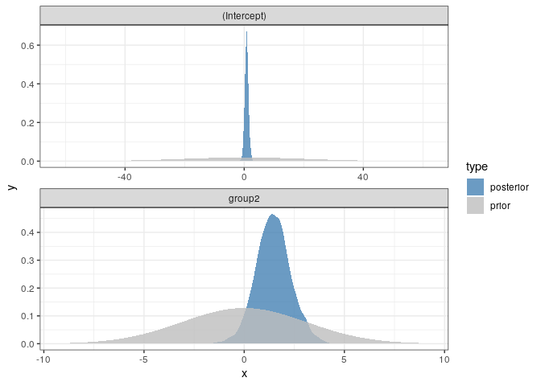
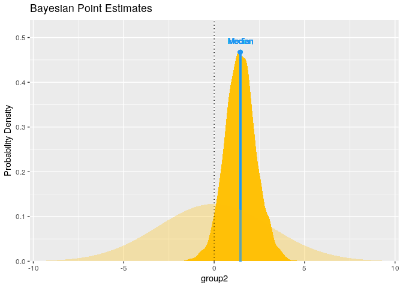
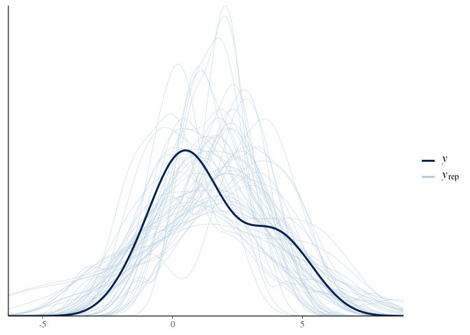

Bayesian Distributions
================
Jesse Cambon
15 April, 2020

  - <https://github.com/easystats/see/issues/48>
  - <https://easystats.github.io/see/articles/bayestestR.html>
  - <https://cran.r-project.org/web/packages/bayestestR/vignettes/bayes_factors.html>

<!-- end list -->

``` r
library(rstanarm)
```

    ## Loading required package: Rcpp

    ## rstanarm (Version 2.19.3, packaged: 2020-02-11 05:16:41 UTC)

    ## - Do not expect the default priors to remain the same in future rstanarm versions.

    ## Thus, R scripts should specify priors explicitly, even if they are just the defaults.

    ## - For execution on a local, multicore CPU with excess RAM we recommend calling

    ## options(mc.cores = parallel::detectCores())

    ## - bayesplot theme set to bayesplot::theme_default()

    ##    * Does _not_ affect other ggplot2 plots

    ##    * See ?bayesplot_theme_set for details on theme setting

``` r
library(tidyverse)
```

    ## ── Attaching packages ─────────────────────────────────────────────────────────────────────── tidyverse 1.3.0 ──

    ## ✓ ggplot2 3.3.0     ✓ purrr   0.3.3
    ## ✓ tibble  2.1.3     ✓ dplyr   0.8.5
    ## ✓ tidyr   1.0.2     ✓ forcats 0.5.0
    ## ✓ readr   1.3.1

    ## ── Conflicts ────────────────────────────────────────────────────────────────────────── tidyverse_conflicts() ──
    ## x dplyr::filter() masks stats::filter()
    ## x dplyr::lag()    masks stats::lag()

``` r
library(bayestestR)
library(wesanderson)
options(mc.cores = parallel::detectCores()) 

model <- stan_glm(extra ~ group, data = sleep,
                  prior = normal(0, 3, autoscale = FALSE))

summary(model)
```

    ## 
    ## Model Info:
    ##  function:     stan_glm
    ##  family:       gaussian [identity]
    ##  formula:      extra ~ group
    ##  algorithm:    sampling
    ##  sample:       4000 (posterior sample size)
    ##  priors:       see help('prior_summary')
    ##  observations: 20
    ##  predictors:   2
    ## 
    ## Estimates:
    ##               mean   sd   10%   50%   90%
    ## (Intercept) 0.8    0.6  0.0   0.8   1.6  
    ## group2      1.5    0.9  0.4   1.4   2.6  
    ## sigma       2.0    0.3  1.6   1.9   2.4  
    ## 
    ## Fit Diagnostics:
    ##            mean   sd   10%   50%   90%
    ## mean_PPD 1.6    0.6  0.7   1.6   2.3  
    ## 
    ## The mean_ppd is the sample average posterior predictive distribution of the outcome variable (for details see help('summary.stanreg')).
    ## 
    ## MCMC diagnostics
    ##               mcse Rhat n_eff
    ## (Intercept)   0.0  1.0  3013 
    ## group2        0.0  1.0  3496 
    ## sigma         0.0  1.0  2649 
    ## mean_PPD      0.0  1.0  3606 
    ## log-posterior 0.0  1.0  1464 
    ## 
    ## For each parameter, mcse is Monte Carlo standard error, n_eff is a crude measure of effective sample size, and Rhat is the potential scale reduction factor on split chains (at convergence Rhat=1).

<https://github.com/easystats/see/issues/48>

``` r
#My_first_BF <- bayesfactor_parameters(model, null = c(-1, 1))

density <- estimate_density(model)
sim_prior <- simulate_prior(model)
density_prior <- estimate_density(sim_prior)

# Combine density for prior and posterior distributions
post_prior <- density %>% mutate(type='posterior') %>%
  bind_rows(density_prior %>% mutate(type='prior'))
```

Plot the prior and posterior distributions

``` r
ggplot(data=post_prior,aes(x=x,y=y,fill=type)) + 
  theme_bw() +
  facet_wrap(~Parameter,ncol=1,scales='free') +
  geom_ribbon( mapping = aes(
    ymin = 0,
    ymax = y  ),
  alpha = .8) +   
  scale_fill_manual(values=c('steelblue','grey'))
```

<!-- -->

``` r
#  scale_x_continuous(expand=expand_scale(mult = c(-.4, -.4)))
```

``` r
point_est <- point_estimate(model,centrality='median')

p <- plot(point_est, panel = F)[[1]]
sp <- simulate_prior(model)
ed <- estimate_density(sp[["group2"]])

p + geom_ribbon(
  data = ed,
  mapping = aes(
    x = x,
    ymin = 0,
    ymax = y,
    group = NA
  ),
  fill = "#FFC107",
  alpha = .3
)
```

<!-- -->

Check posterior distribution

``` r
pp_check(model)
```

<!-- -->
