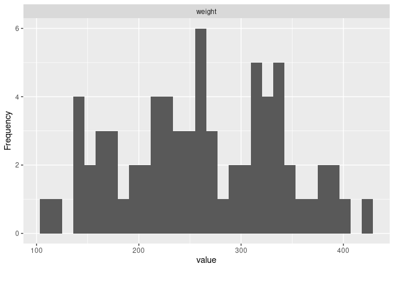
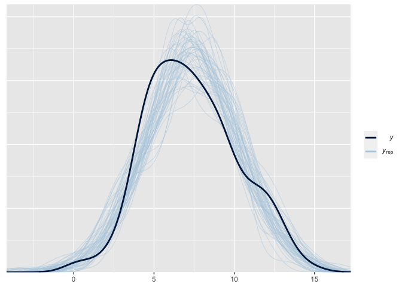
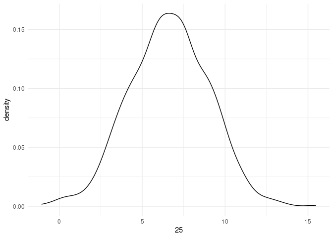
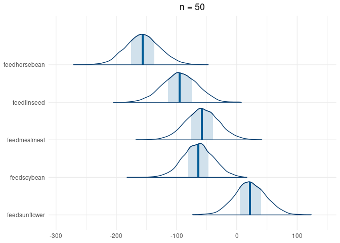
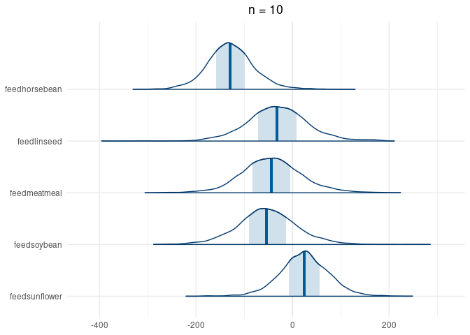

Bayesian Modeling
================
Jesse Cambon
26 April, 2020

References: \* <http://appliedpredictivemodeling.com/data> \*
<http://faculty.marshall.usc.edu/gareth-james/ISL/data.html>

Todo: \* HDI \* Sigma Term \* References

## Setup

``` r
#library(AppliedPredictiveModeling) # datasets
library(ISLR) # datasets
library(skimr)
library(tidyverse)
library(wesanderson)
library(rstanarm)
library(bayestestR)
library(insight)
library(bayesplot)
library(broom)
library(rsample)
library(knitr)
library(jcolors)
library(patchwork)
library(ggrepel)

num_cores <-  parallel::detectCores()
options(mc.cores = num_cores)

set.seed(42) # for reproducibility
```

## Set input data and formula

Datasets and formulas: \* ISLR::Carseats : Sales \~ Advertising + Price
\* ISLR::Credit : Limit \~ Income + Rating \* chickwts: weight \~ feed

``` r
### Set input dataset here ################
split <- initial_split(chickwts, prop = 0.9)
############################################

### Set model equation here ##########################
model_formula = as.formula(weight ~ feed)
######################################################
```

``` r
library(DataExplorer)
plot_histogram(chickwts)
```

<!-- -->

C/V split

``` r
train <- training(split) %>% as_tibble()
test  <- testing(split) %>% as_tibble()

train_small <- train %>% sample_n(50)
train_tiny <- train %>% sample_n(10)
```

Fit models

``` r
lm_model <- glm(model_formula, data = train)
stan_model <- stan_glm(model_formula, data = train)
stan_model_small <- stan_glm(model_formula, data = train_small)
stan_model_tiny <- stan_glm(model_formula, data = train_tiny)
```

Extract posterior

<http://mc-stan.org/rstanarm/reference/as.matrix.stanreg.html>

``` r
post1 <- as.data.frame(stan_model) %>% as_tibble()
```

Posterior Intervals

<https://mc-stan.org/rstanarm/reference/posterior_interval.stanreg.html>
<https://mc-stan.org/rstanarm/articles/rstanarm.html>

``` r
rstanarm::posterior_interval(stan_model)
```

    ##                       5%         95%
    ## (Intercept)    291.27630  348.823590
    ## feedhorsebean -200.18273 -117.077455
    ## feedlinseed   -136.17444  -54.577025
    ## feedmeatmeal   -87.69721   -6.675457
    ## feedsoybean   -110.93448  -31.152785
    ## feedsunflower  -28.86849   52.031729
    ## sigma           49.65987   67.718056

``` r
tidy(lm_model,conf.int=T) %>% select(-p.value,-std.error)
```

    ## # A tibble: 6 x 5
    ##   term          estimate statistic conf.low conf.high
    ##   <chr>            <dbl>     <dbl>    <dbl>     <dbl>
    ## 1 (Intercept)     323.      17.9      288.     359.  
    ## 2 feedhorsebean  -163.      -6.39    -213.    -113.  
    ## 3 feedlinseed    -100.      -4.01    -149.     -51.2 
    ## 4 feedmeatmeal    -51.2     -2.01    -101.      -1.19
    ## 5 feedsoybean     -75.6     -3.10    -124.     -27.8 
    ## 6 feedsunflower     8.52     0.342    -40.3     57.4

``` r
describe_posterior(stan_model, test = c("p_direction","rope","bayesfactor"))
```

    ## Computation of Bayes factors: sampling priors, please wait...

    ## Loading required namespace: logspline

    ## # Description of Posterior Distributions
    ## 
    ## Parameter     |   Median | CI |   CI_low |  CI_high |    pd | ROPE_CI | ROPE_low | ROPE_high | ROPE_Percentage |          BF |  Rhat |  ESS
    ## -------------------------------------------------------------------------------------------------------------------------------------------
    ## (Intercept)   |  319.321 | 89 |  290.958 |  346.643 | 1.000 |      89 |   -8.001 |     8.001 |           0.000 | 2.71712e+12 | 1.003 | 1224
    ## feedhorsebean | -158.335 | 89 | -199.135 | -118.498 | 1.000 |      89 |   -8.001 |     8.001 |           0.000 |    4695.152 | 1.002 | 1636
    ## feedlinseed   |  -95.500 | 89 | -134.784 |  -56.117 | 0.999 |      89 |   -8.001 |     8.001 |           0.000 |      84.706 | 1.001 | 1638
    ## feedmeatmeal  |  -47.398 | 89 |  -85.796 |   -7.000 | 0.971 |      89 |   -8.001 |     8.001 |           0.006 |       0.784 | 1.001 | 1643
    ## feedsoybean   |  -71.998 | 89 | -111.022 |  -33.822 | 0.996 |      89 |   -8.001 |     8.001 |           0.000 |       5.994 | 1.001 | 1636
    ## feedsunflower |   12.480 | 89 |  -28.990 |   49.562 | 0.696 |      89 |   -8.001 |     8.001 |           0.244 |       0.134 | 1.002 | 1842

Rope

``` r
rope(stan_model)
```

    ## # Proportion of samples inside the ROPE [-8.00, 8.00]:
    ## 
    ## Parameter     | inside ROPE
    ## ---------------------------
    ## (Intercept)   |      0.00 %
    ## feedhorsebean |      0.00 %
    ## feedlinseed   |      0.00 %
    ## feedmeatmeal  |      0.65 %
    ## feedsoybean   |      0.00 %
    ## feedsunflower |     24.38 %

``` r
#rope(stan_model_small)
```

Markov Chain Diagnostics

``` r
mcmc_trace(stan_model)
```

<!-- -->

``` r
#mcmc_trace(stan_model_small)
#mcmc_trace(stan_model_tiny)
```

Highest Density Intervals

``` r
hdi(stan_model)
```

    ## # Highest Density Interval
    ## 
    ## Parameter     |            89% HDI
    ## ----------------------------------
    ## (Intercept)   | [ 290.96,  346.64]
    ## feedhorsebean | [-199.14, -118.50]
    ## feedlinseed   | [-134.78,  -56.12]
    ## feedmeatmeal  | [ -85.80,   -7.00]
    ## feedsoybean   | [-111.02,  -33.82]
    ## feedsunflower | [ -28.99,   49.56]

``` r
stan_model$coefficients
```

    ##   (Intercept) feedhorsebean   feedlinseed  feedmeatmeal   feedsoybean 
    ##     319.32076    -158.33490     -95.50015     -47.39838     -71.99846 
    ## feedsunflower 
    ##      12.48013

``` r
hdi(stan_model_small)
```

    ## # Highest Density Interval
    ## 
    ## Parameter     |            89% HDI
    ## ----------------------------------
    ## (Intercept)   | [ 289.23,  350.53]
    ## feedhorsebean | [-201.52, -110.40]
    ## feedlinseed   | [-138.07,  -45.98]
    ## feedmeatmeal  | [-102.99,  -14.77]
    ## feedsoybean   | [-101.73,  -20.53]
    ## feedsunflower | [ -21.10,   62.79]

``` r
hdi(stan_model_tiny)
```

    ## # Highest Density Interval
    ## 
    ## Parameter     |           89% HDI
    ## ---------------------------------
    ## (Intercept)   | [ 248.83, 361.31]
    ## feedhorsebean | [-203.67, -50.82]
    ## feedlinseed   | [-135.02,  67.39]
    ## feedmeatmeal  | [-139.32,  58.56]
    ## feedsoybean   | [-159.85,  39.94]
    ## feedsunflower | [ -55.54, 105.11]

What percentage of each posterior distribution is greater than a certain
cutoff value

``` r
cutoff_value <- -100 # define the cutoff

posterior <- get_parameters(stan_model,iterations=10000) %>% 
  pivot_longer(everything(),names_to='Parameter')

post_pct <- 
  posterior %>% 
  mutate(above=case_when(value > cutoff_value ~ 1, TRUE ~ 0)) %>%
  group_by(Parameter) %>%
  summarize(above_pct=mean(above)) %>%
  ungroup()

post_pct %>% kable()
```

| Parameter     | above\_pct |
| :------------ | ---------: |
| (Intercept)   |    1.00000 |
| feedhorsebean |    0.01025 |
| feedlinseed   |    0.57450 |
| feedmeatmeal  |    0.98200 |
| feedsoybean   |    0.88175 |
| feedsunflower |    1.00000 |

``` r
mcmc_areas(stan_model,pars=vars(contains('feed')))
```

    ## Warning: `expand_scale()` is deprecated; use `expansion()` instead.

<!-- -->

``` r
tidy(lm_model) %>% kable()
```

| term          |     estimate | std.error |   statistic |   p.value |
| :------------ | -----------: | --------: | ----------: | --------: |
| (Intercept)   |   323.300000 |  18.04243 |  17.9188675 | 0.0000000 |
| feedhorsebean | \-163.100000 |  25.51586 | \-6.3921038 | 0.0000000 |
| feedlinseed   | \-100.027273 |  24.92921 | \-4.0124532 | 0.0001744 |
| feedmeatmeal  |  \-51.200000 |  25.51586 | \-2.0065954 | 0.0494624 |
| feedsoybean   |  \-75.633333 |  24.42957 | \-3.0959745 | 0.0030196 |
| feedsunflower |     8.518182 |  24.92921 |   0.3416949 | 0.7338155 |

``` r
tidy(stan_model) %>% kable()
```

| term          |    estimate | std.error |
| :------------ | ----------: | --------: |
| (Intercept)   |   319.32076 |  17.46102 |
| feedhorsebean | \-158.33490 |  24.68960 |
| feedlinseed   |  \-95.50015 |  24.90985 |
| feedmeatmeal  |  \-47.39838 |  24.37650 |
| feedsoybean   |  \-71.99846 |  23.99419 |
| feedsunflower |    12.48013 |  24.61945 |

``` r
prior_summary(stan_model)
```

    ## Priors for model 'stan_model' 
    ## ------
    ## Intercept (after predictors centered)
    ##   Specified prior:
    ##     ~ normal(location = 0, scale = 10)
    ##   Adjusted prior:
    ##     ~ normal(location = 0, scale = 800)
    ## 
    ## Coefficients
    ##   Specified prior:
    ##     ~ normal(location = [0,0,0,...], scale = [2.5,2.5,2.5,...])
    ##   Adjusted prior:
    ##     ~ normal(location = [0,0,0,...], scale = [200.03,200.03,200.03,...])
    ## 
    ## Auxiliary (sigma)
    ##   Specified prior:
    ##     ~ exponential(rate = 1)
    ##   Adjusted prior:
    ##     ~ exponential(rate = 0.012)
    ## ------
    ## See help('prior_summary.stanreg') for more details

Draw from the prior and posterior distributions

``` r
# Function for simulating prior and posterior distributions from stan model
sim_post_prior <- function(model) {
  # Simulate prior with bayestestR package
  prior <- simulate_prior(model) %>%
  pivot_longer(everything(),names_to='Parameter')

  # Simulate Posterior with insight package
  posterior <- get_parameters(model,iterations=10000) %>% 
  pivot_longer(everything(),names_to='Parameter')

  # Combine into one dataset
  combined <- prior %>% mutate(Distribution='Prior') %>% 
  bind_rows(posterior %>% mutate(Distribution='Posterior'))
  
  return(combined)
}

prior_posterior <- sim_post_prior(stan_model)
prior_posterior_small <- sim_post_prior(stan_model_small)
prior_posterior_tiny <- sim_post_prior(stan_model_tiny)
```

Plot our parameter prior and posterior distributions

``` r
# Find the x,y coordinates for peak density in a sample
find_peak_density <- function(x_sample) {
  density_x <- density(x_sample)
  # Find coordinates for peak density
  x_max <- density_x$x[which.max(density_x$y)]
  y_max <- max(density_x$y)
  
  return(tibble(x=x_max,y=y_max))
}

# Function for plotting 
plot_parameters <- function(distribution_sample,train_data,plot_peaks=FALSE) {
    
  # data to plot - exclude intercept term
  plot_data <- distribution_sample %>% filter(!str_detect(Parameter,'Intercept'))
    
  # Points for labeling max density 
  # based loosely on: https://stackoverflow.com/questions/56520287/how-to-add-label-to-each-geom-density-line)
 density_coordinates <- plot_data %>% 
  group_by(Distribution,Parameter) %>%
  do(find_peak_density(.$value))
    
  base_plot <- ggplot(data=plot_data,
         aes(x=value,fill=Parameter)) +
    facet_wrap(~fct_rev(Distribution),scales='free') +
    theme_minimal() +
    scale_y_continuous(expand =c(0,0,0.15,0)) + # add spacing for labels
    geom_vline(xintercept=0,color='red',size=0.25,linetype='dashed') +
    theme(legend.position='top',
          legend.title=element_blank(),
          plot.title = element_text(hjust = 0.5)) +
    geom_density(alpha=0.4,size=0.05) + ggtitle(str_c('n = ',as.character(nrow(train_data)))) +
    xlab('') + ylab('') + scale_fill_jcolors('pal6') + 
    guides(color = guide_legend(reverse=T))
  
  if (plot_peaks == TRUE) {
    return(base_plot +
    geom_point(data=density_coordinates, aes(x=x, y=y),show.legend = F) +
    geom_text_repel(data=density_coordinates, aes(label=round(x,2),x=x, y=y),
                     force=1.5,size=4,show.legend = F))
  }
  else {
    return(base_plot)
  }
}
```

Compare parameter distributions by sample size of training dataset

``` r
plot_parameters(prior_posterior,train) 
```

<!-- -->

``` r
plot_parameters(prior_posterior_small,train_small) 
```

<!-- -->

``` r
plot_parameters(prior_posterior_tiny,train_tiny)
```

<!-- -->

Posterior Prediction Check

``` r
# Function that adds size of training dataset to pp_check
pp_check_info <- function(model) {
  pp_check(model) + ggtitle(str_c('n = ',as.character(nrow(model$data)))) +
      theme_minimal() +
      theme(plot.title = element_text(hjust = 0.5))
}

pp_check_info(stan_model)
```

<!-- -->

``` r
pp_check_info(stan_model_small)
```

<!-- -->

``` r
pp_check_info(stan_model_tiny)
```

<!-- -->

Manually plot the outcome distribution to compare to the posterior check
plot above

``` r
# Extract variables from formula
all_model_vars <- all.vars(model_formula)
outcome_var <- sym(all_model_vars[1])
predictors <- all_model_vars[-1]

ggplot(aes(x=!!outcome_var),data=train) + geom_density() + theme_minimal()
```

<!-- -->

Make predictions using the posterior distribution

``` r
post_pred <- posterior_predict(stan_model,new_data = test,draws = 1000) %>%
  as_tibble()
```

``` r
# Function that adds size of training dataset to mcmc_areas
mcmc_areas_info <- function(model,variables) {
  predictor_vars <- str_c('feed',unlist(stan_model$xlevels,use.names=F)[-1])
  
  mcmc_areas(model,pars=predictor_vars) + ggtitle(str_c('n = ',as.character(nrow(model$data)))) +
      theme_minimal() +
      theme(plot.title = element_text(hjust = 0.5))
}

mcmc_areas_info(stan_model,predictors)
```

    ## Warning: `expand_scale()` is deprecated; use `expansion()` instead.

<!-- -->

``` r
mcmc_areas_info(stan_model_small,predictors)
```

    ## Warning: `expand_scale()` is deprecated; use `expansion()` instead.

<!-- -->

``` r
mcmc_areas_info(stan_model_tiny,predictors) 
```

    ## Warning: `expand_scale()` is deprecated; use `expansion()` instead.

<!-- -->

``` r
#mcmc_intervals(stan_model,pars=predictors) + theme_bw()
#posterior_vs_prior(stan_model)
```

Look at the posterior prediction distribution for a single observation

``` r
row_num <- quo(`4`)

true_value <- test %>% slice(as.numeric(as_label(row_num))) %>%
  pull(outcome_var)

ggplot(aes(x=!!row_num),data=post_pred) + geom_density() + theme_minimal() +
  geom_vline(xintercept=true_value,color='steelblue')

# Take a look at that same row number
print(test %>% slice(as.numeric(as_label(row_num))))
```
