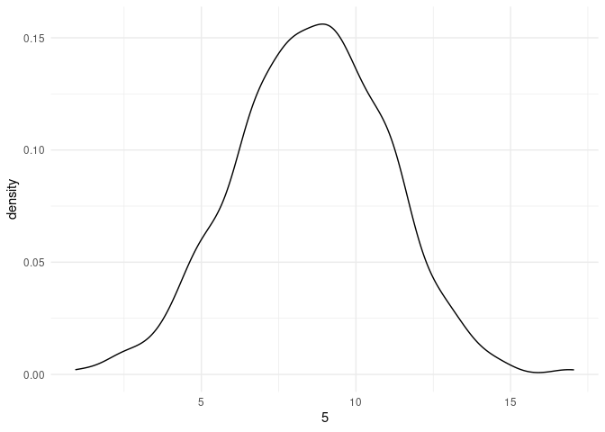
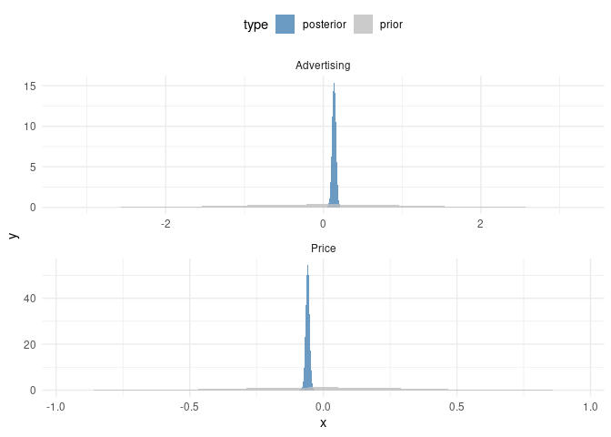

Bayesian Modeling
================
Jesse Cambon
21 April, 2020

References: \* <http://appliedpredictivemodeling.com/data> \*
<http://faculty.marshall.usc.edu/gareth-james/ISL/data.html> \#\# Setup

``` r
library(AppliedPredictiveModeling) # datasets
library(ISLR) # datasets
library(skimr)
library(tidyverse)
```

    ## ── Attaching packages ──────────────────────────────────────────────────────────────────────── tidyverse 1.3.0 ──

    ## ✓ ggplot2 3.3.0     ✓ purrr   0.3.4
    ## ✓ tibble  3.0.0     ✓ dplyr   0.8.5
    ## ✓ tidyr   1.0.2     ✓ stringr 1.4.0
    ## ✓ readr   1.3.1     ✓ forcats 0.5.0

    ## ── Conflicts ─────────────────────────────────────────────────────────────────────────── tidyverse_conflicts() ──
    ## x dplyr::filter() masks stats::filter()
    ## x dplyr::lag()    masks stats::lag()

``` r
library(wesanderson)
library(rstanarm)
```

    ## Loading required package: Rcpp

    ## rstanarm (Version 2.19.3, packaged: 2020-02-11 05:16:41 UTC)

    ## - Do not expect the default priors to remain the same in future rstanarm versions.

    ## Thus, R scripts should specify priors explicitly, even if they are just the defaults.

    ## - For execution on a local, multicore CPU with excess RAM we recommend calling

    ## options(mc.cores = parallel::detectCores())

    ## - bayesplot theme set to bayesplot::theme_default()

    ##    * Does _not_ affect other ggplot2 plots

    ##    * See ?bayesplot_theme_set for details on theme setting

``` r
library(bayestestR)
library(broom)
library(rsample)
```

    ## 
    ## Attaching package: 'rsample'

    ## The following object is masked from 'package:Rcpp':
    ## 
    ##     populate

``` r
num_cores <-  parallel::detectCores()
options(mc.cores = num_cores)

set.seed(42) # for reproducibility

# C/V split
split <- initial_split(Carseats, prop = 1/2)
carseat_train <- training(split) %>% as_tibble()
carseat_test  <- testing(split) %>% as_tibble()
```

Fit models

``` r
lm_model <- lm(Sales ~ Advertising + Price, data = carseat_train)
stan_model <- stan_glm(Sales ~ Advertising + Price, data = carseat_train)
```

``` r
tidy(lm_model)
```

    ## # A tibble: 3 x 5
    ##   term        estimate std.error statistic  p.value
    ##   <chr>          <dbl>     <dbl>     <dbl>    <dbl>
    ## 1 (Intercept)  13.3      0.868       15.3  3.25e-35
    ## 2 Advertising   0.136    0.0245       5.55 9.10e- 8
    ## 3 Price        -0.0587   0.00723     -8.12 4.99e-14

``` r
tidy(stan_model)
```

    ## # A tibble: 3 x 3
    ##   term        estimate std.error
    ##   <chr>          <dbl>     <dbl>
    ## 1 (Intercept)  13.2      0.868  
    ## 2 Advertising   0.136    0.0250 
    ## 3 Price        -0.0586   0.00713

Make predictions using the posterior distribution

``` r
post_pred <- posterior_predict(stan_model,new_data = carseat_test,draws = 1000) %>%
  as_tibble()

#post_pred_density <- estimate_density(post_pred)
```

Look at the posterior prediction distribution for a single observation

``` r
ggplot(aes(x=`5`),data=post_pred) + geom_density() + theme_minimal()
```

    ## Don't know how to automatically pick scale for object of type ppd/matrix. Defaulting to continuous.

<!-- -->

Plot prior and posterior distributions for predictors

<https://github.com/easystats/see/issues/48>

``` r
density <- estimate_density(stan_model)
sim_prior <- simulate_prior(stan_model)

density_prior <- estimate_density(sim_prior)

# Combine density for prior and posterior distributions
post_prior <- density %>% mutate(type='posterior') %>%
  bind_rows(density_prior %>% mutate(type='prior'))
```

Plot the prior and posterior distributions

``` r
ggplot(data=post_prior %>% filter(!str_detect(Parameter,'Intercept')),aes(x=x,y=y,fill=type)) + 
  theme_minimal() +
  theme(legend.position='top') +
  facet_wrap(~Parameter,ncol=1,scales='free') +
  geom_ribbon( mapping = aes(
    ymin = 0,
    ymax = y  ),
  alpha = .8) +   
  scale_fill_manual(values=c('steelblue','grey'))
```

<!-- -->
