Bayesian Modeling
================
Jesse Cambon
30 April, 2020

References: \* <http://appliedpredictivemodeling.com/data> \*
<http://faculty.marshall.usc.edu/gareth-james/ISL/data.html>

Todo: \* HDI \* Sigma Term \* References

## Setup

``` r
#library(AppliedPredictiveModeling) # datasets
library(ISLR) # datasets
library(skimr)
library(tidyverse)
library(wesanderson)
library(rstanarm)
library(bayestestR)
library(insight)
library(bayesplot)
library(broom)
library(rsample)
library(jcolors)
library(patchwork)
library(ggrepel)
library(knitr)

num_cores <-  parallel::detectCores()
options(mc.cores = num_cores)

set.seed(42) # for reproducibility
```

## Set input data and formula

Datasets and formulas: \* ISLR::Carseats : Sales \~ Advertising + Price
\* ISLR::Credit : Limit \~ Income + Rating \* chickwts: weight \~ feed

``` r
### Set input dataset here ################
split <- initial_split(chickwts, prop = 0.9)
############################################

### Set model equation here ##########################
model_formula = as.formula(weight ~ feed)
######################################################
```

``` r
chickwts %>% group_by(feed) %>%
  summarize(n=n(),
            min=min(weight),
            median=median(weight),
            mean=mean(weight),
            max=max(weight)) %>%
            ungroup() %>%
  kable()
```

| feed      |  n | min | median |     mean | max |
| :-------- | -: | --: | -----: | -------: | --: |
| casein    | 12 | 216 |  342.0 | 323.5833 | 404 |
| horsebean | 10 | 108 |  151.5 | 160.2000 | 227 |
| linseed   | 12 | 141 |  221.0 | 218.7500 | 309 |
| meatmeal  | 11 | 153 |  263.0 | 276.9091 | 380 |
| soybean   | 14 | 158 |  248.0 | 246.4286 | 329 |
| sunflower | 12 | 226 |  328.0 | 328.9167 | 423 |

``` r
ggplot(data=chickwts,aes(x=weight,fill=feed)) + 
  facet_wrap( ~ feed) +
  theme_minimal() +
  theme(legend.position='none') +
  geom_density(alpha=0.7)+
  scale_color_jcolors('default') +
  xlab('Weight') + ylab('')
```

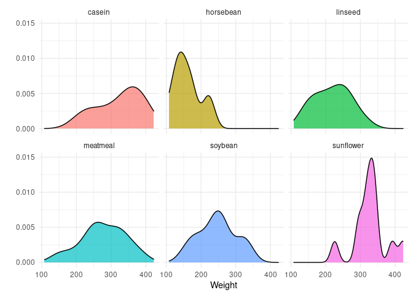<!-- -->

C/V split

``` r
train <- training(split) %>% as_tibble()
test  <- testing(split) %>% as_tibble()

train_small <- train %>% sample_n(30)
train_tiny <- train %>% sample_n(15)
```

Fit models

``` r
lm_model <- glm(model_formula, data = train)
stan_model <- stan_glm(model_formula, data = train)
stan_model_small <- stan_glm(model_formula, data = train_small)
stan_model_tiny <- stan_glm(model_formula, data = train_tiny)
```

Extract posterior

<http://mc-stan.org/rstanarm/reference/as.matrix.stanreg.html>

``` r
post1 <- as.data.frame(stan_model) %>% as_tibble()
```

Posterior Intervals

<https://mc-stan.org/rstanarm/reference/posterior_interval.stanreg.html>
<https://mc-stan.org/rstanarm/articles/rstanarm.html>

``` r
rstanarm::posterior_interval(stan_model) %>% as.data.frame() %>%
  rownames_to_column('feed')
```

    ##            feed         5%         95%
    ## 1   (Intercept)  290.53537  350.194061
    ## 2 feedhorsebean -200.23743 -116.511315
    ## 3   feedlinseed -138.06695  -55.356663
    ## 4  feedmeatmeal  -91.48396   -4.827427
    ## 5   feedsoybean -113.34100  -30.701755
    ## 6 feedsunflower  -30.73630   52.775160
    ## 7         sigma   50.01772   67.437854

``` r
tidy(lm_model,conf.int=T) %>% select(-std.error)
```

    ## # A tibble: 6 x 6
    ##   term          estimate statistic  p.value conf.low conf.high
    ##   <chr>            <dbl>     <dbl>    <dbl>    <dbl>     <dbl>
    ## 1 (Intercept)     323.      17.9   2.57e-25    288.     359.  
    ## 2 feedhorsebean  -163.      -6.39  3.05e- 8   -213.    -113.  
    ## 3 feedlinseed    -100.      -4.01  1.74e- 4   -149.     -51.2 
    ## 4 feedmeatmeal    -51.2     -2.01  4.95e- 2   -101.      -1.19
    ## 5 feedsoybean     -75.6     -3.10  3.02e- 3   -124.     -27.8 
    ## 6 feedsunflower     8.52     0.342 7.34e- 1    -40.3     57.4

``` r
# this could take a bit to run
post_descr <- describe_posterior(stan_model, test = c("p_direction","rope","bayesfactor"))
```

    ## Computation of Bayes factors: sampling priors, please wait...

    ## Loading required namespace: logspline

``` r
kable(post_descr)
```

| Parameter     |      Median | CI |     CI\_low |     CI\_high |      pd | ROPE\_CI |  ROPE\_low | ROPE\_high | ROPE\_Percentage |           BF |     Rhat |  ESS |
| :------------ | ----------: | -: | ----------: | -----------: | ------: | -------: | ---------: | ---------: | ---------------: | -----------: | -------: | ---: |
| (Intercept)   |   320.24350 | 89 |   290.08448 |   347.803012 | 1.00000 |       89 | \-8.001383 |   8.001383 |        0.0000000 | 1.862527e+24 | 1.008134 | 1252 |
| feedhorsebean | \-158.87134 | 89 | \-200.56483 | \-120.058178 | 1.00000 |       89 | \-8.001383 |   8.001383 |        0.0000000 | 3.911899e+03 | 1.004595 | 1767 |
| feedlinseed   |  \-95.51556 | 89 | \-135.69007 |  \-55.959280 | 1.00000 |       89 | \-8.001383 |   8.001383 |        0.0000000 | 4.199747e+01 | 1.006326 | 1665 |
| feedmeatmeal  |  \-47.54054 | 89 |  \-92.05273 |   \-8.744213 | 0.96725 |       89 | \-8.001383 |   8.001383 |        0.0000000 | 6.826946e-01 | 1.006196 | 1625 |
| feedsoybean   |  \-72.21472 | 89 | \-113.19881 |  \-33.269377 | 0.99750 |       89 | \-8.001383 |   8.001383 |        0.0000000 | 8.051012e+00 | 1.006223 | 1636 |
| feedsunflower |    11.16637 | 89 |  \-27.96346 |    52.923724 | 0.67150 |       89 | \-8.001383 |   8.001383 |        0.2580736 | 1.391958e-01 | 1.003641 | 1768 |

Rope

``` r
rope(stan_model)
```

    ## # Proportion of samples inside the ROPE [-8.00, 8.00]:
    ## 
    ## Parameter     | inside ROPE
    ## ---------------------------
    ## (Intercept)   |      0.00 %
    ## feedhorsebean |      0.00 %
    ## feedlinseed   |      0.00 %
    ## feedmeatmeal  |      0.00 %
    ## feedsoybean   |      0.00 %
    ## feedsunflower |     25.81 %

``` r
rope(stan_model_small)
```

    ## # Proportion of samples inside the ROPE [-8.07, 8.07]:
    ## 
    ## Parameter     | inside ROPE
    ## ---------------------------
    ## (Intercept)   |      0.00 %
    ## feedhorsebean |      0.00 %
    ## feedlinseed   |      8.57 %
    ## feedmeatmeal  |     15.25 %
    ## feedsoybean   |      0.00 %
    ## feedsunflower |      9.77 %

Markov Chain Diagnostics

``` r
mcmc_trace(stan_model)
```

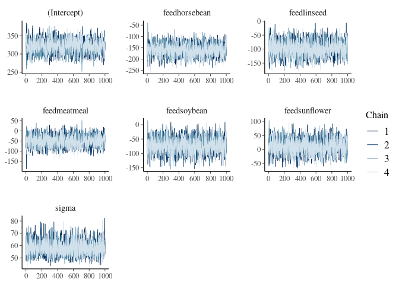<!-- -->

``` r
mcmc_trace(stan_model_small)
```

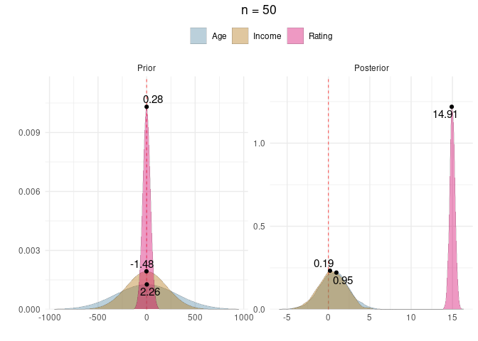<!-- -->

``` r
#mcmc_trace(stan_model_tiny)
```

Highest Density Intervals

``` r
hdi(stan_model)
```

    ## # Highest Density Interval
    ## 
    ## Parameter     |            89% HDI
    ## ----------------------------------
    ## (Intercept)   | [ 290.08,  347.80]
    ## feedhorsebean | [-200.56, -120.06]
    ## feedlinseed   | [-135.69,  -55.96]
    ## feedmeatmeal  | [ -92.05,   -8.74]
    ## feedsoybean   | [-113.20,  -33.27]
    ## feedsunflower | [ -27.96,   52.92]

``` r
stan_model$coefficients
```

    ##   (Intercept) feedhorsebean   feedlinseed  feedmeatmeal   feedsoybean 
    ##     320.24350    -158.87134     -95.51556     -47.54054     -72.21472 
    ## feedsunflower 
    ##      11.16637

``` r
hdi(stan_model_small)
```

    ## # Highest Density Interval
    ## 
    ## Parameter     |           89% HDI
    ## ---------------------------------
    ## (Intercept)   | [ 269.04, 351.91]
    ## feedhorsebean | [-201.99, -83.31]
    ## feedlinseed   | [-127.78,  17.69]
    ## feedmeatmeal  | [ -89.46,  36.34]
    ## feedsoybean   | [-116.26, -12.99]
    ## feedsunflower | [ -13.58, 105.97]

``` r
hdi(stan_model_tiny)
```

    ## # Highest Density Interval
    ## 
    ## Parameter     |           89% HDI
    ## ---------------------------------
    ## (Intercept)   | [ 304.94, 426.25]
    ## feedhorsebean | [-225.23, -53.81]
    ## feedlinseed   | [-245.32, -32.72]
    ## feedmeatmeal  | [-211.73, -54.28]
    ## feedsoybean   | [-154.78, -12.64]
    ## feedsunflower | [ -76.13,  96.25]

What percentage of each posterior distribution is greater than a certain
cutoff value?

``` r
cutoff_value <- -100 # define the cutoff

posterior <- get_parameters(stan_model,iterations=10000) %>% 
  pivot_longer(everything(),names_to='Parameter')

post_pct <- 
  posterior %>% filter(Parameter != '(Intercept)') %>%
  mutate(above=case_when(value > cutoff_value ~ 1, TRUE ~ 0)) %>%
  group_by(Parameter) %>%
  summarize(above_pct=mean(above)) %>%
  ungroup()

post_pct %>% kable()
```

| Parameter     | above\_pct |
| :------------ | ---------: |
| feedhorsebean |    0.01075 |
| feedlinseed   |    0.56675 |
| feedmeatmeal  |    0.97650 |
| feedsoybean   |    0.86925 |
| feedsunflower |    1.00000 |

### Posterior Distributions

``` r
# Function that adds size of training dataset to mcmc_areas
mcmc_areas_info <- function(model,variables) {
  predictor_vars <- str_c('feed',unlist(stan_model$xlevels,use.names=F)[-1])
  
  mcmc_areas(model,pars=predictor_vars) + ggtitle(str_c('n = ',as.character(nrow(model$data)))) +
      theme_minimal() +
      theme(plot.title = element_text(hjust = 0.5))
}

mcmc_areas_info(stan_model,predictors)
```

    ## Warning: `expand_scale()` is deprecated; use `expansion()` instead.

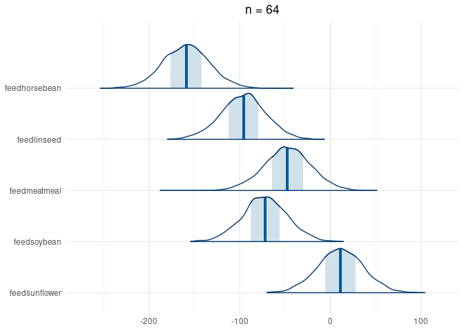<!-- -->

``` r
mcmc_areas_info(stan_model_small,predictors)
```

    ## Warning: `expand_scale()` is deprecated; use `expansion()` instead.

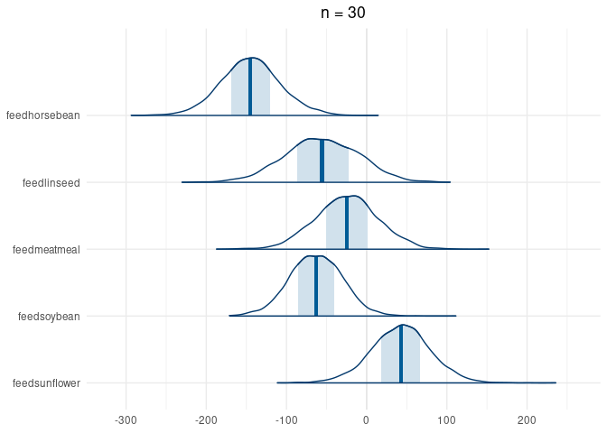<!-- -->

``` r
mcmc_areas_info(stan_model_tiny,predictors) 
```

    ## Warning: `expand_scale()` is deprecated; use `expansion()` instead.

<!-- -->

``` r
#mcmc_intervals(stan_model,pars=predictors) + theme_bw()
#posterior_vs_prior(stan_model)
```

``` r
prior_summary(stan_model)
```

    ## Priors for model 'stan_model' 
    ## ------
    ## Intercept (after predictors centered)
    ##   Specified prior:
    ##     ~ normal(location = 0, scale = 10)
    ##   Adjusted prior:
    ##     ~ normal(location = 0, scale = 800)
    ## 
    ## Coefficients
    ##   Specified prior:
    ##     ~ normal(location = [0,0,0,...], scale = [2.5,2.5,2.5,...])
    ##   Adjusted prior:
    ##     ~ normal(location = [0,0,0,...], scale = [200.03,200.03,200.03,...])
    ## 
    ## Auxiliary (sigma)
    ##   Specified prior:
    ##     ~ exponential(rate = 1)
    ##   Adjusted prior:
    ##     ~ exponential(rate = 0.012)
    ## ------
    ## See help('prior_summary.stanreg') for more details

Draw from the prior and posterior distributions

``` r
# Function for simulating prior and posterior distributions from stan model
sim_post_prior <- function(model) {
  # Simulate prior with bayestestR package
  prior <- simulate_prior(model) %>%
  pivot_longer(everything(),names_to='Parameter')

  # Simulate Posterior with insight package
  posterior <- get_parameters(model,iterations=10000) %>% 
  pivot_longer(everything(),names_to='Parameter')

  # Combine into one dataset
  combined <- prior %>% mutate(Distribution='Prior') %>% 
  bind_rows(posterior %>% mutate(Distribution='Posterior'))
  
  return(combined)
}

prior_posterior <- sim_post_prior(stan_model)
prior_posterior_small <- sim_post_prior(stan_model_small)
prior_posterior_tiny <- sim_post_prior(stan_model_tiny)
```

Plot our parameter prior and posterior distributions

``` r
# Find the x,y coordinates for peak density in a sample
find_peak_density <- function(x_sample) {
  density_x <- density(x_sample)
  # Find coordinates for peak density
  x_max <- density_x$x[which.max(density_x$y)]
  y_max <- max(density_x$y)
  
  return(tibble(x=x_max,y=y_max))
}

# Function for plotting 
plot_parameters <- function(distribution_sample,train_data,plot_peaks=FALSE) {
    
  # data to plot - exclude intercept term
  plot_data <- distribution_sample %>% filter(!str_detect(Parameter,'Intercept'))
    
  # Points for labeling max density 
  # based loosely on: https://stackoverflow.com/questions/56520287/how-to-add-label-to-each-geom-density-line)
 density_coordinates <- plot_data %>% 
  group_by(Distribution,Parameter) %>%
  do(find_peak_density(.$value))
    
  base_plot <- ggplot(data=plot_data,
         aes(x=value,fill=Parameter)) +
    facet_wrap(~fct_rev(Distribution),scales='free') +
    theme_minimal() +
    scale_y_continuous(expand =c(0,0,0.15,0)) + # add spacing for labels
    geom_vline(xintercept=0,color='red',size=0.25,linetype='dashed') +
    theme(legend.position='top',
          legend.title=element_blank(),
          plot.title = element_text(hjust = 0.5)) +
    geom_density(alpha=0.4,size=0.05) + ggtitle(str_c('n = ',as.character(nrow(train_data)))) +
    xlab('') + ylab('') + scale_fill_jcolors('pal6') + 
    guides(color = guide_legend(reverse=T))
  
  if (plot_peaks == TRUE) {
    return(base_plot +
    geom_point(data=density_coordinates, aes(x=x, y=y),show.legend = F) +
    geom_text_repel(data=density_coordinates, aes(label=round(x,2),x=x, y=y),
                     force=1.5,size=4,show.legend = F))
  }
  else {
    return(base_plot)
  }
}
```

Compare parameter distributions by sample size of training dataset

``` r
plot_parameters(prior_posterior,train) 
```

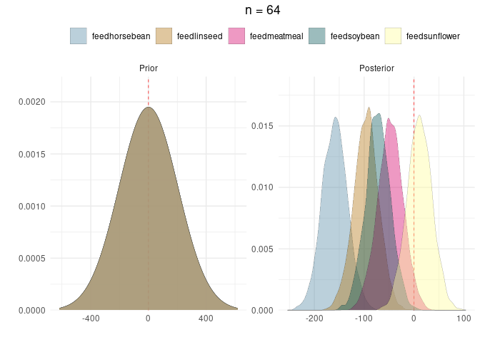<!-- -->

``` r
plot_parameters(prior_posterior_small,train_small) 
```

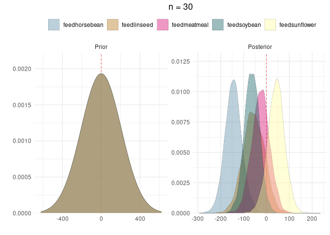<!-- -->

``` r
plot_parameters(prior_posterior_tiny,train_tiny)
```

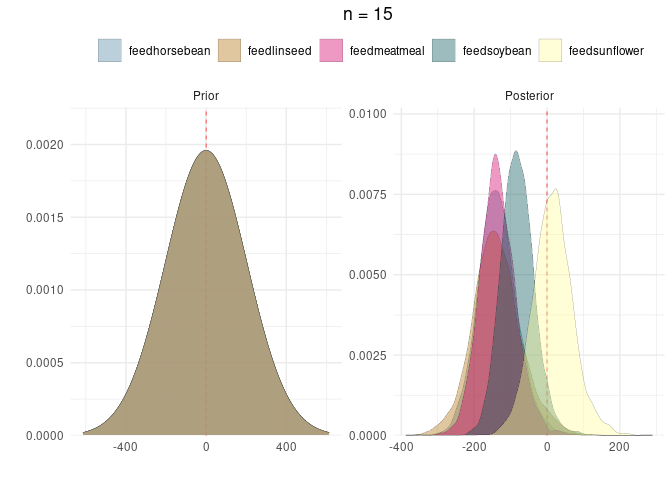<!-- -->

## Predictive Posterior Distribution

``` r
# Function that adds size of training dataset to pp_check
pp_check_info <- function(model) {
  pp_check(model) + ggtitle(str_c('n = ',as.character(nrow(model$data)))) +
      theme_minimal() +
      theme(plot.title = element_text(hjust = 0.5))
}

pp_check_info(stan_model)
```

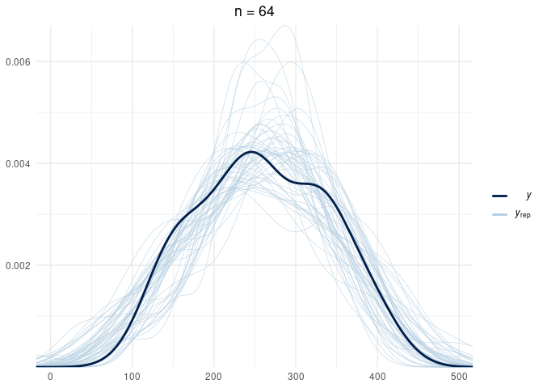<!-- -->

``` r
pp_check_info(stan_model_small)
```

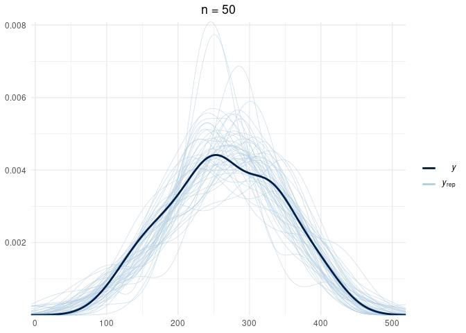<!-- -->

``` r
pp_check_info(stan_model_tiny)
```

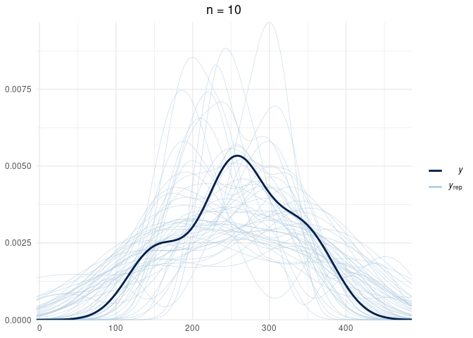<!-- -->

Manually plot the outcome distribution to compare to the posterior check
plot above

``` r
# Extract variables from formula
all_model_vars <- all.vars(model_formula)
outcome_var <- sym(all_model_vars[1])
predictors <- all_model_vars[-1]

ggplot(aes(x=!!outcome_var),data=train) + geom_density() + theme_minimal()
```

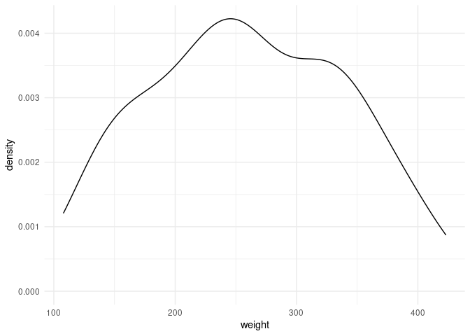<!-- -->

Make predictions using the posterior distribution

``` r
post_pred <- posterior_predict(stan_model,new_data = test,draws = 1000) %>%
  as_tibble()
```

Look at the posterior prediction distribution for a single observation

``` r
row_num <- quo(`2`)

true_value <- test %>% slice(as.numeric(as_label(row_num))) %>%
  pull(outcome_var)

ggplot(aes(x=!!row_num),data=post_pred) + geom_density() + theme_minimal() +
  geom_vline(xintercept=true_value,color='steelblue')
```

    ## Don't know how to automatically pick scale for object of type ppd/matrix. Defaulting to continuous.

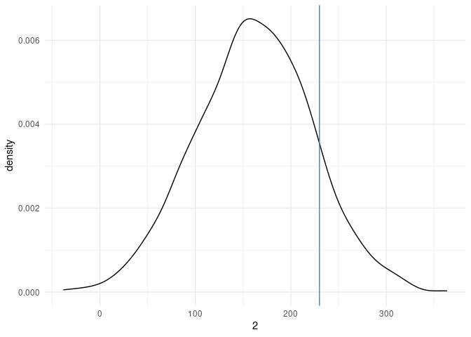<!-- -->

``` r
# Take a look at that same row number
print(test %>% slice(as.numeric(as_label(row_num))))
```

    ## # A tibble: 1 x 2
    ##   weight feed   
    ##    <dbl> <fct>  
    ## 1    230 soybean
