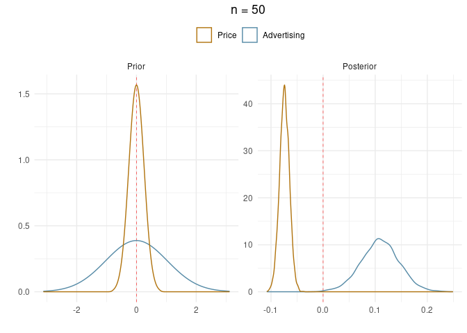
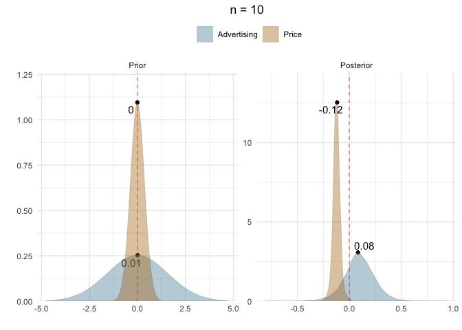
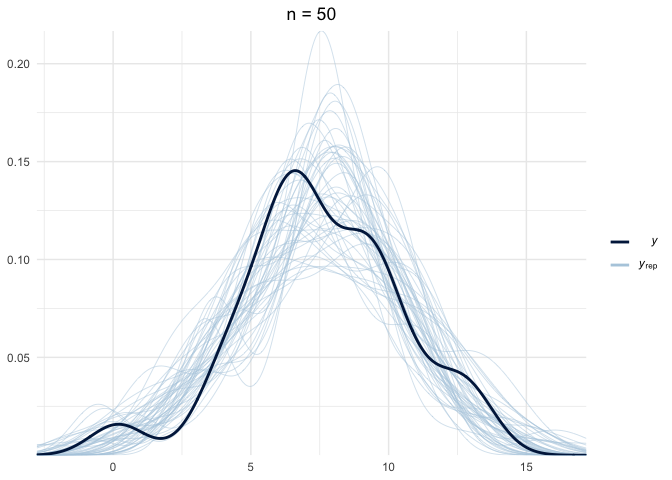
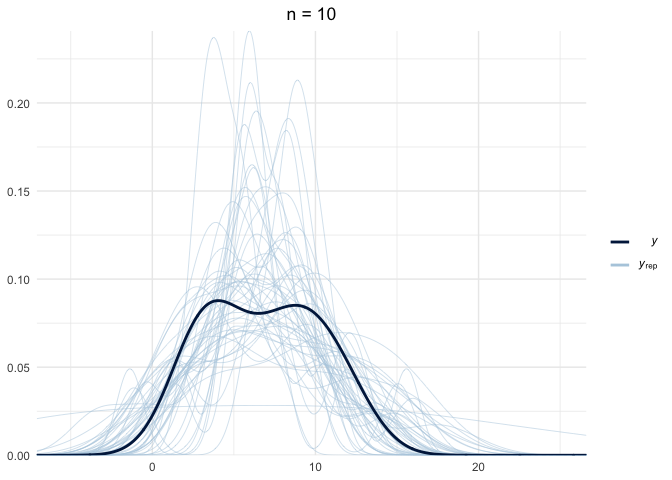
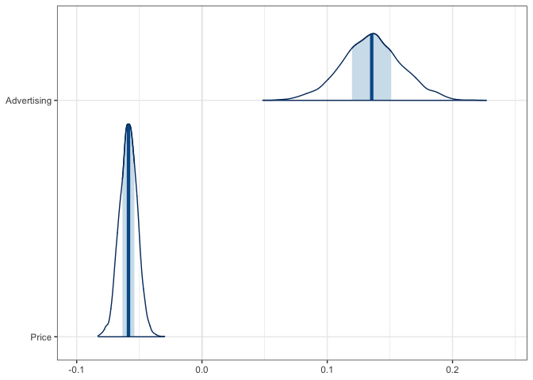
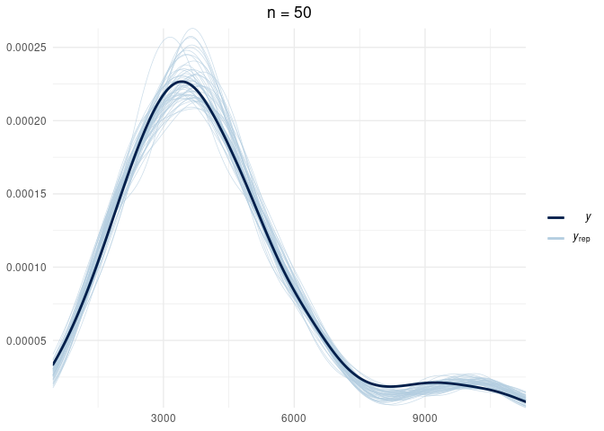
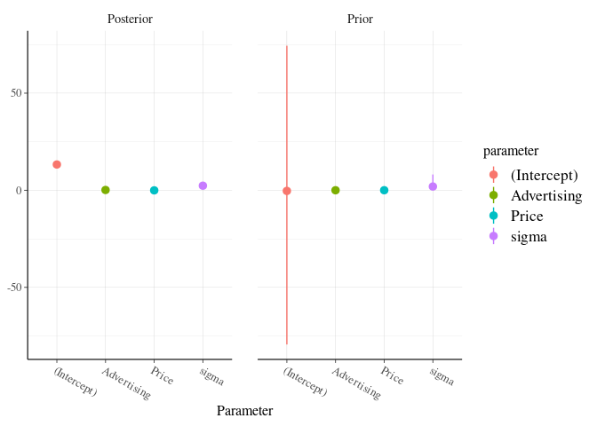

Bayesian Modeling
================
Jesse Cambon
23 April, 2020

References: \* <http://appliedpredictivemodeling.com/data> \*
<http://faculty.marshall.usc.edu/gareth-james/ISL/data.html>

## Setup

``` r
#library(AppliedPredictiveModeling) # datasets
library(ISLR) # datasets
library(skimr)
library(tidyverse)
library(wesanderson)
library(rstanarm)
library(bayestestR)
library(insight)
library(bayesplot)
library(broom)
library(rsample)
library(knitr)
library(jcolors)
library(patchwork)

num_cores <-  parallel::detectCores()
options(mc.cores = num_cores)

set.seed(42) # for reproducibility

# C/V split
split <- initial_split(Carseats, prop = 1/2)
carseat_train <- training(split) %>% as_tibble()
carseat_test  <- testing(split) %>% as_tibble()

carseat_train_small <- carseat_train %>% sample_n(50)
carseat_train_tiny <- carseat_train %>% sample_n(10)
```

Fit models

``` r
lm_model <- lm(Sales ~ Advertising + Price, data = carseat_train)
stan_model <- stan_glm(Sales ~ Advertising + Price, data = carseat_train)
stan_model_small <- stan_glm(Sales ~ Advertising + Price, data = carseat_train_small)
stan_model_tiny <- stan_glm(Sales ~ Advertising + Price, data = carseat_train_tiny)
```

``` r
tidy(lm_model) %>% kable()
```

| term        |    estimate | std.error |  statistic | p.value |
| :---------- | ----------: | --------: | ---------: | ------: |
| (Intercept) |  13.2501126 | 0.8683728 |  15.258553 |   0e+00 |
| Advertising |   0.1360082 | 0.0245020 |   5.550900 |   1e-07 |
| Price       | \-0.0586870 | 0.0072273 | \-8.120147 |   0e+00 |

``` r
tidy(stan_model) %>% kable()
```

| term        |    estimate | std.error |
| :---------- | ----------: | --------: |
| (Intercept) |  13.2545992 | 0.8467460 |
| Advertising |   0.1354843 | 0.0231555 |
| Price       | \-0.0586622 | 0.0070801 |

``` r
prior_summary(stan_model)
```

    ## Priors for model 'stan_model' 
    ## ------
    ## Intercept (after predictors centered)
    ##   Specified prior:
    ##     ~ normal(location = 0, scale = 10)
    ##   Adjusted prior:
    ##     ~ normal(location = 0, scale = 28)
    ## 
    ## Coefficients
    ##   Specified prior:
    ##     ~ normal(location = [0,0], scale = [2.5,2.5])
    ##   Adjusted prior:
    ##     ~ normal(location = [0,0], scale = [1.05,0.31])
    ## 
    ## Auxiliary (sigma)
    ##   Specified prior:
    ##     ~ exponential(rate = 1)
    ##   Adjusted prior:
    ##     ~ exponential(rate = 0.35)
    ## ------
    ## See help('prior_summary.stanreg') for more details

``` r
prior_summary(stan_model_small)
```

    ## Priors for model 'stan_model_small' 
    ## ------
    ## Intercept (after predictors centered)
    ##   Specified prior:
    ##     ~ normal(location = 0, scale = 10)
    ##   Adjusted prior:
    ##     ~ normal(location = 0, scale = 29)
    ## 
    ## Coefficients
    ##   Specified prior:
    ##     ~ normal(location = [0,0], scale = [2.5,2.5])
    ##   Adjusted prior:
    ##     ~ normal(location = [0,0], scale = [1.00,0.25])
    ## 
    ## Auxiliary (sigma)
    ##   Specified prior:
    ##     ~ exponential(rate = 1)
    ##   Adjusted prior:
    ##     ~ exponential(rate = 0.34)
    ## ------
    ## See help('prior_summary.stanreg') for more details

``` r
prior_summary(stan_model_tiny)
```

    ## Priors for model 'stan_model_tiny' 
    ## ------
    ## Intercept (after predictors centered)
    ##   Specified prior:
    ##     ~ normal(location = 0, scale = 10)
    ##   Adjusted prior:
    ##     ~ normal(location = 0, scale = 34)
    ## 
    ## Coefficients
    ##   Specified prior:
    ##     ~ normal(location = [0,0], scale = [2.5,2.5])
    ##   Adjusted prior:
    ##     ~ normal(location = [0,0], scale = [1.54,0.36])
    ## 
    ## Auxiliary (sigma)
    ##   Specified prior:
    ##     ~ exponential(rate = 1)
    ##   Adjusted prior:
    ##     ~ exponential(rate = 0.29)
    ## ------
    ## See help('prior_summary.stanreg') for more details

Draw from the prior and posterior distributions

``` r
# Function for simulating prior and posterior distributions from stan model
sim_post_prior <- function(model) {
  # Simulate prior with bayestestR package
  prior <- simulate_prior(model) %>%
  pivot_longer(everything(),names_to='Parameter')

  # Simulate Posterior with insight package
  posterior <- get_parameters(model,iterations=10000) %>% 
  pivot_longer(everything(),names_to='Parameter')

  # Combine into one dataset
  combined <- prior %>% mutate(Distribution='Prior') %>% 
  bind_rows(posterior %>% mutate(Distribution='Posterior'))
  
  return(combined)
}

prior_posterior <- sim_post_prior(stan_model)
prior_posterior_small <- sim_post_prior(stan_model_small)
prior_posterior_tiny <- sim_post_prior(stan_model_tiny)
```

``` r
# Function for plotting 
plot_parameters <- function(distribution_sample,train_data) {
ggplot(data=distribution_sample %>% filter(!str_detect(Parameter,'Intercept')),
       aes(x=value,color=Parameter)) +
  facet_wrap(.~fct_rev(Distribution),scales='free') +
  theme_minimal() +
  geom_vline(xintercept=0,color='red',size=0.2,linetype='dashed') +
  theme(legend.position='top',
        legend.title=element_blank(),
        plot.title = element_text(hjust = 0.5)) +
  geom_density() + ggtitle(str_c('n = ',as.character(nrow(train_data)))) +
  xlab('') + ylab('') + scale_color_jcolors('pal6') + 
  guides(color = guide_legend(reverse=T))
}
```

Compare parameter distributions by sample size of training dataset

``` r
plot_parameters(prior_posterior,carseat_train) 
```

<!-- -->

``` r
plot_parameters(prior_posterior_small,carseat_train_small) 
```

<!-- -->

``` r
plot_parameters(prior_posterior_tiny,carseat_train_tiny)
```

<!-- -->

Posterior Prediction Check

``` r
# Function that adds size of training dataset to pp_check
pp_check_info <- function(model) {
  pp_check(model) + ggtitle(str_c('n = ',as.character(nrow(model$data)))) +
      theme(plot.title = element_text(hjust = 0.5))
}

pp_check_info(stan_model)
```

<!-- -->

``` r
pp_check_info(stan_model_small)
```

<!-- -->

``` r
pp_check_info(stan_model_tiny)
```

<!-- -->

Manually plot the outcome distribution to compare to the posterior check
plot above

``` r
ggplot(aes(x=Sales),data=carseat_train) + geom_density() + theme_minimal()
```

<!-- -->

Make predictions using the posterior distribution

``` r
post_pred <- posterior_predict(stan_model,new_data = carseat_test,draws = 1000) %>%
  as_tibble()
```

``` r
mcmc_areas(stan_model,pars=c('Advertising','Price')) + theme_bw()
```

    ## Warning: `expand_scale()` is deprecated; use `expansion()` instead.

<!-- -->

``` r
mcmc_intervals(stan_model,pars=c('Advertising','Price')) + theme_bw()
```

<!-- -->

``` r
posterior_vs_prior(stan_model)
```

    ## 
    ## Drawing from prior...

<!-- -->

Look at the posterior prediction distribution for a single observation

``` r
row_num <- quo(`25`)
ggplot(aes(x=!!row_num),data=post_pred) + geom_density() + theme_minimal()
```

    ## Don't know how to automatically pick scale for object of type ppd/matrix. Defaulting to continuous.

<!-- -->

``` r
# Take a look at that same row number
print(carseat_test %>% select(Sales, Advertising, Price) %>% slice(as.numeric(as_label(row_num))))
```

    ## # A tibble: 1 x 3
    ##   Sales Advertising Price
    ##   <dbl>       <dbl> <dbl>
    ## 1  7.96           0   124
