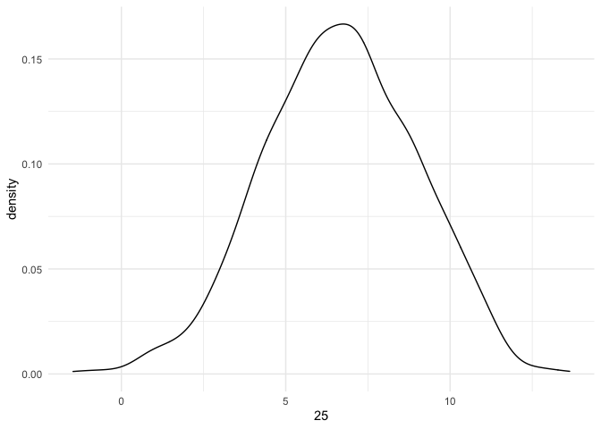

Bayesian Modeling
================
Jesse Cambon
23 April, 2020

References: \* <http://appliedpredictivemodeling.com/data> \*
<http://faculty.marshall.usc.edu/gareth-james/ISL/data.html>

## Setup

``` r
#library(AppliedPredictiveModeling) # datasets
library(ISLR) # datasets
library(skimr)
library(tidyverse)
library(wesanderson)
library(rstanarm)
library(bayestestR)
library(insight)
library(bayesplot)
library(broom)
library(rsample)
library(knitr)
library(jcolors)
library(patchwork)

num_cores <-  parallel::detectCores()
options(mc.cores = num_cores)

set.seed(42) # for reproducibility

# C/V split
split <- initial_split(Carseats, prop = 1/2)
carseat_train <- training(split) %>% as_tibble()
carseat_test  <- testing(split) %>% as_tibble()
```

Fit models

``` r
lm_model <- lm(Sales ~ Advertising + Price, data = carseat_train)
stan_model <- stan_glm(Sales ~ Advertising + Price, data = carseat_train)
```

``` r
tidy(lm_model) %>% kable()
```

| term        |    estimate | std.error |  statistic | p.value |
| :---------- | ----------: | --------: | ---------: | ------: |
| (Intercept) |  13.2501126 | 0.8683728 |  15.258553 |   0e+00 |
| Advertising |   0.1360082 | 0.0245020 |   5.550900 |   1e-07 |
| Price       | \-0.0586870 | 0.0072273 | \-8.120147 |   0e+00 |

``` r
tidy(stan_model) %>% kable()
```

| term        |    estimate | std.error |
| :---------- | ----------: | --------: |
| (Intercept) |  13.2376070 | 0.8675335 |
| Advertising |   0.1361909 | 0.0250300 |
| Price       | \-0.0586394 | 0.0071318 |

``` r
prior_summary(stan_model)
```

    ## Priors for model 'stan_model' 
    ## ------
    ## Intercept (after predictors centered)
    ##   Specified prior:
    ##     ~ normal(location = 0, scale = 10)
    ##   Adjusted prior:
    ##     ~ normal(location = 0, scale = 28)
    ## 
    ## Coefficients
    ##   Specified prior:
    ##     ~ normal(location = [0,0], scale = [2.5,2.5])
    ##   Adjusted prior:
    ##     ~ normal(location = [0,0], scale = [1.05,0.31])
    ## 
    ## Auxiliary (sigma)
    ##   Specified prior:
    ##     ~ exponential(rate = 1)
    ##   Adjusted prior:
    ##     ~ exponential(rate = 0.35)
    ## ------
    ## See help('prior_summary.stanreg') for more details

``` r
pointest <- point_estimate(stan_model)
```

Make predictions using the posterior
distribution

``` r
post_pred <- posterior_predict(stan_model,new_data = carseat_test,draws = 1000) %>%
  as_tibble()

#post_pred_density <- estimate_density(post_pred)
```

Look at the posterior prediction distribution for a single observation

``` r
row_num <- quo(`25`)
ggplot(aes(x=!!row_num),data=post_pred) + geom_density() + theme_minimal()
```

    ## Don't know how to automatically pick scale for object of type ppd/matrix. Defaulting to continuous.

<!-- -->

``` r
# Take a look at that same row number
print(carseat_test %>% select(Sales, Advertising, Price) %>% slice(as.numeric(as_label(row_num))))
```

    ## # A tibble: 1 x 3
    ##   Sales Advertising Price
    ##   <dbl>       <dbl> <dbl>
    ## 1  7.96           0   124

Draw from the prior distribution

``` r
# Simulate prior with bayestestR package
prior <- simulate_prior(stan_model) %>%
  pivot_longer(everything(),names_to='Parameter')

# Simulate Posterior with insight package
posterior <- get_parameters(stan_model,iterations=10000) %>% 
  pivot_longer(everything(),names_to='Parameter')

prior_posterior <- prior %>% mutate(Distribution='Prior') %>% 
  bind_rows(posterior %>% mutate(Distribution='Posterior'))
```

``` r
ggplot(data=prior_posterior %>% filter(!str_detect(Parameter,'Intercept')),aes(x=value,color=Distribution)) + 
  facet_wrap(Parameter~Distribution,scales='free') +
  theme_minimal() +
  theme(legend.position='top',
        legend.title=element_blank(),
        plot.title = element_text(hjust = 0.5)) +
  geom_density() + ggtitle('Prior vs Posterior Distributions') +
  xlab('') + ylab('') 
```

<!-- -->

Plot
priors

``` r
ggplot(data=prior %>% filter(!str_detect(Parameter,'Intercept')),aes(x=value,color=Parameter)) + 
  facet_grid(~Parameter,scales='free_x') +
  theme_minimal() +
  theme(legend.position='top',
        plot.title = element_text(hjust = 0.5)) +
  geom_density() + ggtitle('Prior Distributions') +
ggplot(data=posterior %>% filter(!str_detect(Parameter,'Intercept')),aes(x=value,color=Parameter)) + 
  facet_grid(~Parameter,scales='free_x') +
  theme_minimal() +
  theme(legend.position='top',
        plot.title = element_text(hjust = 0.5)) +
  geom_density() + ggtitle('Posterior Distributions') 
```

<!-- -->

``` r
mcmc_areas(stan_model,pars=c('Advertising','Price')) + theme_bw()
```

    ## Warning: `expand_scale()` is deprecated; use `expansion()` instead.

<!-- -->

``` r
mcmc_intervals(stan_model,pars=c('Advertising','Price')) + theme_bw()
```

<!-- -->

``` r
posterior_vs_prior(stan_model)
```

    ## 
    ## Drawing from prior...

<!-- -->

Posterior Prediction Check

``` r
pp_check(stan_model)
```

<!-- -->

Manually plot the outcome distribution to compare to the posterior check
plot
above

``` r
ggplot(aes(x=Sales),data=carseat_train) + geom_density() + theme_minimal()
```

<!-- -->
