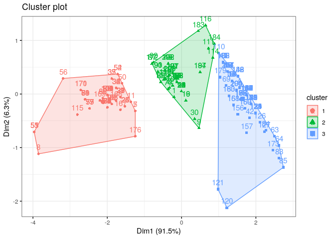

K-means Clustering
================
Jesse Cambon
24 November, 2019

Demonstrate K-means clustering

## References

  - <https://uc-r.github.io/kmeans_clustering>
  - <https://cran.r-project.org/web/packages/broom/vignettes/kmeans.html>

## Setup

``` r
library(tidyverse)
library(knitr)
library(kableExtra)
library(broom)
library(factoextra)
library(wesanderson)
```

## Cluster Data

``` r
library(fueleconomy)
my_vehicles <- vehicles %>% filter(year == 2015) %>%
  drop_na(cyl,displ,cty)

vehicles_sel <- my_vehicles %>%
  select(cty,cyl,displ)

# Scale variables for clustering
vehicles_sel_scaled <- vehicles_sel %>%
  mutate_all(scale)

# Try different numbers of clusters
clust3 <- kmeans(vehicles_sel_scaled, centers = 3)
clust5 <- kmeans(vehicles_sel_scaled, centers = 5)
clust7 <- kmeans(vehicles_sel_scaled, centers = 7) 
clust10 <- kmeans(vehicles_sel_scaled, centers = 10)
```

## View Results

``` r
combine_results <- augment(clust3, my_vehicles)  

combine_summ <- combine_results %>% group_by(.cluster) %>% 
  summarize(num_vehicles=n(),
            mean_cty=mean(cty),
            min_cty=min(cty),
            max_cty=max(cty),
            mean_displ=mean(displ),
            mean_cyl=mean(cyl)) %>%
  arrange(desc(mean_cty))
```

``` r
kable(combine_summ,format='markdown',digits=2) %>%
  kable_styling(bootstrap_options = c("striped",'border'))
```

| .cluster | num\_vehicles | mean\_cty | min\_cty | max\_cty | mean\_displ | mean\_cyl |
| :------- | ------------: | --------: | -------: | -------: | ----------: | --------: |
| 3        |            86 |     25.05 |       20 |       33 |        1.87 |      4.05 |
| 2        |            55 |     18.71 |       16 |       24 |        3.12 |      5.78 |
| 1        |            63 |     15.19 |       11 |       20 |        5.12 |      8.29 |

## Visualize

``` r
fviz_cluster(clust3,data=vehicles_sel,repel=F,ggtheme=theme_bw())
```

<!-- -->

``` r
ggplot(aes(x=cyl,y=cty,color=.cluster),data=combine_results) + 
  geom_jitter() +
  theme_bw() +
  theme(legend.position='top') +
  scale_color_manual(values=wes_palette('Darjeeling1')) +
  guides(color = guide_legend(title='Cluster',override.aes = list(size=2.5))) +
  xlab('Cylinders (cyl)') +
  ylab('City Fuel Economy (cty)')
```

<!-- -->
