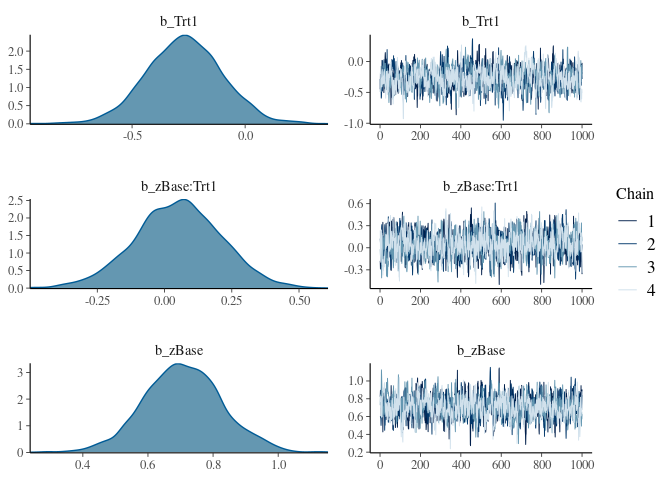
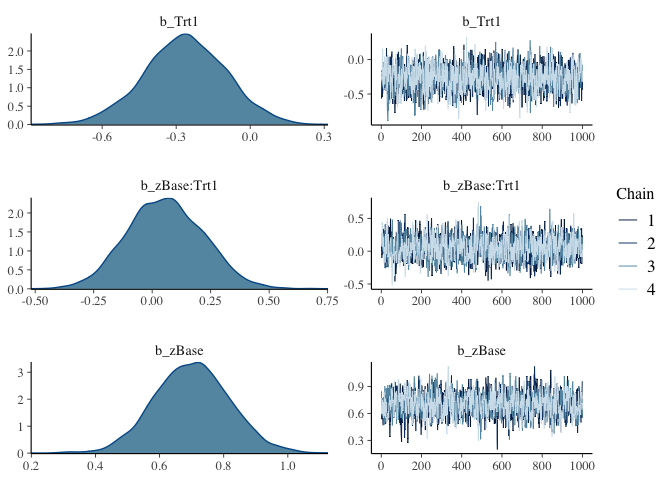
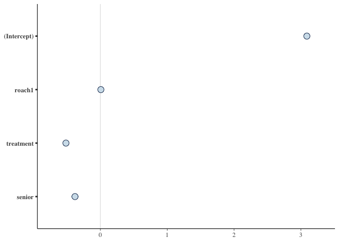
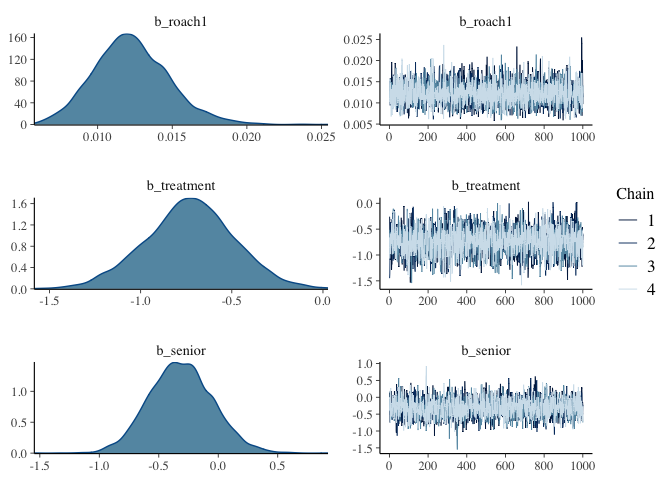
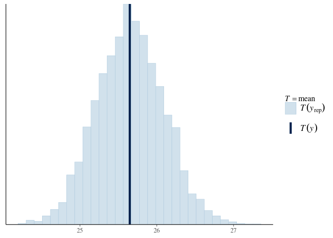
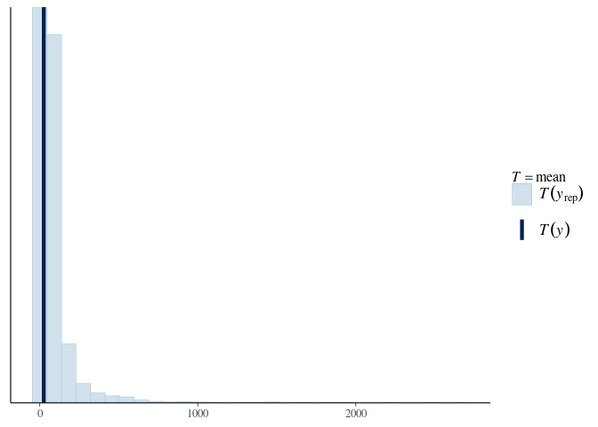
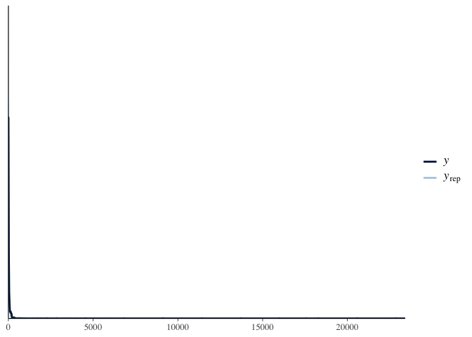
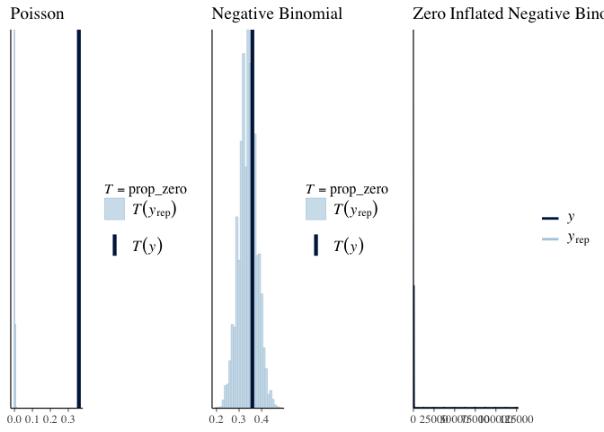

Comparing Bayesian Modeling Packages
================
Jesse Cambon
26 April, 2020

Compare rstan, brms, and rstanarm

``` r
library(rstan)
library(brms)
library(rstanarm)
library(tidyverse)
library(bayesplot)
options(mc.cores = parallel::detectCores())
```

## Rstan

Walking through this example:
<https://cran.r-project.org/web/packages/rstan/vignettes/rstan.html#sample-from-the-posterior-distribution>

``` r
# Sample Dataset
schools_data <- list(
  J = 8,
  y = c(28,  8, -3,  7, -1,  1, 18, 12),
  sigma = c(15, 10, 16, 11,  9, 11, 10, 18)
)

stan_code <- "
data {
  int<lower=0> J;          // number of schools 
  real y[J];               // estimated treatment effects
  real<lower=0> sigma[J];  // s.e. of effect estimates 
}
parameters {
  real mu; 
  real<lower=0> tau;
  vector[J] eta;
}
transformed parameters {
  vector[J] theta;
  theta = mu + tau * eta;
}
model {
  target += normal_lpdf(eta | 0, 1);
  target += normal_lpdf(y | theta, sigma);
}"
```

``` r
fit1 <- stan(
  model_code = stan_code,  # Stan program
  data = schools_data,    # named list of data
  chains = 4,             # number of Markov chains
  warmup = 1000,          # number of warmup iterations per chain
  iter = 2000,            # total number of iterations per chain
  cores = 2,              # number of cores (could use one per chain)
  refresh = 0             # no progress shown
  )
```

    ## Trying to compile a simple C file

    ## Running /usr/lib/R/bin/R CMD SHLIB foo.c
    ## gcc -std=gnu99 -I"/usr/share/R/include" -DNDEBUG   -I"/home/cambonator/R/x86_64-pc-linux-gnu-library/3.6/Rcpp/include/"  -I"/home/cambonator/R/x86_64-pc-linux-gnu-library/3.6/RcppEigen/include/"  -I"/home/cambonator/R/x86_64-pc-linux-gnu-library/3.6/RcppEigen/include/unsupported"  -I"/home/cambonator/R/x86_64-pc-linux-gnu-library/3.6/BH/include" -I"/home/cambonator/R/x86_64-pc-linux-gnu-library/3.6/StanHeaders/include/src/"  -I"/home/cambonator/R/x86_64-pc-linux-gnu-library/3.6/StanHeaders/include/"  -I"/home/cambonator/R/x86_64-pc-linux-gnu-library/3.6/rstan/include" -DEIGEN_NO_DEBUG  -D_REENTRANT  -DBOOST_DISABLE_ASSERTS -DBOOST_PENDING_INTEGER_LOG2_HPP -include stan/math/prim/mat/fun/Eigen.hpp     -fpic  -g -O2 -fdebug-prefix-map=/build/r-base-jbaK_j/r-base-3.6.3=. -fstack-protector-strong -Wformat -Werror=format-security -Wdate-time -D_FORTIFY_SOURCE=2 -g  -c foo.c -o foo.o
    ## In file included from /home/cambonator/R/x86_64-pc-linux-gnu-library/3.6/RcppEigen/include/Eigen/Core:88,
    ##                  from /home/cambonator/R/x86_64-pc-linux-gnu-library/3.6/RcppEigen/include/Eigen/Dense:1,
    ##                  from /home/cambonator/R/x86_64-pc-linux-gnu-library/3.6/StanHeaders/include/stan/math/prim/mat/fun/Eigen.hpp:4,
    ##                  from <command-line>:
    ## /home/cambonator/R/x86_64-pc-linux-gnu-library/3.6/RcppEigen/include/Eigen/src/Core/util/Macros.h:613:1: error: unknown type name ‘namespace’
    ##   613 | namespace Eigen {
    ##       | ^~~~~~~~~
    ## /home/cambonator/R/x86_64-pc-linux-gnu-library/3.6/RcppEigen/include/Eigen/src/Core/util/Macros.h:613:17: error: expected ‘=’, ‘,’, ‘;’, ‘asm’ or ‘__attribute__’ before ‘{’ token
    ##   613 | namespace Eigen {
    ##       |                 ^
    ## In file included from /home/cambonator/R/x86_64-pc-linux-gnu-library/3.6/RcppEigen/include/Eigen/Dense:1,
    ##                  from /home/cambonator/R/x86_64-pc-linux-gnu-library/3.6/StanHeaders/include/stan/math/prim/mat/fun/Eigen.hpp:4,
    ##                  from <command-line>:
    ## /home/cambonator/R/x86_64-pc-linux-gnu-library/3.6/RcppEigen/include/Eigen/Core:96:10: fatal error: complex: No such file or directory
    ##    96 | #include <complex>
    ##       |          ^~~~~~~~~
    ## compilation terminated.
    ## make: *** [/usr/lib/R/etc/Makeconf:168: foo.o] Error 1

    ## Warning: There were 1 divergent transitions after warmup. Increasing adapt_delta above 0.8 may help. See
    ## http://mc-stan.org/misc/warnings.html#divergent-transitions-after-warmup

    ## Warning: Examine the pairs() plot to diagnose sampling problems

## Brms

The Brms package supports

Example based on : <https://github.com/paul-buerkner/brms>

  - `(1 | var)` is used to specify the variable as a random effect.
    Random effects are categorical grouping variables we are trying
    control for.

Mixed effect model has both random effects and fixed effects

  - <https://www.theanalysisfactor.com/understanding-random-effects-in-mixed-models/>
  - <https://ourcodingclub.github.io/tutorials/mixed-models/#what>
  - <https://ase.tufts.edu/gsc/gradresources/guidetomixedmodelsinr/mixed%20model%20guide.html>
  - <https://en.wikipedia.org/wiki/Mixed_model>

<!-- end list -->

``` r
fit1 <- brm(count ~ zAge + zBase * Trt + (1|patient), 
            data = epilepsy, family = poisson())
```

    ## Compiling the C++ model

    ## Trying to compile a simple C file

    ## Running /usr/lib/R/bin/R CMD SHLIB foo.c
    ## gcc -std=gnu99 -I"/usr/share/R/include" -DNDEBUG   -I"/home/cambonator/R/x86_64-pc-linux-gnu-library/3.6/Rcpp/include/"  -I"/home/cambonator/R/x86_64-pc-linux-gnu-library/3.6/RcppEigen/include/"  -I"/home/cambonator/R/x86_64-pc-linux-gnu-library/3.6/RcppEigen/include/unsupported"  -I"/home/cambonator/R/x86_64-pc-linux-gnu-library/3.6/BH/include" -I"/home/cambonator/R/x86_64-pc-linux-gnu-library/3.6/StanHeaders/include/src/"  -I"/home/cambonator/R/x86_64-pc-linux-gnu-library/3.6/StanHeaders/include/"  -I"/home/cambonator/R/x86_64-pc-linux-gnu-library/3.6/rstan/include" -DEIGEN_NO_DEBUG  -D_REENTRANT  -DBOOST_DISABLE_ASSERTS -DBOOST_PENDING_INTEGER_LOG2_HPP -include stan/math/prim/mat/fun/Eigen.hpp     -fpic  -g -O2 -fdebug-prefix-map=/build/r-base-jbaK_j/r-base-3.6.3=. -fstack-protector-strong -Wformat -Werror=format-security -Wdate-time -D_FORTIFY_SOURCE=2 -g  -c foo.c -o foo.o
    ## In file included from /home/cambonator/R/x86_64-pc-linux-gnu-library/3.6/RcppEigen/include/Eigen/Core:88,
    ##                  from /home/cambonator/R/x86_64-pc-linux-gnu-library/3.6/RcppEigen/include/Eigen/Dense:1,
    ##                  from /home/cambonator/R/x86_64-pc-linux-gnu-library/3.6/StanHeaders/include/stan/math/prim/mat/fun/Eigen.hpp:4,
    ##                  from <command-line>:
    ## /home/cambonator/R/x86_64-pc-linux-gnu-library/3.6/RcppEigen/include/Eigen/src/Core/util/Macros.h:613:1: error: unknown type name ‘namespace’
    ##   613 | namespace Eigen {
    ##       | ^~~~~~~~~
    ## /home/cambonator/R/x86_64-pc-linux-gnu-library/3.6/RcppEigen/include/Eigen/src/Core/util/Macros.h:613:17: error: expected ‘=’, ‘,’, ‘;’, ‘asm’ or ‘__attribute__’ before ‘{’ token
    ##   613 | namespace Eigen {
    ##       |                 ^
    ## In file included from /home/cambonator/R/x86_64-pc-linux-gnu-library/3.6/RcppEigen/include/Eigen/Dense:1,
    ##                  from /home/cambonator/R/x86_64-pc-linux-gnu-library/3.6/StanHeaders/include/stan/math/prim/mat/fun/Eigen.hpp:4,
    ##                  from <command-line>:
    ## /home/cambonator/R/x86_64-pc-linux-gnu-library/3.6/RcppEigen/include/Eigen/Core:96:10: fatal error: complex: No such file or directory
    ##    96 | #include <complex>
    ##       |          ^~~~~~~~~
    ## compilation terminated.
    ## make: *** [/usr/lib/R/etc/Makeconf:168: foo.o] Error 1

    ## Start sampling

``` r
fit2 <- brm(count ~ zAge + zBase * Trt + (1|patient) + (1|obs), 
            data = epilepsy, family = poisson())
```

    ## Compiling the C++ model
    ## Trying to compile a simple C file

    ## Running /usr/lib/R/bin/R CMD SHLIB foo.c
    ## gcc -std=gnu99 -I"/usr/share/R/include" -DNDEBUG   -I"/home/cambonator/R/x86_64-pc-linux-gnu-library/3.6/Rcpp/include/"  -I"/home/cambonator/R/x86_64-pc-linux-gnu-library/3.6/RcppEigen/include/"  -I"/home/cambonator/R/x86_64-pc-linux-gnu-library/3.6/RcppEigen/include/unsupported"  -I"/home/cambonator/R/x86_64-pc-linux-gnu-library/3.6/BH/include" -I"/home/cambonator/R/x86_64-pc-linux-gnu-library/3.6/StanHeaders/include/src/"  -I"/home/cambonator/R/x86_64-pc-linux-gnu-library/3.6/StanHeaders/include/"  -I"/home/cambonator/R/x86_64-pc-linux-gnu-library/3.6/rstan/include" -DEIGEN_NO_DEBUG  -D_REENTRANT  -DBOOST_DISABLE_ASSERTS -DBOOST_PENDING_INTEGER_LOG2_HPP -include stan/math/prim/mat/fun/Eigen.hpp     -fpic  -g -O2 -fdebug-prefix-map=/build/r-base-jbaK_j/r-base-3.6.3=. -fstack-protector-strong -Wformat -Werror=format-security -Wdate-time -D_FORTIFY_SOURCE=2 -g  -c foo.c -o foo.o
    ## In file included from /home/cambonator/R/x86_64-pc-linux-gnu-library/3.6/RcppEigen/include/Eigen/Core:88,
    ##                  from /home/cambonator/R/x86_64-pc-linux-gnu-library/3.6/RcppEigen/include/Eigen/Dense:1,
    ##                  from /home/cambonator/R/x86_64-pc-linux-gnu-library/3.6/StanHeaders/include/stan/math/prim/mat/fun/Eigen.hpp:4,
    ##                  from <command-line>:
    ## /home/cambonator/R/x86_64-pc-linux-gnu-library/3.6/RcppEigen/include/Eigen/src/Core/util/Macros.h:613:1: error: unknown type name ‘namespace’
    ##   613 | namespace Eigen {
    ##       | ^~~~~~~~~
    ## /home/cambonator/R/x86_64-pc-linux-gnu-library/3.6/RcppEigen/include/Eigen/src/Core/util/Macros.h:613:17: error: expected ‘=’, ‘,’, ‘;’, ‘asm’ or ‘__attribute__’ before ‘{’ token
    ##   613 | namespace Eigen {
    ##       |                 ^
    ## In file included from /home/cambonator/R/x86_64-pc-linux-gnu-library/3.6/RcppEigen/include/Eigen/Dense:1,
    ##                  from /home/cambonator/R/x86_64-pc-linux-gnu-library/3.6/StanHeaders/include/stan/math/prim/mat/fun/Eigen.hpp:4,
    ##                  from <command-line>:
    ## /home/cambonator/R/x86_64-pc-linux-gnu-library/3.6/RcppEigen/include/Eigen/Core:96:10: fatal error: complex: No such file or directory
    ##    96 | #include <complex>
    ##       |          ^~~~~~~~~
    ## compilation terminated.
    ## make: *** [/usr/lib/R/etc/Makeconf:168: foo.o] Error 1

    ## Start sampling

``` r
fit1
```

    ##  Family: poisson 
    ##   Links: mu = log 
    ## Formula: count ~ zAge + zBase * Trt + (1 | patient) 
    ##    Data: epilepsy (Number of observations: 236) 
    ## Samples: 4 chains, each with iter = 2000; warmup = 1000; thin = 1;
    ##          total post-warmup samples = 4000
    ## 
    ## Group-Level Effects: 
    ## ~patient (Number of levels: 59) 
    ##               Estimate Est.Error l-95% CI u-95% CI Rhat Bulk_ESS Tail_ESS
    ## sd(Intercept)     0.58      0.07     0.46     0.73 1.00      808     1552
    ## 
    ## Population-Level Effects: 
    ##            Estimate Est.Error l-95% CI u-95% CI Rhat Bulk_ESS Tail_ESS
    ## Intercept      1.78      0.12     1.54     2.01 1.00      785     1300
    ## zAge           0.09      0.09    -0.07     0.26 1.00      690     1599
    ## zBase          0.71      0.12     0.47     0.95 1.00      892     1566
    ## Trt1          -0.27      0.17    -0.60     0.06 1.01      769     1159
    ## zBase:Trt1     0.05      0.16    -0.27     0.36 1.00     1014     1735
    ## 
    ## Samples were drawn using sampling(NUTS). For each parameter, Bulk_ESS
    ## and Tail_ESS are effective sample size measures, and Rhat is the potential
    ## scale reduction factor on split chains (at convergence, Rhat = 1).

``` r
plot(fit1, pars = c("Trt", "zBase")) 
```

<!-- -->

``` r
plot(fit2, pars = c("Trt", "zBase"))
```

<!-- -->

Compare model results with leave-one-out validation

<https://mc-stan.org/loo/>

``` r
loo(fit1, fit2)
```

    ## Warning: Found 6 observations with a pareto_k > 0.7 in model 'fit1'. It is
    ## recommended to set 'reloo = TRUE' in order to calculate the ELPD without the
    ## assumption that these observations are negligible. This will refit the model 6
    ## times to compute the ELPDs for the problematic observations directly.

    ## Warning: Found 56 observations with a pareto_k > 0.7 in model 'fit2'. With this
    ## many problematic observations, it may be more appropriate to use 'kfold' with
    ## argument 'K = 10' to perform 10-fold cross-validation rather than LOO.

    ## Output of model 'fit1':
    ## 
    ## Computed from 4000 by 236 log-likelihood matrix
    ## 
    ##          Estimate   SE
    ## elpd_loo   -670.3 36.2
    ## p_loo        92.2 13.6
    ## looic      1340.5 72.3
    ## ------
    ## Monte Carlo SE of elpd_loo is NA.
    ## 
    ## Pareto k diagnostic values:
    ##                          Count Pct.    Min. n_eff
    ## (-Inf, 0.5]   (good)     212   89.8%   435       
    ##  (0.5, 0.7]   (ok)        18    7.6%   84        
    ##    (0.7, 1]   (bad)        5    2.1%   14        
    ##    (1, Inf)   (very bad)   1    0.4%   7         
    ## See help('pareto-k-diagnostic') for details.
    ## 
    ## Output of model 'fit2':
    ## 
    ## Computed from 4000 by 236 log-likelihood matrix
    ## 
    ##          Estimate   SE
    ## elpd_loo   -597.4 14.5
    ## p_loo       110.1  7.8
    ## looic      1194.9 29.1
    ## ------
    ## Monte Carlo SE of elpd_loo is NA.
    ## 
    ## Pareto k diagnostic values:
    ##                          Count Pct.    Min. n_eff
    ## (-Inf, 0.5]   (good)      79   33.5%   562       
    ##  (0.5, 0.7]   (ok)       101   42.8%   119       
    ##    (0.7, 1]   (bad)       46   19.5%   26        
    ##    (1, Inf)   (very bad)  10    4.2%   5         
    ## See help('pareto-k-diagnostic') for details.
    ## 
    ## Model comparisons:
    ##      elpd_diff se_diff
    ## fit2   0.0       0.0  
    ## fit1 -72.8      26.0

## RStanarm

Rstanarm examle compared with brms

  - <https://mc-stan.org/loo/articles/loo2-example.html>
  - <http://mc-stan.org/rstanarm/articles/count.html>

brms prior setting:
<https://www.jamesrrae.com/post/bayesian-logistic-regression-using-brms-part-1/>

``` r
# Use rstanarm to fit a poisson model
roach_pois <-
  stan_glm(
    formula = y ~ roach1 + treatment + senior,
    offset = log(exposure2),
    data = roaches,
    family = poisson(link = "log"),
    prior = normal(0, 2.5, autoscale = TRUE),
    prior_intercept = normal(0, 5, autoscale = TRUE),
    seed = 12345
  )

# # Use rstanarm to fit a negative binomial model
roach_negbinom2 <- update(roach_pois, family = neg_binomial_2)
```

Fit a Brms model for comparison

``` r
# Priors to be used by brm
my_priors <- c(
  prior(normal(0, 5), class = "Intercept"),
  prior(normal(0, 2.5), class = "b")
)

# Fit with zero inflated negative binomial with brm
roach_zinb <-
  brm(
    formula=y ~ roach1 + treatment + senior,
    data = roaches,
    family = zero_inflated_negbinomial,
    seed = 12345
  )
```

    ## Compiling the C++ model

    ## Trying to compile a simple C file

    ## Running /usr/lib/R/bin/R CMD SHLIB foo.c
    ## gcc -std=gnu99 -I"/usr/share/R/include" -DNDEBUG   -I"/home/cambonator/R/x86_64-pc-linux-gnu-library/3.6/Rcpp/include/"  -I"/home/cambonator/R/x86_64-pc-linux-gnu-library/3.6/RcppEigen/include/"  -I"/home/cambonator/R/x86_64-pc-linux-gnu-library/3.6/RcppEigen/include/unsupported"  -I"/home/cambonator/R/x86_64-pc-linux-gnu-library/3.6/BH/include" -I"/home/cambonator/R/x86_64-pc-linux-gnu-library/3.6/StanHeaders/include/src/"  -I"/home/cambonator/R/x86_64-pc-linux-gnu-library/3.6/StanHeaders/include/"  -I"/home/cambonator/R/x86_64-pc-linux-gnu-library/3.6/rstan/include" -DEIGEN_NO_DEBUG  -D_REENTRANT  -DBOOST_DISABLE_ASSERTS -DBOOST_PENDING_INTEGER_LOG2_HPP -include stan/math/prim/mat/fun/Eigen.hpp     -fpic  -g -O2 -fdebug-prefix-map=/build/r-base-jbaK_j/r-base-3.6.3=. -fstack-protector-strong -Wformat -Werror=format-security -Wdate-time -D_FORTIFY_SOURCE=2 -g  -c foo.c -o foo.o
    ## In file included from /home/cambonator/R/x86_64-pc-linux-gnu-library/3.6/RcppEigen/include/Eigen/Core:88,
    ##                  from /home/cambonator/R/x86_64-pc-linux-gnu-library/3.6/RcppEigen/include/Eigen/Dense:1,
    ##                  from /home/cambonator/R/x86_64-pc-linux-gnu-library/3.6/StanHeaders/include/stan/math/prim/mat/fun/Eigen.hpp:4,
    ##                  from <command-line>:
    ## /home/cambonator/R/x86_64-pc-linux-gnu-library/3.6/RcppEigen/include/Eigen/src/Core/util/Macros.h:613:1: error: unknown type name ‘namespace’
    ##   613 | namespace Eigen {
    ##       | ^~~~~~~~~
    ## /home/cambonator/R/x86_64-pc-linux-gnu-library/3.6/RcppEigen/include/Eigen/src/Core/util/Macros.h:613:17: error: expected ‘=’, ‘,’, ‘;’, ‘asm’ or ‘__attribute__’ before ‘{’ token
    ##   613 | namespace Eigen {
    ##       |                 ^
    ## In file included from /home/cambonator/R/x86_64-pc-linux-gnu-library/3.6/RcppEigen/include/Eigen/Dense:1,
    ##                  from /home/cambonator/R/x86_64-pc-linux-gnu-library/3.6/StanHeaders/include/stan/math/prim/mat/fun/Eigen.hpp:4,
    ##                  from <command-line>:
    ## /home/cambonator/R/x86_64-pc-linux-gnu-library/3.6/RcppEigen/include/Eigen/Core:96:10: fatal error: complex: No such file or directory
    ##    96 | #include <complex>
    ##       |          ^~~~~~~~~
    ## compilation terminated.
    ## make: *** [/usr/lib/R/etc/Makeconf:168: foo.o] Error 1

    ## Start sampling

``` r
plot(roach_pois)
```

<!-- -->

``` r
plot(roach_zinb,pars=c('roach1','treatment','senior'))
```

<!-- -->

``` r
pp_check(roach_pois,plotfun='stat')
```

    ## `stat_bin()` using `bins = 30`. Pick better value with `binwidth`.

<!-- -->

``` r
pp_check(roach_negbinom2,plotfun='stat')
```

    ## `stat_bin()` using `bins = 30`. Pick better value with `binwidth`.

<!-- -->

``` r
pp_check(roach_zinb,plotfun='stat')
```

    ## Using 10 posterior samples for ppc type 'dens_overlay' by default.

    ## Warning: The following arguments were unrecognized and ignored: plotfun

<!-- -->

``` r
prop_zero <- function(y) mean(y == 0)

prop_zero_test1 <- pp_check(roach_pois, plotfun = "stat", stat = "prop_zero", binwidth = .005)
prop_zero_test2 <- pp_check(roach_negbinom2, plotfun = "stat", stat = "prop_zero", 
                            binwidth = 0.01)
prop_zero_test3 <- pp_check(roach_zinb, plotfun = "stat", stat = "prop_zero", 
                            binwidth = 0.01)
```

    ## Using 10 posterior samples for ppc type 'dens_overlay' by default.

    ## Warning: The following arguments were unrecognized and ignored: plotfun, stat,
    ## binwidth

``` r
# Show graphs for Poisson and negative binomial side by side
bayesplot_grid(prop_zero_test1 + ggtitle("Poisson"), 
               prop_zero_test2 + ggtitle("Negative Binomial"), 
               prop_zero_test3 + ggtitle("Zero Inflated Negative Binomial"),
               grid_args = list(ncol = 3))
```

<!-- -->

``` r
#loo(roach_pois, roach_negbinom2)
```
