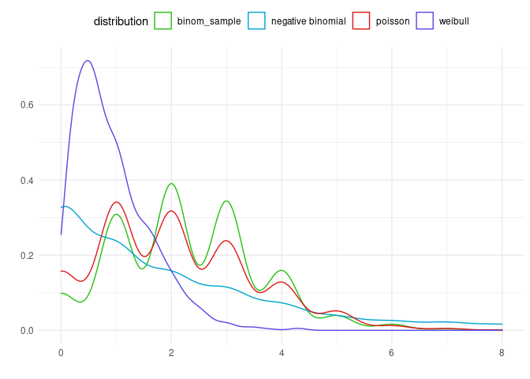

Distribution Sampling
================
Jesse Cambon
01 May, 2020

References: \* <http://appliedpredictivemodeling.com/data> \*
<http://faculty.marshall.usc.edu/gareth-james/ISL/data.html>

``` r
library(tidyverse)
library(bayestestR)
library(BayesFactor)
library(jcolors)
library(infer)
library(broom)
library(knitr)

set.seed(42) # for reproducibility
```

Perform sampling

``` r
bernouli_sample <- rbernoulli(10,p=0.9) # T/F
uniform = runif(10,-4,4)

num_rows <- 1000

dist <- 
  tibble(
    cauchy=rcauchy(num_rows,0,0.5),
    norm_sample = rnorm(num_rows,0,0.5),
    beta_sample = rbeta(num_rows,0,1)
) %>%
  pivot_longer(everything(),values_to='value',names_to='distribution')


# Distributions used for count data
count_dist <- tibble(poisson= rpois(num_rows,2),
                      `negative binomial`=rnbinom(num_rows,1,mu=2),
                      binom_sample = rbinom(num_rows,9,.25),
                      weibull=rweibull(num_rows,1.4)
                      ) %>%
  pivot_longer(everything(),values_to='value',names_to='distribution')
```

Compare some distributions

``` r
ggplot(data=dist,aes(x=value,color=distribution)) + 
#  facet_wrap(~distribution,ncol=1) +
  scale_x_continuous(limits =c(-3,3)) +
  theme_minimal() +
  theme(legend.position='top') +
  geom_density(alpha=0.8) +
  scale_color_jcolors('default') + 
  xlab('') + ylab('')
```

    ## Warning: Removed 116 rows containing non-finite values (stat_density).

<!-- -->

Poisson v Neg Binomial v Weibull

``` r
ggplot(data=count_dist,aes(x=value,color=distribution)) + 
#  facet_wrap(~distribution,ncol=1) +
  scale_x_continuous(limits =c(0,8)) +
  theme_minimal() +
  theme(legend.position='top') +
  geom_density(alpha=0.8) +
  scale_color_jcolors('default') + 
  xlab('') + ylab('')
```

    ## Warning: Removed 25 rows containing non-finite values (stat_density).

<!-- -->

## Significance Testing

### T-test (Frequentist version)

``` r
t.test(trees$Height)
```

    ## 
    ##  One Sample t-test
    ## 
    ## data:  trees$Height
    ## t = 66.41, df = 30, p-value < 2.2e-16
    ## alternative hypothesis: true mean is not equal to 0
    ## 95 percent confidence interval:
    ##  73.6628 78.3372
    ## sample estimates:
    ## mean of x 
    ##        76

Simulate some data and run more T-tests

``` r
compare_norms <- rnorm(100,25,10) %>%
  as_tibble() %>% rename(sample1=value) %>%
  mutate(sample2 = rnorm(100,28,10))

results <- t.test(compare_norms$sample1,compare_norms$sample2)
results
```

    ## 
    ##  Welch Two Sample t-test
    ## 
    ## data:  compare_norms$sample1 and compare_norms$sample2
    ## t = 1.4176, df = 197.32, p-value = 0.1579
    ## alternative hypothesis: true difference in means is not equal to 0
    ## 95 percent confidence interval:
    ##  -0.7904857  4.8324013
    ## sample estimates:
    ## mean of x mean of y 
    ##  28.30323  26.28227

Tidy T-test (infer package)

<https://infer.netlify.app/>

``` r
compare_norms_long <- 
  compare_norms %>%
  pivot_longer(everything(),names_to='sample',values_to='value')

compare_norms_long %>%
  t_test(value ~ sample,order=c('sample1','sample2')) %>%
  kable()
```

| statistic |    t\_df |  p\_value | alternative |   lower\_ci | upper\_ci |
| --------: | -------: | --------: | :---------- | ----------: | --------: |
|  1.417581 | 197.3181 | 0.1578903 | two.sided   | \-0.7904857 |  4.832401 |

### Bayesian T-test

<https://easystats.github.io/bayestestR/articles/example2.html>

``` r
bayes_result <- BayesFactor::ttestBF(compare_norms$sample1,compare_norms$sample2)
bayes_result
```

    ## Bayes factor analysis
    ## --------------
    ## [1] Alt., r=0.707 : 0.3932028 ±0%
    ## 
    ## Against denominator:
    ##   Null, mu1-mu2 = 0 
    ## ---
    ## Bayes factor type: BFindepSample, JZS

``` r
describe_posterior(bayes_result) %>% kable()
```

| Parameter  |   Median | CI |     CI\_low | CI\_high |      pd | ROPE\_CI | ROPE\_low | ROPE\_high | ROPE\_Percentage |        BF | Prior\_Distribution | Prior\_Location | Prior\_Scale |
| :--------- | -------: | -: | ----------: | -------: | ------: | -------: | --------: | ---------: | ---------------: | --------: | :------------------ | --------------: | -----------: |
| Difference | 1.885353 | 89 | \-0.2588156 | 4.222233 | 0.91725 |       89 |     \-0.1 |        0.1 |        0.0263971 | 0.3932028 | cauchy              |               0 |    0.7071068 |
