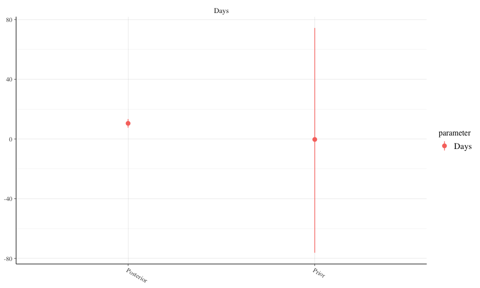
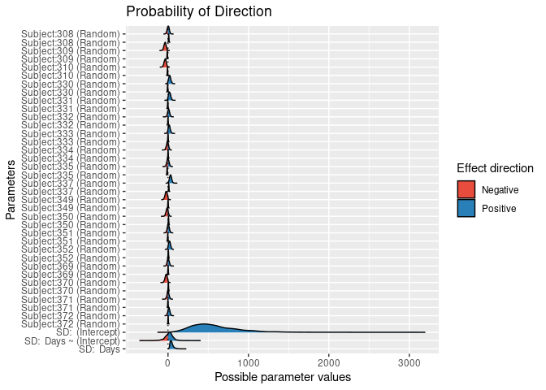

Multilevel Models
================
Jesse Cambon
February, 2021

  - [Bayesian approach](#bayesian-approach)

References:

  - <https://cran.r-project.org/web/packages/lme4/vignettes/lmer.pdf>
  - <https://www.rensvandeschoot.com/tutorials/lme4/>

<!-- end list -->

``` r
library(lme4)
library(broom.mixed)
library(rstanarm)
library(bayesplot)
library(tidyverse)
library(bayestestR)
```

``` r
fm1 <- lmer(Reaction ~ Days + (1 + Days | Subject), data = sleepstudy)
```

``` r
#sleepstudy
```

``` r
# Overall Trend
sleepstudy %>%
  ggplot(aes(x = Days, y = Reaction)) +
  geom_point() + geom_smooth(method = 'lm')
```

    ## `geom_smooth()` using formula 'y ~ x'

<!-- -->

``` r
#
sleepstudy %>%
  ggplot(aes(x = Days, y = Reaction)) +
  facet_wrap(~Subject) +
  geom_point() + geom_smooth(method = 'lm')
```

    ## `geom_smooth()` using formula 'y ~ x'

<!-- -->

``` r
tidy(fm1)
```

    ## # A tibble: 6 x 6
    ##   effect   group    term                  estimate std.error statistic
    ##   <chr>    <chr>    <chr>                    <dbl>     <dbl>     <dbl>
    ## 1 fixed    <NA>     (Intercept)           251.          6.82     36.8 
    ## 2 fixed    <NA>     Days                   10.5         1.55      6.77
    ## 3 ran_pars Subject  sd__(Intercept)        24.7        NA        NA   
    ## 4 ran_pars Subject  cor__(Intercept).Days   0.0656     NA        NA   
    ## 5 ran_pars Subject  sd__Days                5.92       NA        NA   
    ## 6 ran_pars Residual sd__Observation        25.6        NA        NA

``` r
glance(fm1)
```

    ## # A tibble: 1 x 6
    ##   sigma logLik   AIC   BIC REMLcrit df.residual
    ##   <dbl>  <dbl> <dbl> <dbl>    <dbl>       <int>
    ## 1  25.6  -872. 1756. 1775.    1744.         174

## Bayesian approach

<https://mc-stan.org/users/documentation/case-studies/tutorial_rstanarm.html>

``` r
bm1 <- stan_lmer(Reaction ~ Days + (1 + Days | Subject), data = sleepstudy)
```

    ## 
    ## SAMPLING FOR MODEL 'continuous' NOW (CHAIN 1).
    ## Chain 1: 
    ## Chain 1: Gradient evaluation took 0.000162 seconds
    ## Chain 1: 1000 transitions using 10 leapfrog steps per transition would take 1.62 seconds.
    ## Chain 1: Adjust your expectations accordingly!
    ## Chain 1: 
    ## Chain 1: 
    ## Chain 1: Iteration:    1 / 2000 [  0%]  (Warmup)
    ## Chain 1: Iteration:  200 / 2000 [ 10%]  (Warmup)
    ## Chain 1: Iteration:  400 / 2000 [ 20%]  (Warmup)
    ## Chain 1: Iteration:  600 / 2000 [ 30%]  (Warmup)
    ## Chain 1: Iteration:  800 / 2000 [ 40%]  (Warmup)
    ## Chain 1: Iteration: 1000 / 2000 [ 50%]  (Warmup)
    ## Chain 1: Iteration: 1001 / 2000 [ 50%]  (Sampling)
    ## Chain 1: Iteration: 1200 / 2000 [ 60%]  (Sampling)
    ## Chain 1: Iteration: 1400 / 2000 [ 70%]  (Sampling)
    ## Chain 1: Iteration: 1600 / 2000 [ 80%]  (Sampling)
    ## Chain 1: Iteration: 1800 / 2000 [ 90%]  (Sampling)
    ## Chain 1: Iteration: 2000 / 2000 [100%]  (Sampling)
    ## Chain 1: 
    ## Chain 1:  Elapsed Time: 13.8489 seconds (Warm-up)
    ## Chain 1:                6.09436 seconds (Sampling)
    ## Chain 1:                19.9433 seconds (Total)
    ## Chain 1: 
    ## 
    ## SAMPLING FOR MODEL 'continuous' NOW (CHAIN 2).
    ## Chain 2: 
    ## Chain 2: Gradient evaluation took 9.5e-05 seconds
    ## Chain 2: 1000 transitions using 10 leapfrog steps per transition would take 0.95 seconds.
    ## Chain 2: Adjust your expectations accordingly!
    ## Chain 2: 
    ## Chain 2: 
    ## Chain 2: Iteration:    1 / 2000 [  0%]  (Warmup)
    ## Chain 2: Iteration:  200 / 2000 [ 10%]  (Warmup)
    ## Chain 2: Iteration:  400 / 2000 [ 20%]  (Warmup)
    ## Chain 2: Iteration:  600 / 2000 [ 30%]  (Warmup)
    ## Chain 2: Iteration:  800 / 2000 [ 40%]  (Warmup)
    ## Chain 2: Iteration: 1000 / 2000 [ 50%]  (Warmup)
    ## Chain 2: Iteration: 1001 / 2000 [ 50%]  (Sampling)
    ## Chain 2: Iteration: 1200 / 2000 [ 60%]  (Sampling)
    ## Chain 2: Iteration: 1400 / 2000 [ 70%]  (Sampling)
    ## Chain 2: Iteration: 1600 / 2000 [ 80%]  (Sampling)
    ## Chain 2: Iteration: 1800 / 2000 [ 90%]  (Sampling)
    ## Chain 2: Iteration: 2000 / 2000 [100%]  (Sampling)
    ## Chain 2: 
    ## Chain 2:  Elapsed Time: 12.3924 seconds (Warm-up)
    ## Chain 2:                4.55831 seconds (Sampling)
    ## Chain 2:                16.9507 seconds (Total)
    ## Chain 2: 
    ## 
    ## SAMPLING FOR MODEL 'continuous' NOW (CHAIN 3).
    ## Chain 3: 
    ## Chain 3: Gradient evaluation took 8.7e-05 seconds
    ## Chain 3: 1000 transitions using 10 leapfrog steps per transition would take 0.87 seconds.
    ## Chain 3: Adjust your expectations accordingly!
    ## Chain 3: 
    ## Chain 3: 
    ## Chain 3: Iteration:    1 / 2000 [  0%]  (Warmup)
    ## Chain 3: Iteration:  200 / 2000 [ 10%]  (Warmup)
    ## Chain 3: Iteration:  400 / 2000 [ 20%]  (Warmup)
    ## Chain 3: Iteration:  600 / 2000 [ 30%]  (Warmup)
    ## Chain 3: Iteration:  800 / 2000 [ 40%]  (Warmup)
    ## Chain 3: Iteration: 1000 / 2000 [ 50%]  (Warmup)
    ## Chain 3: Iteration: 1001 / 2000 [ 50%]  (Sampling)
    ## Chain 3: Iteration: 1200 / 2000 [ 60%]  (Sampling)
    ## Chain 3: Iteration: 1400 / 2000 [ 70%]  (Sampling)
    ## Chain 3: Iteration: 1600 / 2000 [ 80%]  (Sampling)
    ## Chain 3: Iteration: 1800 / 2000 [ 90%]  (Sampling)
    ## Chain 3: Iteration: 2000 / 2000 [100%]  (Sampling)
    ## Chain 3: 
    ## Chain 3:  Elapsed Time: 16.181 seconds (Warm-up)
    ## Chain 3:                5.62487 seconds (Sampling)
    ## Chain 3:                21.8059 seconds (Total)
    ## Chain 3: 
    ## 
    ## SAMPLING FOR MODEL 'continuous' NOW (CHAIN 4).
    ## Chain 4: 
    ## Chain 4: Gradient evaluation took 8.2e-05 seconds
    ## Chain 4: 1000 transitions using 10 leapfrog steps per transition would take 0.82 seconds.
    ## Chain 4: Adjust your expectations accordingly!
    ## Chain 4: 
    ## Chain 4: 
    ## Chain 4: Iteration:    1 / 2000 [  0%]  (Warmup)
    ## Chain 4: Iteration:  200 / 2000 [ 10%]  (Warmup)
    ## Chain 4: Iteration:  400 / 2000 [ 20%]  (Warmup)
    ## Chain 4: Iteration:  600 / 2000 [ 30%]  (Warmup)
    ## Chain 4: Iteration:  800 / 2000 [ 40%]  (Warmup)
    ## Chain 4: Iteration: 1000 / 2000 [ 50%]  (Warmup)
    ## Chain 4: Iteration: 1001 / 2000 [ 50%]  (Sampling)
    ## Chain 4: Iteration: 1200 / 2000 [ 60%]  (Sampling)
    ## Chain 4: Iteration: 1400 / 2000 [ 70%]  (Sampling)
    ## Chain 4: Iteration: 1600 / 2000 [ 80%]  (Sampling)
    ## Chain 4: Iteration: 1800 / 2000 [ 90%]  (Sampling)
    ## Chain 4: Iteration: 2000 / 2000 [100%]  (Sampling)
    ## Chain 4: 
    ## Chain 4:  Elapsed Time: 16.6156 seconds (Warm-up)
    ## Chain 4:                5.23911 seconds (Sampling)
    ## Chain 4:                21.8547 seconds (Total)
    ## Chain 4:

``` r
pp_check(bm1)
```

<!-- -->

``` r
mcmc_areas(bm1)
```

<!-- -->

Posterior predictive check

``` r
ppc_ribbon_grouped(
  y = sleepstudy$Reaction,
  yrep = posterior_predict(bm1),
  x = sleepstudy$Days,
  prob = 0.5,
  group = sleepstudy$Subject
) 
```

<!-- -->

``` r
plot(p_direction(bm1, effects = "fixed", component = "all"))
```

<!-- -->

``` r
plot(p_direction(bm1, effects = "random", component = "all"))
```

<!-- -->

``` r
p_direction(bm1, effects = 'all')
```

    ## # Probability of Direction (pd)
    ## 
    ## # Fixed Effects (Conditional Model)
    ## 
    ## Parameter   |      pd
    ## ---------------------
    ## (Intercept) | 100.00%
    ## Days        | 100.00%
    ## 
    ## # Random Effects (Conditional Model)
    ## 
    ## Parameter                              |      pd
    ## ------------------------------------------------
    ## Subject:308                            |  58.93%
    ## Subject:308                            |  99.95%
    ## Subject:309                            |  99.60%
    ## Subject:309                            |  99.95%
    ## Subject:310                            |  99.80%
    ## Subject:310                            |  98.05%
    ## Subject:330                            |  94.42%
    ## Subject:330                            |  93.83%
    ## Subject:331                            |  93.58%
    ## Subject:331                            |  82.85%
    ## Subject:332                            |  74.55%
    ## Subject:332                            |  51.02%
    ## Subject:333                            |  88.50%
    ## Subject:333                            |  51.78%
    ## Subject:334                            |  68.77%
    ## Subject:334                            |  64.08%
    ## Subject:335                            |  53.40%
    ## Subject:335                            | 100.00%
    ## Subject:337                            |  99.30%
    ## Subject:337                            |  99.92%
    ## Subject:349                            |  95.62%
    ## Subject:349                            |  60.22%
    ## Subject:350                            |  80.77%
    ## Subject:350                            |  99.15%
    ## Subject:351                            |  60.65%
    ## Subject:351                            |  86.25%
    ## Subject:352                            |  93.38%
    ## Subject:352                            |  91.95%
    ## Subject:369                            |  59.38%
    ## Subject:369                            |  62.90%
    ## Subject:370                            |  95.83%
    ## Subject:370                            |  93.67%
    ## Subject:371                            |  51.52%
    ## Subject:371                            |  64.20%
    ## Subject:372                            |  81.60%
    ## Subject:372                            |  71.23%
    ## Sigma[Subject:(Intercept),(Intercept)] | 100.00%
    ## Sigma[Subject:Days,(Intercept)]        |  64.00%
    ## Sigma[Subject:Days,Days]               | 100.00%

``` r
summary(bm1)
```

    ## 
    ## Model Info:
    ##  function:     stan_lmer
    ##  family:       gaussian [identity]
    ##  formula:      Reaction ~ Days + (1 + Days | Subject)
    ##  algorithm:    sampling
    ##  sample:       4000 (posterior sample size)
    ##  priors:       see help('prior_summary')
    ##  observations: 180
    ##  groups:       Subject (18)
    ## 
    ## Estimates:
    ##                                          mean   sd    10%   50%   90%
    ## (Intercept)                            251.4    6.6 243.2 251.4 259.6
    ## Days                                    10.4    1.7   8.3  10.5  12.6
    ## b[(Intercept) Subject:308]               2.7   13.0 -13.7   2.8  18.9
    ## b[Days Subject:308]                      9.2    2.8   5.7   9.0  12.9
    ## b[(Intercept) Subject:309]             -36.8   14.2 -55.0 -36.4 -19.0
    ## b[Days Subject:309]                     -9.2    2.9 -12.8  -9.2  -5.6
    ## b[(Intercept) Subject:310]             -35.7   13.8 -53.6 -35.0 -18.1
    ## b[Days Subject:310]                     -5.9    2.8  -9.6  -5.9  -2.3
    ## b[(Intercept) Subject:330]              21.2   13.9   3.7  21.0  39.2
    ## b[Days Subject:330]                     -4.4    2.9  -8.2  -4.3  -0.8
    ## b[(Intercept) Subject:331]              19.9   13.6   2.9  19.3  37.2
    ## b[Days Subject:331]                     -2.7    2.9  -6.4  -2.6   0.9
    ## b[(Intercept) Subject:332]               8.1   12.5  -7.3   7.8  24.0
    ## b[Days Subject:332]                     -0.1    2.7  -3.6  -0.1   3.3
    ## b[(Intercept) Subject:333]              15.1   13.0  -0.7  14.9  32.0
    ## b[Days Subject:333]                      0.1    2.8  -3.4   0.1   3.6
    ## b[(Intercept) Subject:334]              -6.5   13.0 -23.5  -6.1   9.6
    ## b[Days Subject:334]                      1.0    2.8  -2.4   1.0   4.5
    ## b[(Intercept) Subject:335]              -0.8   13.7 -17.9  -1.3  16.9
    ## b[Days Subject:335]                    -10.6    2.9 -14.3 -10.6  -7.0
    ## b[(Intercept) Subject:337]              32.0   13.6  15.1  31.9  49.1
    ## b[Days Subject:337]                      9.1    2.9   5.5   9.1  12.8
    ## b[(Intercept) Subject:349]             -22.7   14.0 -40.8 -22.6  -5.4
    ## b[Days Subject:349]                      0.8    2.9  -2.7   0.8   4.6
    ## b[(Intercept) Subject:350]             -11.4   13.2 -28.8 -11.0   5.3
    ## b[Days Subject:350]                      6.4    2.9   2.8   6.3  10.2
    ## b[(Intercept) Subject:351]               3.8   12.6 -12.1   3.3  19.9
    ## b[Days Subject:351]                     -2.9    2.7  -6.4  -2.8   0.5
    ## b[(Intercept) Subject:352]              18.8   13.0   2.4  18.6  35.5
    ## b[Days Subject:352]                      3.9    2.8   0.3   3.8   7.4
    ## b[(Intercept) Subject:369]               2.9   12.7 -12.8   2.6  19.3
    ## b[Days Subject:369]                      0.9    2.8  -2.6   1.0   4.5
    ## b[(Intercept) Subject:370]             -23.2   13.8 -41.3 -22.6  -5.9
    ## b[Days Subject:370]                      4.4    2.9   0.8   4.4   8.2
    ## b[(Intercept) Subject:371]               0.5   12.7 -15.5   0.5  17.0
    ## b[Days Subject:371]                     -0.9    2.7  -4.3  -0.9   2.6
    ## b[(Intercept) Subject:372]              11.2   12.8  -5.0  10.9  27.3
    ## b[Days Subject:372]                      1.5    2.7  -1.9   1.5   4.9
    ## sigma                                   26.0    1.5  24.1  25.9  27.9
    ## Sigma[Subject:(Intercept),(Intercept)] 578.4  296.1 263.6 522.6 969.2
    ## Sigma[Subject:Days,(Intercept)]         12.6   49.6 -45.6  15.6  68.5
    ## Sigma[Subject:Days,Days]                46.8   22.0  24.5  42.3  74.9
    ## 
    ## Fit Diagnostics:
    ##            mean   sd    10%   50%   90%
    ## mean_PPD 298.5    2.8 294.9 298.5 301.9
    ## 
    ## The mean_ppd is the sample average posterior predictive distribution of the outcome variable (for details see help('summary.stanreg')).
    ## 
    ## MCMC diagnostics
    ##                                        mcse Rhat n_eff
    ## (Intercept)                            0.1  1.0  2060 
    ## Days                                   0.0  1.0  1338 
    ## b[(Intercept) Subject:308]             0.2  1.0  3264 
    ## b[Days Subject:308]                    0.1  1.0  1988 
    ## b[(Intercept) Subject:309]             0.2  1.0  3854 
    ## b[Days Subject:309]                    0.1  1.0  2786 
    ## b[(Intercept) Subject:310]             0.2  1.0  3949 
    ## b[Days Subject:310]                    0.1  1.0  2799 
    ## b[(Intercept) Subject:330]             0.3  1.0  2431 
    ## b[Days Subject:330]                    0.1  1.0  2256 
    ## b[(Intercept) Subject:331]             0.3  1.0  2765 
    ## b[Days Subject:331]                    0.1  1.0  2213 
    ## b[(Intercept) Subject:332]             0.2  1.0  3480 
    ## b[Days Subject:332]                    0.1  1.0  2166 
    ## b[(Intercept) Subject:333]             0.2  1.0  3361 
    ## b[Days Subject:333]                    0.1  1.0  2406 
    ## b[(Intercept) Subject:334]             0.2  1.0  3441 
    ## b[Days Subject:334]                    0.1  1.0  2434 
    ## b[(Intercept) Subject:335]             0.3  1.0  1972 
    ## b[Days Subject:335]                    0.1  1.0  1963 
    ## b[(Intercept) Subject:337]             0.2  1.0  3989 
    ## b[Days Subject:337]                    0.1  1.0  2988 
    ## b[(Intercept) Subject:349]             0.2  1.0  3638 
    ## b[Days Subject:349]                    0.1  1.0  2387 
    ## b[(Intercept) Subject:350]             0.2  1.0  2866 
    ## b[Days Subject:350]                    0.1  1.0  2038 
    ## b[(Intercept) Subject:351]             0.2  1.0  2982 
    ## b[Days Subject:351]                    0.1  1.0  2125 
    ## b[(Intercept) Subject:352]             0.2  1.0  3902 
    ## b[Days Subject:352]                    0.1  1.0  2708 
    ## b[(Intercept) Subject:369]             0.2  1.0  4568 
    ## b[Days Subject:369]                    0.1  1.0  2630 
    ## b[(Intercept) Subject:370]             0.3  1.0  2750 
    ## b[Days Subject:370]                    0.1  1.0  1870 
    ## b[(Intercept) Subject:371]             0.2  1.0  3877 
    ## b[Days Subject:371]                    0.1  1.0  2553 
    ## b[(Intercept) Subject:372]             0.2  1.0  4102 
    ## b[Days Subject:372]                    0.1  1.0  2381 
    ## sigma                                  0.0  1.0  3174 
    ## Sigma[Subject:(Intercept),(Intercept)] 6.6  1.0  1989 
    ## Sigma[Subject:Days,(Intercept)]        1.6  1.0   970 
    ## Sigma[Subject:Days,Days]               0.5  1.0  1860 
    ## mean_PPD                               0.0  1.0  4081 
    ## log-posterior                          0.2  1.0   766 
    ## 
    ## For each parameter, mcse is Monte Carlo standard error, n_eff is a crude measure of effective sample size, and Rhat is the potential scale reduction factor on split chains (at convergence Rhat=1).
