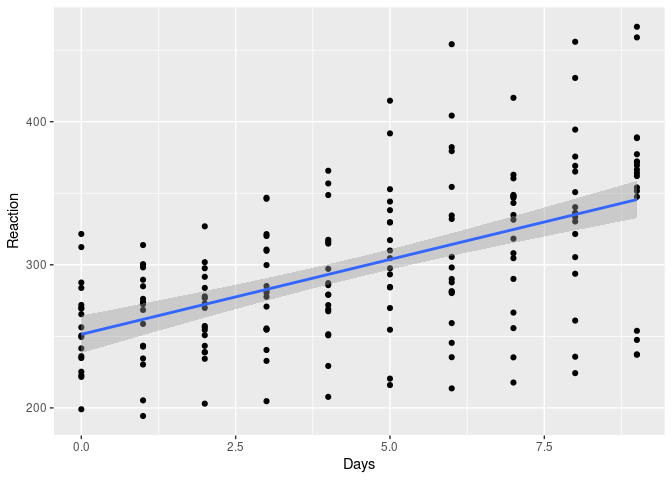
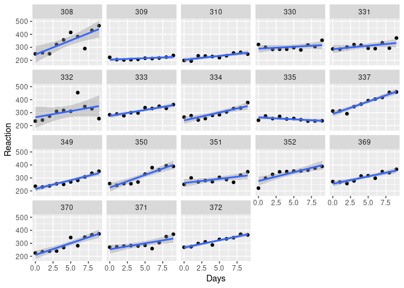
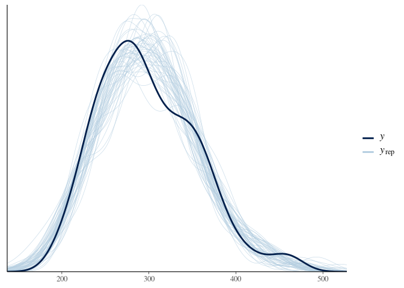
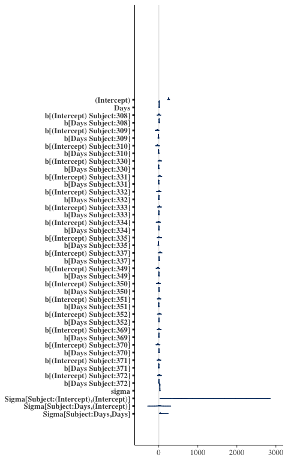
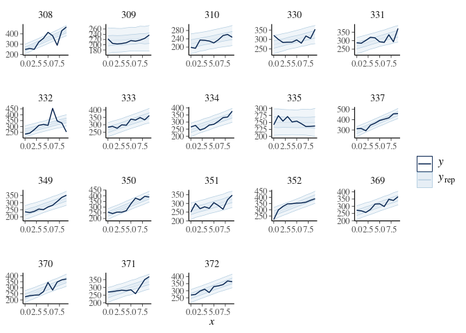

Multilevel Models
================
Jesse Cambon
February, 2021

-   [Bayesian approach](#bayesian-approach)

References:

-   <https://cran.r-project.org/web/packages/lme4/vignettes/lmer.pdf>
-   <https://www.rensvandeschoot.com/tutorials/lme4/>

``` r
library(lme4)
library(rstanarm)
library(bayesplot)
library(tidyverse)
```

``` r
fm1 <- lmer(Reaction ~ Days + (1 + Days | Subject), data = sleepstudy)
```

``` r
#sleepstudy
```

``` r
# Overall Trend
sleepstudy %>%
  ggplot(aes(x = Days, y = Reaction)) +
  geom_point() + geom_smooth(method = 'lm')
```

    ## `geom_smooth()` using formula 'y ~ x'

<!-- -->

``` r
#
sleepstudy %>%
  ggplot(aes(x = Days, y = Reaction)) +
  facet_wrap(~Subject) +
  geom_point() + geom_smooth(method = 'lm')
```

    ## `geom_smooth()` using formula 'y ~ x'

<!-- -->

``` r
summary(fm1)
```

    ## Linear mixed model fit by REML ['lmerMod']
    ## Formula: Reaction ~ Days + (1 + Days | Subject)
    ##    Data: sleepstudy
    ## 
    ## REML criterion at convergence: 1743.6
    ## 
    ## Scaled residuals: 
    ##     Min      1Q  Median      3Q     Max 
    ## -3.9536 -0.4634  0.0231  0.4634  5.1793 
    ## 
    ## Random effects:
    ##  Groups   Name        Variance Std.Dev. Corr
    ##  Subject  (Intercept) 612.10   24.741       
    ##           Days         35.07    5.922   0.07
    ##  Residual             654.94   25.592       
    ## Number of obs: 180, groups:  Subject, 18
    ## 
    ## Fixed effects:
    ##             Estimate Std. Error t value
    ## (Intercept)  251.405      6.825  36.838
    ## Days          10.467      1.546   6.771
    ## 
    ## Correlation of Fixed Effects:
    ##      (Intr)
    ## Days -0.138

## Bayesian approach

<https://mc-stan.org/users/documentation/case-studies/tutorial_rstanarm.html>

``` r
bm1 <- stan_lmer(Reaction ~ Days + (1 + Days | Subject), data = sleepstudy)
```

    ## 
    ## SAMPLING FOR MODEL 'continuous' NOW (CHAIN 1).
    ## Chain 1: 
    ## Chain 1: Gradient evaluation took 0.00031 seconds
    ## Chain 1: 1000 transitions using 10 leapfrog steps per transition would take 3.1 seconds.
    ## Chain 1: Adjust your expectations accordingly!
    ## Chain 1: 
    ## Chain 1: 
    ## Chain 1: Iteration:    1 / 2000 [  0%]  (Warmup)
    ## Chain 1: Iteration:  200 / 2000 [ 10%]  (Warmup)
    ## Chain 1: Iteration:  400 / 2000 [ 20%]  (Warmup)
    ## Chain 1: Iteration:  600 / 2000 [ 30%]  (Warmup)
    ## Chain 1: Iteration:  800 / 2000 [ 40%]  (Warmup)
    ## Chain 1: Iteration: 1000 / 2000 [ 50%]  (Warmup)
    ## Chain 1: Iteration: 1001 / 2000 [ 50%]  (Sampling)
    ## Chain 1: Iteration: 1200 / 2000 [ 60%]  (Sampling)
    ## Chain 1: Iteration: 1400 / 2000 [ 70%]  (Sampling)
    ## Chain 1: Iteration: 1600 / 2000 [ 80%]  (Sampling)
    ## Chain 1: Iteration: 1800 / 2000 [ 90%]  (Sampling)
    ## Chain 1: Iteration: 2000 / 2000 [100%]  (Sampling)
    ## Chain 1: 
    ## Chain 1:  Elapsed Time: 9.66258 seconds (Warm-up)
    ## Chain 1:                4.06258 seconds (Sampling)
    ## Chain 1:                13.7252 seconds (Total)
    ## Chain 1: 
    ## 
    ## SAMPLING FOR MODEL 'continuous' NOW (CHAIN 2).
    ## Chain 2: 
    ## Chain 2: Gradient evaluation took 5.8e-05 seconds
    ## Chain 2: 1000 transitions using 10 leapfrog steps per transition would take 0.58 seconds.
    ## Chain 2: Adjust your expectations accordingly!
    ## Chain 2: 
    ## Chain 2: 
    ## Chain 2: Iteration:    1 / 2000 [  0%]  (Warmup)
    ## Chain 2: Iteration:  200 / 2000 [ 10%]  (Warmup)
    ## Chain 2: Iteration:  400 / 2000 [ 20%]  (Warmup)
    ## Chain 2: Iteration:  600 / 2000 [ 30%]  (Warmup)
    ## Chain 2: Iteration:  800 / 2000 [ 40%]  (Warmup)
    ## Chain 2: Iteration: 1000 / 2000 [ 50%]  (Warmup)
    ## Chain 2: Iteration: 1001 / 2000 [ 50%]  (Sampling)
    ## Chain 2: Iteration: 1200 / 2000 [ 60%]  (Sampling)
    ## Chain 2: Iteration: 1400 / 2000 [ 70%]  (Sampling)
    ## Chain 2: Iteration: 1600 / 2000 [ 80%]  (Sampling)
    ## Chain 2: Iteration: 1800 / 2000 [ 90%]  (Sampling)
    ## Chain 2: Iteration: 2000 / 2000 [100%]  (Sampling)
    ## Chain 2: 
    ## Chain 2:  Elapsed Time: 10.1159 seconds (Warm-up)
    ## Chain 2:                3.425 seconds (Sampling)
    ## Chain 2:                13.5409 seconds (Total)
    ## Chain 2: 
    ## 
    ## SAMPLING FOR MODEL 'continuous' NOW (CHAIN 3).
    ## Chain 3: 
    ## Chain 3: Gradient evaluation took 6e-05 seconds
    ## Chain 3: 1000 transitions using 10 leapfrog steps per transition would take 0.6 seconds.
    ## Chain 3: Adjust your expectations accordingly!
    ## Chain 3: 
    ## Chain 3: 
    ## Chain 3: Iteration:    1 / 2000 [  0%]  (Warmup)
    ## Chain 3: Iteration:  200 / 2000 [ 10%]  (Warmup)
    ## Chain 3: Iteration:  400 / 2000 [ 20%]  (Warmup)
    ## Chain 3: Iteration:  600 / 2000 [ 30%]  (Warmup)
    ## Chain 3: Iteration:  800 / 2000 [ 40%]  (Warmup)
    ## Chain 3: Iteration: 1000 / 2000 [ 50%]  (Warmup)
    ## Chain 3: Iteration: 1001 / 2000 [ 50%]  (Sampling)
    ## Chain 3: Iteration: 1200 / 2000 [ 60%]  (Sampling)
    ## Chain 3: Iteration: 1400 / 2000 [ 70%]  (Sampling)
    ## Chain 3: Iteration: 1600 / 2000 [ 80%]  (Sampling)
    ## Chain 3: Iteration: 1800 / 2000 [ 90%]  (Sampling)
    ## Chain 3: Iteration: 2000 / 2000 [100%]  (Sampling)
    ## Chain 3: 
    ## Chain 3:  Elapsed Time: 8.49661 seconds (Warm-up)
    ## Chain 3:                3.65741 seconds (Sampling)
    ## Chain 3:                12.154 seconds (Total)
    ## Chain 3: 
    ## 
    ## SAMPLING FOR MODEL 'continuous' NOW (CHAIN 4).
    ## Chain 4: 
    ## Chain 4: Gradient evaluation took 6.6e-05 seconds
    ## Chain 4: 1000 transitions using 10 leapfrog steps per transition would take 0.66 seconds.
    ## Chain 4: Adjust your expectations accordingly!
    ## Chain 4: 
    ## Chain 4: 
    ## Chain 4: Iteration:    1 / 2000 [  0%]  (Warmup)
    ## Chain 4: Iteration:  200 / 2000 [ 10%]  (Warmup)
    ## Chain 4: Iteration:  400 / 2000 [ 20%]  (Warmup)
    ## Chain 4: Iteration:  600 / 2000 [ 30%]  (Warmup)
    ## Chain 4: Iteration:  800 / 2000 [ 40%]  (Warmup)
    ## Chain 4: Iteration: 1000 / 2000 [ 50%]  (Warmup)
    ## Chain 4: Iteration: 1001 / 2000 [ 50%]  (Sampling)
    ## Chain 4: Iteration: 1200 / 2000 [ 60%]  (Sampling)
    ## Chain 4: Iteration: 1400 / 2000 [ 70%]  (Sampling)
    ## Chain 4: Iteration: 1600 / 2000 [ 80%]  (Sampling)
    ## Chain 4: Iteration: 1800 / 2000 [ 90%]  (Sampling)
    ## Chain 4: Iteration: 2000 / 2000 [100%]  (Sampling)
    ## Chain 4: 
    ## Chain 4:  Elapsed Time: 14.0472 seconds (Warm-up)
    ## Chain 4:                3.38213 seconds (Sampling)
    ## Chain 4:                17.4293 seconds (Total)
    ## Chain 4:

``` r
pp_check(bm1)
```

<!-- -->

``` r
mcmc_areas(bm1)
```

<!-- -->

Posterior predictive check

``` r
ppc_ribbon_grouped(
  y = sleepstudy$Reaction,
  yrep = posterior_predict(bm1),
  x = sleepstudy$Days,
  prob = 0.5,
  group = sleepstudy$Subject
) 
```

<!-- -->

``` r
#posterior_vs_prior(bm1, pars = "beta", group_by_parameter = TRUE )
```

``` r
summary(bm1)
```

    ## 
    ## Model Info:
    ## 
    ##  function:     stan_lmer
    ##  family:       gaussian [identity]
    ##  formula:      Reaction ~ Days + (1 + Days | Subject)
    ##  algorithm:    sampling
    ##  sample:       4000 (posterior sample size)
    ##  priors:       see help('prior_summary')
    ##  observations: 180
    ##  groups:       Subject (18)
    ## 
    ## Estimates:
    ##                                          mean   sd    10%   50%   90%
    ## (Intercept)                            251.4    6.8 242.7 251.4 260.2
    ## Days                                    10.5    1.8   8.3  10.5  12.8
    ## b[(Intercept) Subject:308]               1.9   13.0 -14.9   2.3  18.5
    ## b[Days Subject:308]                      9.2    2.9   5.6   9.2  12.9
    ## b[(Intercept) Subject:309]             -37.1   13.5 -54.2 -36.9 -19.7
    ## b[Days Subject:309]                     -9.2    2.9 -13.0  -9.2  -5.7
    ## b[(Intercept) Subject:310]             -35.7   14.0 -53.8 -35.2 -17.8
    ## b[Days Subject:310]                     -6.1    2.9  -9.8  -6.0  -2.4
    ## b[(Intercept) Subject:330]              21.4   14.0   3.6  20.8  39.6
    ## b[Days Subject:330]                     -4.6    3.0  -8.4  -4.5  -0.8
    ## b[(Intercept) Subject:331]              20.4   13.8   3.5  19.6  38.7
    ## b[Days Subject:331]                     -2.8    2.9  -6.6  -2.7   0.8
    ## b[(Intercept) Subject:332]               8.1   13.0  -8.1   7.9  25.1
    ## b[Days Subject:332]                     -0.2    2.8  -3.9  -0.2   3.3
    ## b[(Intercept) Subject:333]              15.2   13.0  -0.8  14.8  31.6
    ## b[Days Subject:333]                     -0.1    2.8  -3.7   0.0   3.5
    ## b[(Intercept) Subject:334]              -6.9   12.5 -22.9  -6.5   8.8
    ## b[Days Subject:334]                      0.9    2.8  -2.5   0.9   4.5
    ## b[(Intercept) Subject:335]              -0.3   14.2 -18.1  -0.9  18.0
    ## b[Days Subject:335]                    -10.9    3.0 -14.8 -10.7  -7.1
    ## b[(Intercept) Subject:337]              31.5   13.6  14.6  30.9  49.4
    ## b[Days Subject:337]                      9.1    2.9   5.4   9.1  12.8
    ## b[(Intercept) Subject:349]             -22.9   13.6 -41.3 -22.3  -6.0
    ## b[Days Subject:349]                      0.7    2.9  -3.0   0.7   4.5
    ## b[(Intercept) Subject:350]             -11.6   13.1 -28.5 -11.2   4.8
    ## b[Days Subject:350]                      6.3    2.8   2.8   6.2   9.9
    ## b[(Intercept) Subject:351]               4.2   12.6 -11.8   4.0  20.3
    ## b[Days Subject:351]                     -3.0    2.8  -6.7  -3.0   0.5
    ## b[(Intercept) Subject:352]              18.9   12.6   3.2  18.5  35.5
    ## b[Days Subject:352]                      3.8    2.8   0.3   3.8   7.2
    ## b[(Intercept) Subject:369]               3.0   12.8 -13.0   3.0  19.4
    ## b[Days Subject:369]                      0.8    2.7  -2.6   0.8   4.3
    ## b[(Intercept) Subject:370]             -23.1   13.8 -41.4 -22.4  -5.6
    ## b[Days Subject:370]                      4.4    3.0   0.7   4.3   8.1
    ## b[(Intercept) Subject:371]               0.5   12.9 -15.7   0.3  17.0
    ## b[Days Subject:371]                     -1.0    2.8  -4.5  -1.0   2.6
    ## b[(Intercept) Subject:372]              11.0   12.9  -5.3  10.9  27.7
    ## b[Days Subject:372]                      1.4    2.8  -2.3   1.4   4.9
    ## sigma                                   26.0    1.6  24.0  25.9  28.1
    ## Sigma[Subject:(Intercept),(Intercept)] 583.6  303.1 267.2 525.1 969.4
    ## Sigma[Subject:Days,(Intercept)]          9.7   51.8 -52.7  12.8  68.6
    ## Sigma[Subject:Days,Days]                47.8   23.2  25.0  42.8  76.7
    ## 
    ## Fit Diagnostics:
    ##            mean   sd    10%   50%   90%
    ## mean_PPD 298.5    2.8 295.1 298.5 302.1
    ## 
    ## The mean_ppd is the sample average posterior predictive distribution of the outcome variable (for details see help('summary.stanreg')).
    ## 
    ## MCMC diagnostics
    ##                                        mcse Rhat n_eff
    ## (Intercept)                            0.2  1.0  1832 
    ## Days                                   0.1  1.0  1312 
    ## b[(Intercept) Subject:308]             0.3  1.0  2707 
    ## b[Days Subject:308]                    0.1  1.0  2021 
    ## b[(Intercept) Subject:309]             0.2  1.0  3448 
    ## b[Days Subject:309]                    0.1  1.0  2308 
    ## b[(Intercept) Subject:310]             0.2  1.0  3355 
    ## b[Days Subject:310]                    0.1  1.0  2475 
    ## b[(Intercept) Subject:330]             0.3  1.0  2265 
    ## b[Days Subject:330]                    0.1  1.0  1930 
    ## b[(Intercept) Subject:331]             0.3  1.0  2724 
    ## b[Days Subject:331]                    0.1  1.0  2110 
    ## b[(Intercept) Subject:332]             0.2  1.0  3081 
    ## b[Days Subject:332]                    0.1  1.0  1953 
    ## b[(Intercept) Subject:333]             0.2  1.0  3674 
    ## b[Days Subject:333]                    0.1  1.0  2230 
    ## b[(Intercept) Subject:334]             0.2  1.0  3026 
    ## b[Days Subject:334]                    0.1  1.0  2280 
    ## b[(Intercept) Subject:335]             0.3  1.0  2238 
    ## b[Days Subject:335]                    0.1  1.0  1576 
    ## b[(Intercept) Subject:337]             0.2  1.0  3611 
    ## b[Days Subject:337]                    0.1  1.0  2605 
    ## b[(Intercept) Subject:349]             0.3  1.0  2974 
    ## b[Days Subject:349]                    0.1  1.0  2237 
    ## b[(Intercept) Subject:350]             0.3  1.0  2413 
    ## b[Days Subject:350]                    0.1  1.0  2010 
    ## b[(Intercept) Subject:351]             0.2  1.0  3314 
    ## b[Days Subject:351]                    0.1  1.0  1830 
    ## b[(Intercept) Subject:352]             0.2  1.0  3143 
    ## b[Days Subject:352]                    0.1  1.0  2039 
    ## b[(Intercept) Subject:369]             0.2  1.0  3008 
    ## b[Days Subject:369]                    0.1  1.0  2138 
    ## b[(Intercept) Subject:370]             0.3  1.0  2680 
    ## b[Days Subject:370]                    0.1  1.0  1975 
    ## b[(Intercept) Subject:371]             0.2  1.0  3316 
    ## b[Days Subject:371]                    0.1  1.0  2281 
    ## b[(Intercept) Subject:372]             0.2  1.0  3398 
    ## b[Days Subject:372]                    0.1  1.0  2143 
    ## sigma                                  0.0  1.0  2780 
    ## Sigma[Subject:(Intercept),(Intercept)] 6.7  1.0  2025 
    ## Sigma[Subject:Days,(Intercept)]        1.7  1.0   907 
    ## Sigma[Subject:Days,Days]               0.6  1.0  1581 
    ## mean_PPD                               0.0  1.0  3780 
    ## log-posterior                          0.2  1.0   860 
    ## 
    ## For each parameter, mcse is Monte Carlo standard error, n_eff is a crude measure of effective sample size, and Rhat is the potential scale reduction factor on split chains (at convergence Rhat=1).
