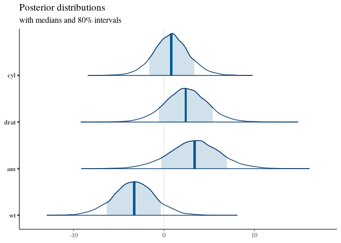
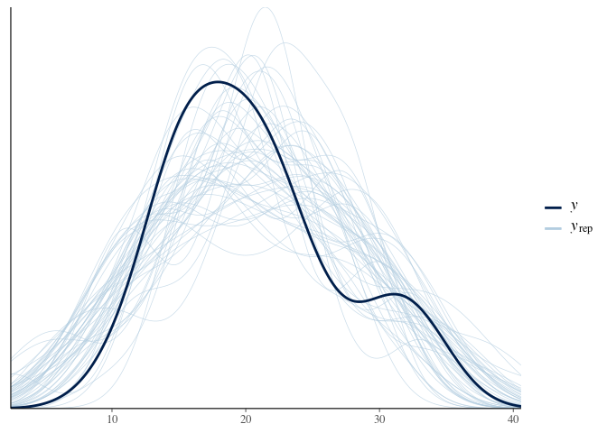

Parsnip
================
Jesse Cambon
12 April, 2020

References: \*
<https://tidymodels.github.io/parsnip/articles/parsnip_Intro.html> \*
<https://www.tidyverse.org/blog/2018/11/parsnip-0-0-1/> \*
<https://m-clark.github.io/workshops/bayesian/04_R.html>

Requires packages: ranger, randomForest, rstanarm

## Setup

``` r
library(parsnip)
library(tidymodels)
```

    ## ── Attaching packages ────────────────────────────────────────────────────────────────────── tidymodels 0.1.0 ──

    ## ✓ broom     0.5.5     ✓ recipes   0.1.9
    ## ✓ dials     0.0.6     ✓ rsample   0.0.6
    ## ✓ dplyr     0.8.5     ✓ tibble    2.1.3
    ## ✓ ggplot2   3.3.0     ✓ tune      0.1.0
    ## ✓ infer     0.5.1     ✓ workflows 0.1.1
    ## ✓ purrr     0.3.3     ✓ yardstick 0.0.6

    ## ── Conflicts ───────────────────────────────────────────────────────────────────────── tidymodels_conflicts() ──
    ## x purrr::discard()    masks scales::discard()
    ## x dplyr::filter()     masks stats::filter()
    ## x recipes::fixed()    masks stringr::fixed()
    ## x dplyr::lag()        masks stats::lag()
    ## x ggplot2::margin()   masks dials::margin()
    ## x recipes::step()     masks stats::step()
    ## x recipes::yj_trans() masks scales::yj_trans()

``` r
set.seed(4831) # set seed for reproducibility
# Split data
split <- initial_split(mtcars, props = 9/10)
car_train <- training(split)
car_test  <- testing(split)

# Defines type of model we want
car_model <- linear_reg()
```

## Bayesian Model

``` r
library(rstanarm)
```

    ## Loading required package: Rcpp

    ## 
    ## Attaching package: 'Rcpp'

    ## The following object is masked from 'package:rsample':
    ## 
    ##     populate

    ## rstanarm (Version 2.19.3, packaged: 2020-02-11 05:16:41 UTC)

    ## - Do not expect the default priors to remain the same in future rstanarm versions.

    ## Thus, R scripts should specify priors explicitly, even if they are just the defaults.

    ## - For execution on a local, multicore CPU with excess RAM we recommend calling

    ## options(mc.cores = parallel::detectCores())

    ## - bayesplot theme set to bayesplot::theme_default()

    ##    * Does _not_ affect other ggplot2 plots

    ##    * See ?bayesplot_theme_set for details on theme setting

``` r
wide_prior <- normal(0, 10)

stan_car_model <- 
  car_model %>%
  set_engine("stan", iter = 5000, prior = wide_prior, seed = 2347)
stan_car_model
```

    ## Linear Regression Model Specification (regression)
    ## 
    ## Engine-Specific Arguments:
    ##   iter = 5000
    ##   prior = wide_prior
    ##   seed = 2347
    ## 
    ## Computational engine: stan

``` r
# don't print anything:
ctrl <- fit_control(verbosity = 0)

stan_fit <- 
  stan_car_model %>%
    fit(mpg ~ ., data = car_train, control = ctrl)
stan_fit
```

    ## parsnip model object
    ## 
    ## Fit time:  6s 
    ## stan_glm
    ##  family:       gaussian [identity]
    ##  formula:      mpg ~ .
    ##  observations: 24
    ##  predictors:   11
    ## ------
    ##             Median MAD_SD
    ## (Intercept) -10.9   32.4 
    ## cyl           0.8    1.9 
    ## disp          0.0    0.0 
    ## hp            0.0    0.0 
    ## drat          2.4    2.3 
    ## wt           -3.3    2.3 
    ## qsec          1.0    0.9 
    ## vs            1.5    2.9 
    ## am            3.4    2.8 
    ## gear          2.6    2.8 
    ## carb         -0.9    1.3 
    ## 
    ## Auxiliary parameter(s):
    ##       Median MAD_SD
    ## sigma 3.0    0.6   
    ## 
    ## ------
    ## * For help interpreting the printed output see ?print.stanreg
    ## * For info on the priors used see ?prior_summary.stanreg

``` r
predict(stan_fit, car_test,type='conf_int')
```

    ## # A tibble: 8 x 2
    ##   .pred_lower .pred_upper
    ##         <dbl>       <dbl>
    ## 1       17.2         26.1
    ## 2       11.1         18.9
    ## 3       11.2         19.3
    ## 4        6.95        18.1
    ## 5       13.2         29.4
    ## 6       13.5         21.7
    ## 7       26.0         31.3
    ## 8       12.5         36.4

``` r
library(tidybayes)
```

    ## 
    ## Attaching package: 'tidybayes'

    ## The following object is masked from 'package:tune':
    ## 
    ##     parameters

    ## The following object is masked from 'package:dials':
    ## 
    ##     parameters

``` r
library(bayesplot)
```

    ## This is bayesplot version 1.7.1

    ## - Online documentation and vignettes at mc-stan.org/bayesplot

    ## - bayesplot theme set to bayesplot::theme_default()

    ##    * Does _not_ affect other ggplot2 plots

    ##    * See ?bayesplot_theme_set for details on theme setting

``` r
# tidybayes to extract info
stan_fit$fit %>% get_variables()
```

    ##  [1] "(Intercept)"   "cyl"           "disp"          "hp"           
    ##  [5] "drat"          "wt"            "qsec"          "vs"           
    ##  [9] "am"            "gear"          "carb"          "sigma"        
    ## [13] "accept_stat__" "stepsize__"    "treedepth__"   "n_leapfrog__" 
    ## [17] "divergent__"   "energy__"

``` r
## Use bayesplot to plot
posterior <- as.matrix(stan_fit$fit)
plot_title <- ggtitle("Posterior distributions",
                      "with medians and 80% intervals")
mcmc_areas(posterior,
           pars = c("cyl", "drat", "am", "wt"),
           prob = .8) + plot_title
```

    ## Warning: `expand_scale()` is deprecated; use `expansion()` instead.

<!-- -->

``` r
#stan_fit %>% spread_draws()
```

``` r
pp_check(stan_fit$fit)
```

<!-- -->

``` r
library(shinystan)
```

    ## Loading required package: shiny

    ## 
    ## This is shinystan version 2.5.0

``` r
launch_shinystan(stan_fit$fit)
```

    ## 
    ## Hang on... preparing graphical posterior predictive checks for rstanarm model.
    ## See help('shinystan', 'rstanarm') for how to disable this feature.

    ## 
    ## Launching ShinyStan interface... for large models this  may take some time.

    ## 
    ## Listening on http://127.0.0.1:6429

## Random Forests

``` r
rf_with_seed <- 
  rand_forest(trees = 2000, mtry = varying(), mode = "regression") %>%
  set_engine("ranger", seed = 63233)

# Fig with ranger
ranger_model <- rf_with_seed %>% 
  set_args(mtry = 4) %>% 
  set_engine("ranger",keep.inbag=TRUE) %>%
  fit(mpg ~ ., data = mtcars)

# First with random forest package
rf_model <- rf_with_seed %>% 
  set_args(mtry = 4) %>% 
  set_engine("randomForest") %>%
  fit(mpg ~ ., data = mtcars)
```

``` r
ranger_predictions <- predict(ranger_model, mtcars, type = "conf_int")
```
