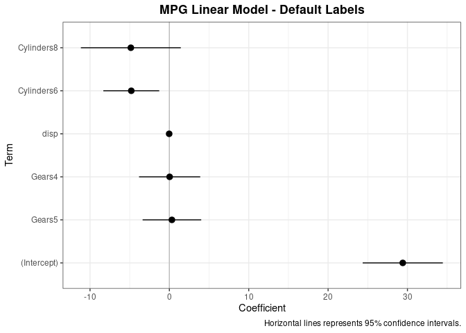
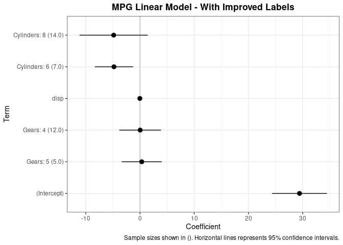

Regression Model Tidying
================
Jesse Cambon
12 September, 2021

-   [Setup](#setup)
-   [Build Linear Model](#build-linear-model)
-   [Plot Coefficients](#plot-coefficients)

Example of labeling categorical variables in a regression model

## Setup

``` r
library(broom)
library(tidyverse)

# obtain character list of independent variables in a model object.
obtain_model_varlist <- function(model_obj) {
  var_list_raw <- unlist(strsplit(as.character(formula(model_obj)[3]), split = " \\+ "))
  # Remove smooth terms (s())
  return(var_list_raw[!str_detect(var_list_raw, "^s\\(")])
}

# Find frequency counts for all categorical variables in var list
var_freq <- function(data, var) {
  var <- rlang::sym(var)
  print(var)

  if (is.factor(data %>% pull(!!var)) | is.character(data %>% pull(!!var))) {
    return(data %>% count(!!var) %>% mutate(term = quo_name(var)) %>%
      rename(level = !!var) %>%
      mutate(
        level = as.character(level), # convert to char
        is_categorical = 1
      ) %>%
      select(term, everything()))
  } else {
    return(tibble())
  }
}

# Iterate through an entire dataset and return a dataset with sample
# sizes for all levels of categorical variables
find_all_freqs <- function(data, var_list) {
  all_freqs <- tibble()
  for (var in var_list) {
    all_freqs <- all_freqs %>%
      bind_rows(var_freq(data, var))
  }
  return(all_freqs)
}

# adds term_name field to a tidy dataframe which includes sample sizes
add_termnames <- function(data, term_freqs, var_list) {
  # Regexs to match the varname (when it begins a string)
  varregex <- paste(str_replace(var_list, "^", "\\^"), collapse = "|")

  return(
    data %>%
      mutate(
        term_name = coalesce(
          str_extract(term, varregex),
          term
          ),
        level = case_when(!is.na(term_name) ~ str_replace(term, varregex, ""))
      ) %>%
      # add in frequency counts and labels
      left_join(term_freqs, by = c("term_name" = "term", "level")) %>%
      mutate(label = case_when(
        is_categorical == 1 ~ str_c(term_name, ": ", level, " (", scales::comma(n), ")"),
        TRUE ~ str_c(term_name)
      ))
  )
}
```

## Build Linear Model

``` r
Mymtcars <- mtcars %>%
  mutate(
    Cylinders = factor(cyl),
    Gears = factor(gear)
  )

car_model <- lm(mpg ~ Cylinders + disp + Gears, data = Mymtcars)

# obtain list of independent variables
car_varlist <- obtain_model_varlist(car_model)
# sample sizes for categorical variable levels
car_freqs <- find_all_freqs(Mymtcars, car_varlist)
```

    ## Cylinders
    ## disp
    ## Gears

``` r
tidy_car <- tidy(car_model, conf.int = T) %>%
  add_termnames(car_freqs, car_varlist)

glance_car <- glance(car_model)
```

## Plot Coefficients

``` r
tidy_car %>%
  ggplot(
    aes(x = reorder(term, -estimate), y = estimate)
  ) +
  geom_point() +
  scale_y_continuous() +
  geom_hline(yintercept = 0, color = "grey") +
  coord_flip() +
  theme_bw() +
  theme(plot.title = element_text(lineheight = 1, face = "bold", hjust = 0.5)) +
  geom_pointrange(mapping = aes(ymin = conf.low, ymax = conf.high)) +
  labs(
    title = "MPG Linear Model - Default Labels",
    caption = "Horizontal lines represents 95% confidence intervals."
  ) +
  xlab("Term") +
  ylab("Coefficient")
```

<!-- -->

``` r
tidy_car %>%
  ggplot(
    aes(x = reorder(label, -estimate), y = estimate)
  ) +
  geom_point() +
  scale_y_continuous() +
  geom_hline(yintercept = 0, color = "grey") +
  coord_flip() +
  theme_bw() +
  theme(plot.title = element_text(lineheight = 1, face = "bold", hjust = 0.5)) +
  geom_pointrange(mapping = aes(ymin = conf.low, ymax = conf.high)) +
  labs(
    title = "MPG Linear Model - With Improved Labels",
    caption = "Sample sizes shown in (). Horizontal lines represents 95% confidence intervals."
  ) +
  xlab("Term") +
  ylab("Coefficient")
```

<!-- -->
