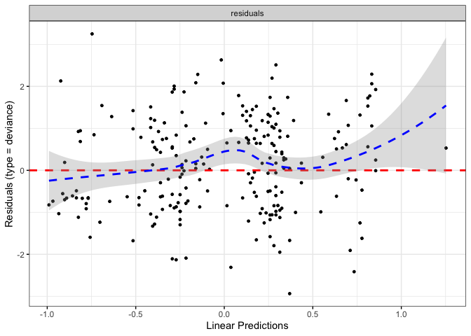
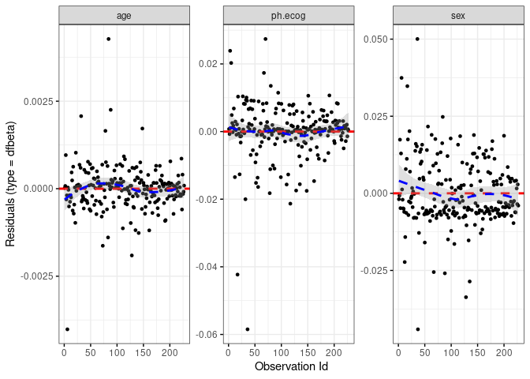
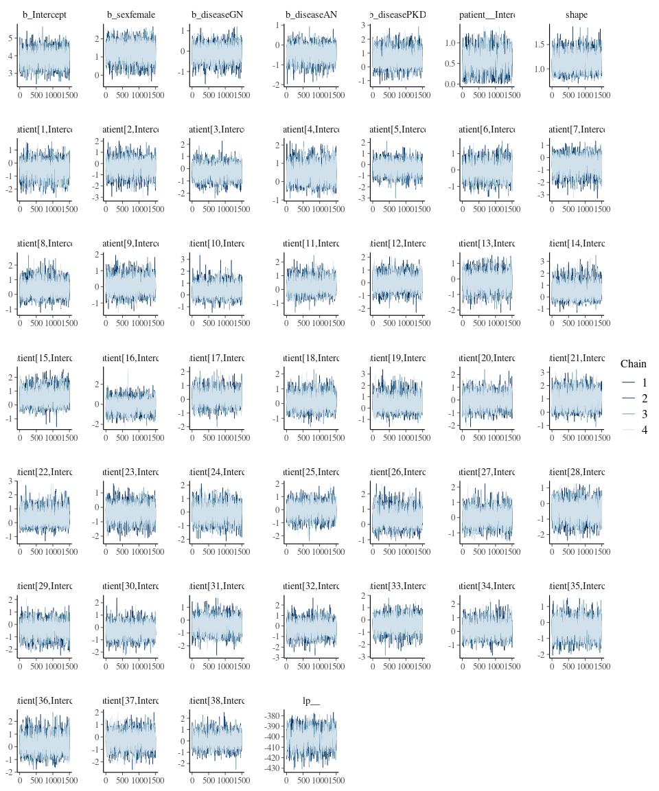
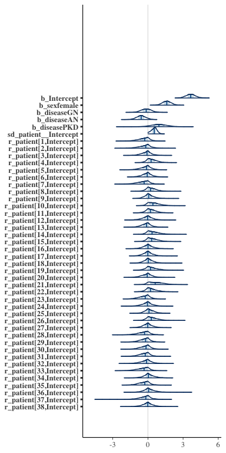
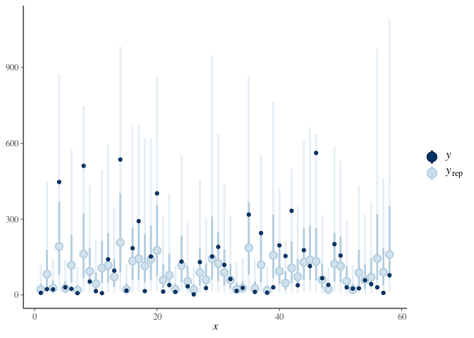
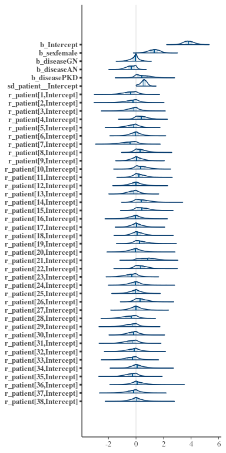
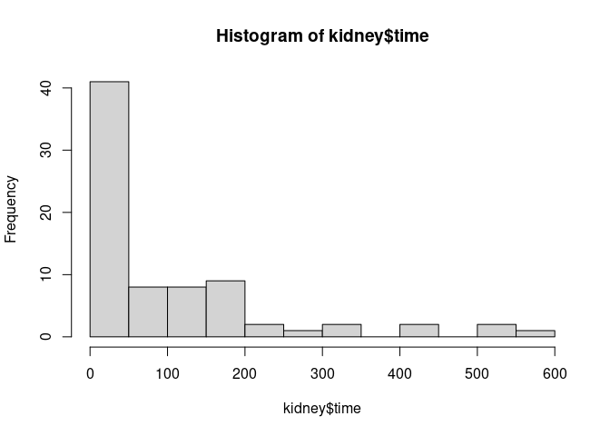
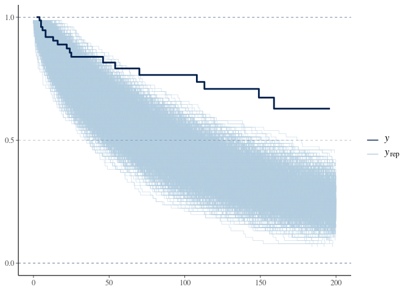

Survival Models
================
Jesse Cambon
12 September, 2021

-   [Kaplan-Meier](#kaplan-meier)
-   [Log-Rank Test](#log-rank-test)
-   [Cox Proportional Hazard Model](#cox-proportional-hazard-model)
    -   [Predictions](#predictions)
    -   [Validation](#validation)
    -   [Parametric Survival Model](#parametric-survival-model)
    -   [Bayesian Survival Models](#bayesian-survival-models)

Survival Analysis

-   Kaplan-Meier Plots
-   Log-rank test
-   Cox Proportional Hazard Model
-   Parametric survival models
-   Bayesian Approaches

Reference:

<https://www.emilyzabor.com/tutorials/survival_analysis_in_r_tutorial.html>

``` r
library(survival)
library(survminer)
library(tidyverse)
library(broom)
library(broom.mixed)
library(brms)
library(bayesplot)
options(mc.cores = parallel::detectCores())
```

# Kaplan-Meier

status: censoring status 1=censored, 2=dead. Can also use TRUE/FALSE see
documentation for event in ?Surv

``` r
lung %>% count(status)
```

    ##   status   n
    ## 1      1  63
    ## 2      2 165

``` r
ggsurvplot(
    fit = survfit(Surv(time, status) ~ sex, data = lung), 
    xlab = "Days", 
    ylab = "Survival Probability")$plot
```

<!-- -->

# Log-Rank Test

Test if there was a statistically significant difference in survival
time between the groups

``` r
survdiff(Surv(time, status) ~ sex, 
         data = lung, 
         rho = 0 # log-rank, see ?survdiff
         )
```

    ## Call:
    ## survdiff(formula = Surv(time, status) ~ sex, data = lung, rho = 0)
    ## 
    ##         N Observed Expected (O-E)^2/E (O-E)^2/V
    ## sex=1 138      112     91.6      4.55      10.3
    ## sex=2  90       53     73.4      5.68      10.3
    ## 
    ##  Chisq= 10.3  on 1 degrees of freedom, p= 0.001

# Cox Proportional Hazard Model

-   Multivariate “semi-parametric” regression approach
-   Assumes hazard can change over time, but is proportional between
    groups at all points in time (ie. hazard ratio is constant over
    time).

``` r
cox_fit <- coxph(Surv(time, status) ~ sex + age + ph.ecog,
        data = lung)

# Exponentiate coefficients to get hazard ratios
cox_hr <- tidy(cox_fit, exponentiate = TRUE, conf.int = TRUE)
```

Survival curve

``` r
ggsurvplot(survfit(cox_fit), data = lung, risk.table = TRUE)
```

<!-- -->

Plot Hazard Ratios

``` r
ggplot(data=cox_hr,
          aes(x = term, y = estimate)) +
geom_point() +
scale_y_continuous() +
geom_hline(yintercept=0,color='grey') +
coord_flip() +
  theme_bw() +
  theme(plot.title = element_text(lineheight = 1, face="bold",hjust = 0.5)) +
geom_pointrange(mapping = aes(ymin = conf.low, ymax = conf.high)) + 
xlab('Term') + ylab('HR') + geom_hline(yintercept = 1, color = "grey")
```

<!-- -->

### Predictions

``` r
sample_obs <- lung %>% 
  sample_n(2, seed = 104) %>%
  mutate(id = 1:n()) %>%
  select(id, status, everything())

cox_pred <- predict(cox_fit, newdata = sample_obs, type = 'expected')
```

### Validation

Reference: <http://www.sthda.com/english/wiki/cox-model-assumptions>

``` r
concordance(cox_fit)
```

    ## Call:
    ## concordance.coxph(object = cox_fit)
    ## 
    ## n= 227 
    ## Concordance= 0.6371 se= 0.02507
    ## concordant discordant     tied.x     tied.y    tied.xy 
    ##      12544       7117        126         28          0

Look at residuals

``` r
ggcoxdiagnostics(cox_fit, type = "deviance", ox.scale = 'observation.id')
```

    ## `geom_smooth()` using formula 'y ~ x'

<!-- -->

``` r
ggcoxdiagnostics(cox_fit, type = "deviance", ox.scale = 'linear.predictions')
```

    ## `geom_smooth()` using formula 'y ~ x'

<!-- -->

``` r
ggcoxdiagnostics(cox_fit, type = 'dfbeta')
```

    ## `geom_smooth()` using formula 'y ~ x'

<!-- -->

Test proportional hazards assumption

``` r
zph_fit <- cox.zph(cox_fit)
ggcoxzph(zph_fit)
```

<!-- -->

## Parametric Survival Model

Accelerated Failure Time models, an alternative to cox regression

``` r
aft_fit <- survreg(Surv(time, status) ~ sex + age + ph.ecog,
        dist = 'weibull',
        data = lung)

# Exponentiate coefficients to get hazard ratios
aft_hr <- tidy(aft_fit, exponentiate = TRUE, conf.int = TRUE)

aft_hr
```

    ## # A tibble: 5 × 7
    ##   term        estimate std.error statistic  p.value conf.low conf.high
    ##   <chr>          <dbl>     <dbl>     <dbl>    <dbl>    <dbl>     <dbl>
    ## 1 (Intercept)  6.27      0.454       13.8  1.66e-43   5.38     7.16   
    ## 2 sex          0.401     0.124        3.24 1.19e- 3   0.159    0.644  
    ## 3 age         -0.00748   0.00676     -1.11 2.69e- 1  -0.0207   0.00578
    ## 4 ph.ecog     -0.340     0.0835      -4.07 4.73e- 5  -0.503   -0.176  
    ## 5 Log(scale)  -0.313     0.0613      -5.11 3.30e- 7  NA       NA

## Bayesian Survival Models

-   <http://paul-buerkner.github.io/brms/reference/kidney.html>
-   <https://mc-stan.org/rstanarm/reference/adapt_delta.html>

``` r
print('Default priors:')
```

    ## [1] "Default priors:"

``` r
get_prior(time | cens(censored) ~ sex + disease + age + (1 | patient),
            data = kidney, family = weibull()
          )
```

    ##                   prior     class       coef   group resp dpar nlpar bound
    ##                  (flat)         b                                         
    ##                  (flat)         b        age                              
    ##                  (flat)         b  diseaseAN                              
    ##                  (flat)         b  diseaseGN                              
    ##                  (flat)         b diseasePKD                              
    ##                  (flat)         b  sexfemale                              
    ##  student_t(3, 3.7, 2.5) Intercept                                         
    ##    student_t(3, 0, 2.5)        sd                                         
    ##    student_t(3, 0, 2.5)        sd            patient                      
    ##    student_t(3, 0, 2.5)        sd  Intercept patient                      
    ##       gamma(0.01, 0.01)     shape                                         
    ##        source
    ##       default
    ##  (vectorized)
    ##  (vectorized)
    ##  (vectorized)
    ##  (vectorized)
    ##  (vectorized)
    ##       default
    ##       default
    ##  (vectorized)
    ##  (vectorized)
    ##       default

``` r
print('Horseshoe priors:')
```

    ## [1] "Horseshoe priors:"

``` r
get_prior(time | cens(censored) ~ sex + disease + age + (1 | patient),
            data = kidney, family = weibull(), 
          prior = set_prior("horseshoe(3)", class = 'b') + 
              set_prior("horseshoe(3)", class = 'Intercept') +
              set_prior("horseshoe(3)", class = 'sd')
          )
```

    ##                   prior     class       coef   group resp dpar nlpar bound
    ##                  (flat)         b                                         
    ##                  (flat)         b        age                              
    ##                  (flat)         b  diseaseAN                              
    ##                  (flat)         b  diseaseGN                              
    ##                  (flat)         b diseasePKD                              
    ##                  (flat)         b  sexfemale                              
    ##  student_t(3, 3.7, 2.5) Intercept                                         
    ##    student_t(3, 0, 2.5)        sd                                         
    ##    student_t(3, 0, 2.5)        sd            patient                      
    ##    student_t(3, 0, 2.5)        sd  Intercept patient                      
    ##       gamma(0.01, 0.01)     shape                                         
    ##        source
    ##       default
    ##  (vectorized)
    ##  (vectorized)
    ##  (vectorized)
    ##  (vectorized)
    ##  (vectorized)
    ##       default
    ##       default
    ##  (vectorized)
    ##  (vectorized)
    ##       default

``` r
# fit weibull model
fit2 <- brm(time | cens(censored) ~ sex + disease + (1 | patient),
            data = kidney, family = weibull(), 
            prior = set_prior("horseshoe(3)"),
            iter = 3000,
            control = list(adapt_delta = 0.98))
```

``` r
summary(fit2)
```

    ##  Family: weibull 
    ##   Links: mu = log; shape = identity 
    ## Formula: time | cens(censored) ~ sex + disease + (1 | patient) 
    ##    Data: kidney (Number of observations: 76) 
    ##   Draws: 4 chains, each with iter = 3000; warmup = 1500; thin = 1;
    ##          total post-warmup draws = 6000
    ## 
    ## Group-Level Effects: 
    ## ~patient (Number of levels: 38) 
    ##               Estimate Est.Error l-95% CI u-95% CI Rhat Bulk_ESS Tail_ESS
    ## sd(Intercept)     0.57      0.24     0.07     1.01 1.00     1041     1334
    ## 
    ## Population-Level Effects: 
    ##            Estimate Est.Error l-95% CI u-95% CI Rhat Bulk_ESS Tail_ESS
    ## Intercept      3.84      0.41     3.06     4.68 1.00     3314     3410
    ## sexfemale      1.29      0.44     0.34     2.09 1.00     3596     2850
    ## diseaseGN     -0.09      0.31    -0.77     0.53 1.00     4872     5044
    ## diseaseAN     -0.38      0.35    -1.13     0.20 1.00     3301     4594
    ## diseasePKD     0.51      0.54    -0.33     1.72 1.00     2936     4874
    ## 
    ## Family Specific Parameters: 
    ##       Estimate Est.Error l-95% CI u-95% CI Rhat Bulk_ESS Tail_ESS
    ## shape     1.14      0.16     0.86     1.49 1.00     1698     3375
    ## 
    ## Draws were sampled using sampling(NUTS). For each parameter, Bulk_ESS
    ## and Tail_ESS are effective sample size measures, and Rhat is the potential
    ## scale reduction factor on split chains (at convergence, Rhat = 1).

``` r
tidy(fit2)
```

    ## Warning: Method 'posterior_samples' is deprecated. Please see ?as_draws for
    ## recommended alternatives.

    ## # A tibble: 6 × 8
    ##   effect   component group   term            estimate std.error conf.low conf.high
    ##   <chr>    <chr>     <chr>   <chr>              <dbl>     <dbl>    <dbl>     <dbl>
    ## 1 fixed    cond      <NA>    (Intercept)       3.84       0.407   3.06       4.68 
    ## 2 fixed    cond      <NA>    sexfemale         1.29       0.440   0.337      2.09 
    ## 3 fixed    cond      <NA>    diseaseGN        -0.0903     0.309  -0.766      0.531
    ## 4 fixed    cond      <NA>    diseaseAN        -0.378      0.354  -1.13       0.199
    ## 5 fixed    cond      <NA>    diseasePKD        0.509      0.544  -0.331      1.72 
    ## 6 ran_pars cond      patient sd__(Intercept)   0.573      0.236   0.0740     1.01

``` r
prior_summary(fit2)
```

    ##                   prior     class       coef   group resp dpar nlpar bound
    ##            horseshoe(3)         b                                         
    ##            horseshoe(3)         b  diseaseAN                              
    ##            horseshoe(3)         b  diseaseGN                              
    ##            horseshoe(3)         b diseasePKD                              
    ##            horseshoe(3)         b  sexfemale                              
    ##  student_t(3, 3.7, 2.5) Intercept                                         
    ##    student_t(3, 0, 2.5)        sd                                         
    ##    student_t(3, 0, 2.5)        sd            patient                      
    ##    student_t(3, 0, 2.5)        sd  Intercept patient                      
    ##       gamma(0.01, 0.01)     shape                                         
    ##        source
    ##          user
    ##  (vectorized)
    ##  (vectorized)
    ##  (vectorized)
    ##  (vectorized)
    ##       default
    ##       default
    ##  (vectorized)
    ##  (vectorized)
    ##       default

``` r
mcmc_trace(fit2)
```

<!-- -->

``` r
pp_check(fit2)
```

    ## Using 10 posterior draws for ppc type 'dens_overlay' by default.

    ## Warning: Censored responses are not shown in 'pp_check'.

<!-- -->

``` r
pp_check(fit2, type = 'intervals')
```

    ## Using all posterior draws for ppc type 'intervals' by default.

    ## Warning: Censored responses are not shown in 'pp_check'.

<!-- -->

``` r
mcmc_areas(fit2,  regex_pars = c('b_*', 'r_*'))
```

<!-- -->

<https://mc-stan.org/bayesplot/reference/PPC-censoring.html>

``` r
yrep <- posterior_predict(fit2)

loo(fit2)
```

    ## Warning: Found 8 observations with a pareto_k > 0.7 in model 'fit2'. It is
    ## recommended to set 'moment_match = TRUE' in order to perform moment matching for
    ## problematic observations.

    ## 
    ## Computed from 6000 by 76 log-likelihood matrix
    ## 
    ##          Estimate   SE
    ## elpd_loo   -335.5 22.4
    ## p_loo        16.3  2.5
    ## looic       671.0 44.8
    ## ------
    ## Monte Carlo SE of elpd_loo is NA.
    ## 
    ## Pareto k diagnostic values:
    ##                          Count Pct.    Min. n_eff
    ## (-Inf, 0.5]   (good)     58    76.3%   1236      
    ##  (0.5, 0.7]   (ok)       10    13.2%   315       
    ##    (0.7, 1]   (bad)       8    10.5%   40        
    ##    (1, Inf)   (very bad)  0     0.0%   <NA>      
    ## See help('pareto-k-diagnostic') for details.

``` r
hist(kidney$time)
```

<!-- -->

``` r
ppc_km_overlay(kidney$time, yrep, status_y = kidney$censored) + 
  xlim(0, 200)
```

    ## Warning: Removed 109087 row(s) containing missing values (geom_path).

<!-- -->
