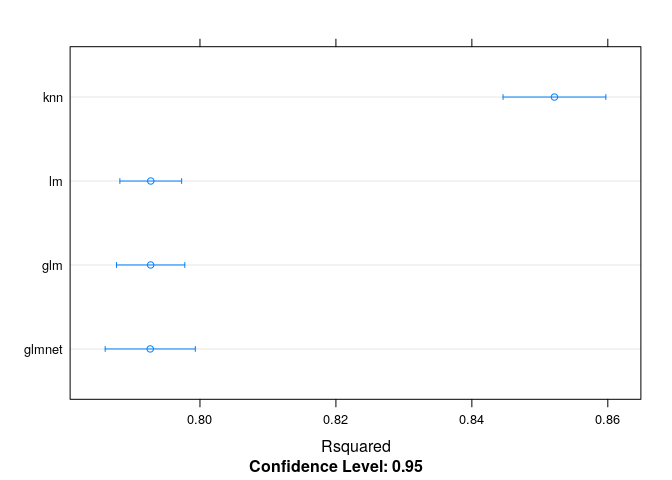
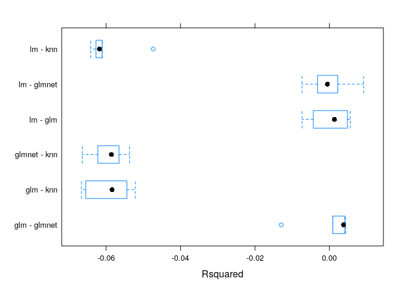

Machine Learning on the Vehicles Dataset
================
Jesse Cambon
21 September, 2018

-   [Setup](#setup)
-   [Build Model](#build-model)
-   [Train Models With Caret](#train-models-with-caret)
    -   [Compare Models](#compare-models)

Predict vehicle fuel economy.

Setup
-----

``` r
library(fueleconomy)
library(tidyverse)
library(broom)
library(caret)
library(skimr)
library(knitr)
library(kableExtra)

# Set seed for reproducibility
set.seed(45)
```

Build Model
-----------

``` r
vehicles_clean <- vehicles %>%
  filter(displ !=0 & !is.na(cyl))

skim(vehicles_clean)

lm_fit <- lm(log(cty) ~ drive + year +
               log(cyl) + log(displ),
             data=vehicles_clean)

lm_stats <- glance(lm_fit)
View(lm_stats)
lm_terms <- tidy(lm_fit,conf.int=T)
View(lm_terms)
```

Train Models With Caret
=======================

``` r
formula <- log(cty) ~ drive + year + fuel +
               log(cyl) + log(displ)

# Use k-fold cross-validation
TC <- trainControl(method="cv", number=5)

caret_lm <- train(formula , vehicles_clean,method='lm',trControl=TC)
```

    ## Warning in predict.lm(modelFit, newdata): prediction from a rank-deficient
    ## fit may be misleading

``` r
caret_glm <- train(formula , vehicles_clean,method='glm',trControl=TC)
```

    ## Warning in predict.lm(object, newdata, se.fit, scale = 1, type =
    ## ifelse(type == : prediction from a rank-deficient fit may be misleading

``` r
caret_glmnet <- train(formula , vehicles_clean,method='glmnet',trControl=TC,tuneLength=5)
caret_knn <- train(formula , vehicles_clean,method='knn',trControl=TC)
```

Compare Models
--------------

``` r
resamps <- resamples(list(lm=caret_lm,
                          glm=caret_glm,
                          glmnet=caret_glmnet,
                          knn=caret_knn))

# Accuracy comparison
dotplot(resamps,metric='Rsquared')
```



``` r
# Difference in accuracy
bwplot(diff(resamps,metric='Rsquared'))
```


