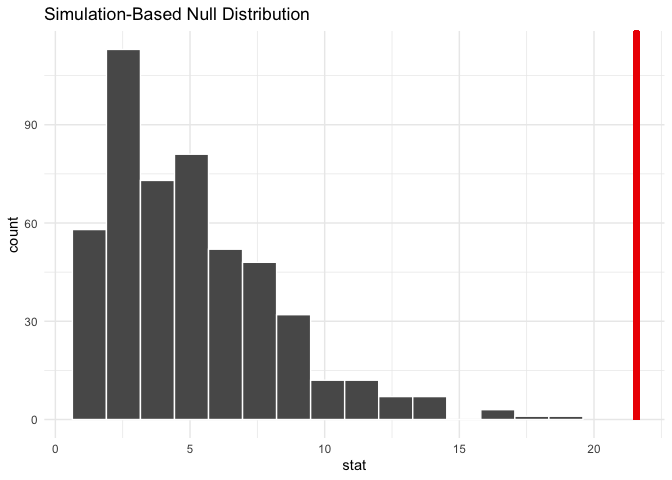
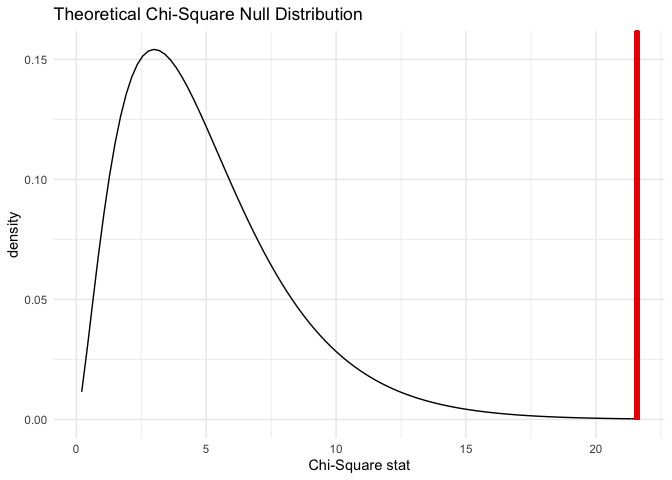
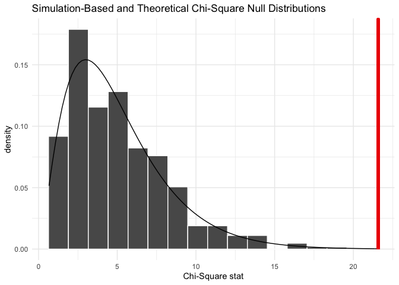

Hypothesis Testing
================
Jesse Cambon
02 February, 2021

References: \* <https://www.tidymodels.org/learn/statistics/xtabs/>

``` r
library(tidymodels) # Includes the infer package
library(knitr)

# Set ggplot theme
theme_set(theme_minimal())


data(ad_data, package = "modeldata")
```

``` r
ad_data %>%
  count(Genotype, Class,sort=T) %>% head(5) %>% kable()
```

| Genotype | Class    |   n |
|:---------|:---------|----:|
| E3E3     | Control  | 133 |
| E3E4     | Control  |  65 |
| E3E4     | Impaired |  41 |
| E3E3     | Impaired |  34 |
| E2E3     | Control  |  30 |

Chi Squared Test of Independences

``` r
ad_data %>% 
  chisq_test(Genotype ~ Class) %>%
  kable()
```

    ## Warning in stats::chisq.test(table(x), ...): Chi-squared approximation may be
    ## incorrect

| statistic | chisq\_df |  p\_value |
|----------:|----------:|----------:|
|  21.57748 |         5 | 0.0006298 |

``` r
observed_indep_statistic <- ad_data %>%
  specify(Genotype ~ Class) %>%
  calculate(stat = "Chisq")


# generate the null distribution using randomization
null_distribution_simulated <- ad_data %>%
  specify(Genotype ~ Class) %>%
  hypothesize(null = "independence") %>%
  generate(reps = 500, type = "permute") %>%
  calculate(stat = "Chisq")
```

``` r
null_distribution_simulated %>%
  visualize() + 
  shade_p_value(observed_indep_statistic,
                direction = "greater") + theme_minimal()
```

<!-- -->

``` r
ad_data %>%
  specify(Genotype ~ Class) %>%
  hypothesize(null = "independence") %>%
  visualize(method = "theoretical") + 
  shade_p_value(observed_indep_statistic,
                direction = "greater")
```

    ## Warning: Check to make sure the conditions have been met for the theoretical
    ## method. {infer} currently does not check these for you.

<!-- -->

``` r
null_distribution_simulated %>%
  visualize(method = "both") + 
  shade_p_value(observed_indep_statistic,
                direction = "greater")
```

    ## Warning: Check to make sure the conditions have been met for the theoretical
    ## method. {infer} currently does not check these for you.

<!-- -->
