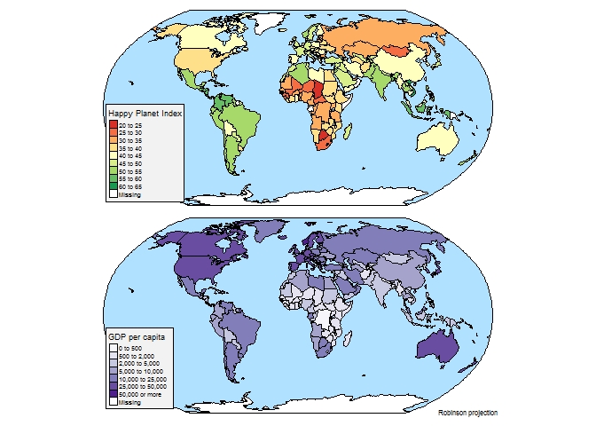
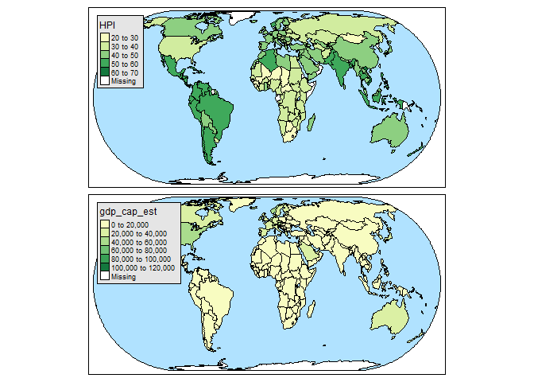

Thematic Maps
================
Jesse Cambon
2018-05-04

Setup
-----

``` r
library(tmap)
library(tidyverse)
#> -- Attaching packages --------------------------------- tidyverse 1.2.1 --
#> v ggplot2 2.2.1     v purrr   0.2.4
#> v tibble  1.4.2     v dplyr   0.7.4
#> v tidyr   0.8.0     v stringr 1.3.0
#> v readr   1.1.1     v forcats 0.3.0
#> -- Conflicts ------------------------------------ tidyverse_conflicts() --
#> x dplyr::filter() masks stats::filter()
#> x dplyr::lag()    masks stats::lag()
```

Test
----

``` r

data("World")

tm_shape(World, projection = "robin") +
    tm_polygons(c("HPI", "gdp_cap_est"), auto.palette.mapping = c(FALSE, TRUE), 
        palette = list("RdYlGn", "Purples"),
        style = c("pretty", "fixed"), n = 7, 
        breaks = list(NULL, c(0, 500, 2000, 5000, 10000, 25000, 50000, Inf)),
        title = c("Happy Planet Index", "GDP per capita")) +
tm_format_World(inner.margins = 0.02, frame = FALSE) +
tm_style_natural(earth.boundary = c(-180, 180, -87, 87))  +
tm_legend(position = c("left", "bottom"), bg.color = "gray95", frame = TRUE) +
tm_credits(c("", "Robinson projection"), position = c("RIGHT", "BOTTOM"))
```



``` r

qtm(World, fill = c("HPI", "gdp_cap_est"), style = "natural")
```



``` r

GDPTable <- World %>% as_tibble() %>% select(name,gdp_cap_est) %>%
  mutate(gdp_cap_est=as.numeric(gdp_cap_est)) %>% arrange(desc(gdp_cap_est)) %>% slice(1:20)
```

| name                   |  gdp\_cap\_est|
|:-----------------------|--------------:|
| Fr. S. Antarctic Lands |      114285.71|
| Qatar                  |      109602.36|
| Luxembourg             |       80056.94|
| Norway                 |       59106.50|
| Kuwait                 |       55403.66|
| Brunei                 |       52165.18|
| United States          |       48074.20|
| Ireland                |       44822.99|
| Cyprus                 |       42698.07|
| Switzerland            |       41646.57|
| Iceland                |       41441.96|
| Netherlands            |       40201.01|
| Austria                |       40132.61|
| Canada                 |       38820.79|
| United Arab Emirates   |       38407.91|
| Sweden                 |       38003.67|
| Australia              |       37634.08|
| Belgium                |       37381.16|
| Denmark                |       37014.75|
| Finland                |       36855.21|
