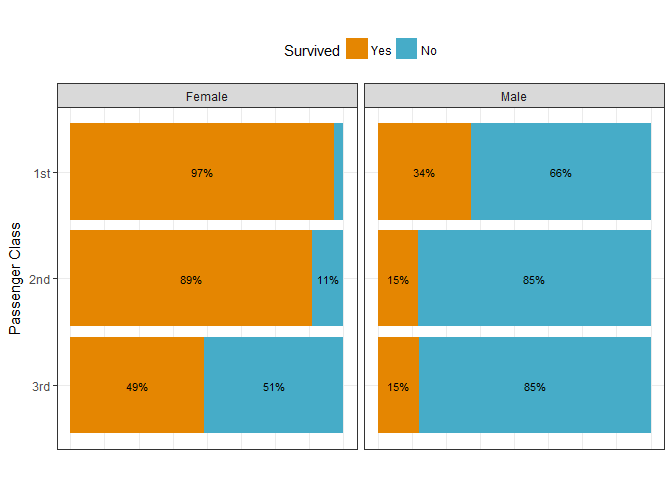
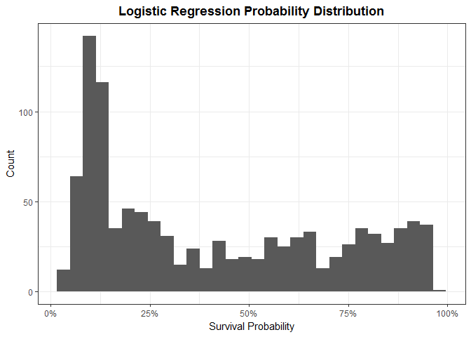
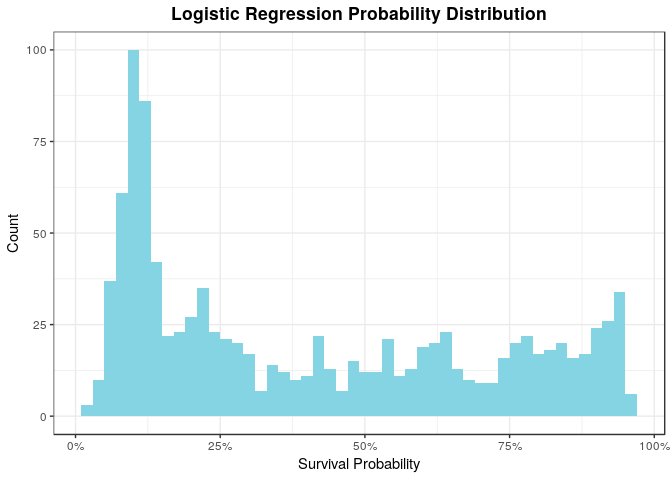
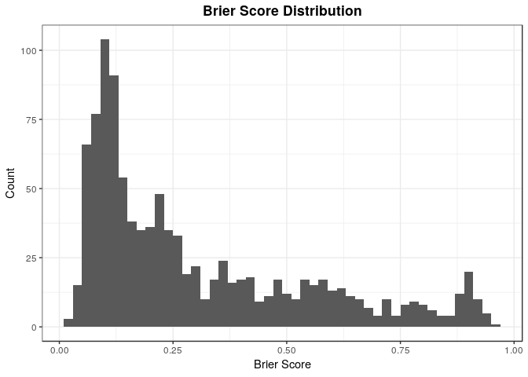
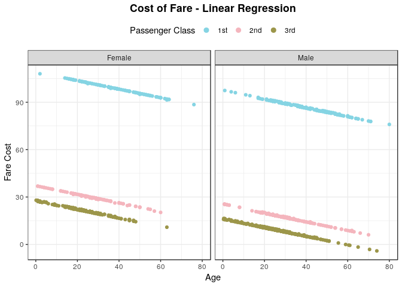
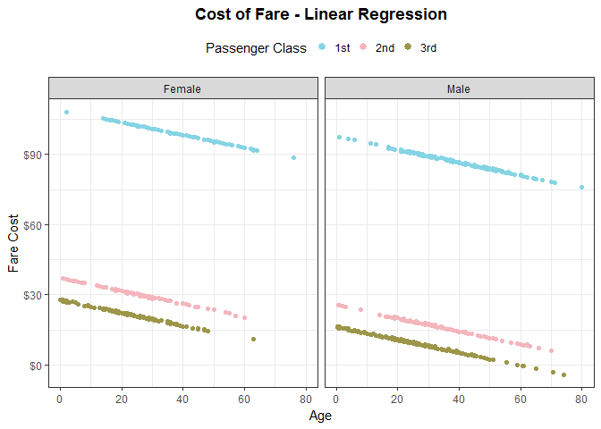
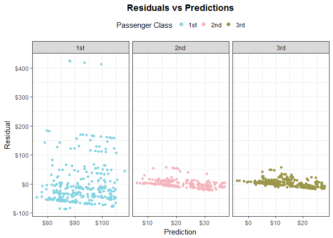
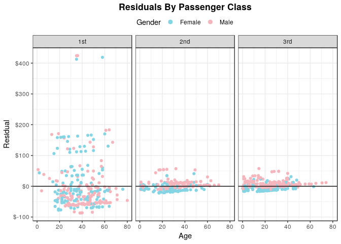

Titanic Data Analysis
================
Jesse Cambon
13 August, 2018

-   [Exploratory Graphs](#exploratory-graphs)
-   [Logistic Regression Model](#logistic-regression-model)
-   [Linear Regression Model](#linear-regression-model)

A modeling analysis of the titanic dataset.

To add: imputation

References: <https://stats.idre.ucla.edu/r/dae/logit-regression/>

``` r
library(tidyverse)
library(PASWR) #titanic3 dataset
library(wesanderson) # color palettes
library(formattable) # percent format
library(caret) # regression utilities
library(Hmisc) # capitalize function
library(broom) # model display capabilities
library(xtable) # pretty table
#library(knitr)  

titanic <- titanic3 %>% as_tibble()

titanic_summ <- titanic %>%
  count(survived,pclass,sex) %>%
  mutate(sex=capitalize(as.character(sex))) %>%
  group_by(pclass,sex) %>%
  mutate(perc_surv_num=n/sum(n),
    perc_surv_char=as.character(percent(n/sum(n),0))) %>%
  ungroup()

# Set default ggplot theme
theme_set(theme_bw()+
  theme(legend.position = "top",
            plot.subtitle= element_text(face="bold",hjust=0.5),
            plot.title = element_text(lineheight=1, face="bold",hjust = 0.5)))
```

Exploratory Graphs
------------------

``` r
ggplot(data=titanic_summ,
       aes(x = fct_rev(pclass), y=perc_surv_num,fill = factor(survived,labels=c('No','Yes')))) +
facet_grid(~factor(sex)) +
geom_bar(stat='identity') +
coord_flip() +
  geom_text(data=titanic_summ,aes(label = ifelse(perc_surv_num > 0.07 ,perc_surv_char,NA)),
    size = 3,position = position_stack(vjust = 0.5)) +
scale_fill_manual(values=wes_palette('FantasticFox1')[c(3,4)]) +
theme(axis.text.x=element_blank(),
        axis.ticks.x=element_blank())+
labs(title='') +
xlab('Passenger Class') +
ylab('') +
guides(fill = guide_legend(title='Survived',reverse=T)) # reverse legend order
```

    ## Warning: Removed 1 rows containing missing values (geom_text).



Logistic Regression Model
-------------------------

We will use the brier score as one measurement of accuracy for our model: <https://en.wikipedia.org/wiki/Brier_score> The book 'Superforecasting' by Philip Tetlock has a good discussion of brier scores.

``` r
log_fit <- glm(survived ~ sex + pclass + age ,family=binomial(link="logit"),data=titanic)

predictions <- titanic %>%
  dplyr::select(sex,pclass,age,survived) %>%
  mutate(prediction=predict(log_fit,newdata=titanic,type='response')) %>%
  mutate(prediction_binary=case_when(prediction >0.5 ~ 1, TRUE ~ 0),
         brier_score=abs(prediction-survived))

#summary(fit)

log_info <- glance(log_fit) %>% 
  mutate(meanBrierScore=mean(predictions$brier_score,na.rm=T)) %>%
  dplyr::select(meanBrierScore,everything())

log_terms <- tidy(log_fit)


# An analysis of our model's classification accuracy
confusionMatrix(factor(predictions$prediction_binary), factor(predictions$survived))
```

    ## Confusion Matrix and Statistics
    ## 
    ##           Reference
    ## Prediction   0   1
    ##          0 710 199
    ##          1  99 301
    ##                                           
    ##                Accuracy : 0.7723          
    ##                  95% CI : (0.7487, 0.7948)
    ##     No Information Rate : 0.618           
    ##     P-Value [Acc > NIR] : < 2.2e-16       
    ##                                           
    ##                   Kappa : 0.4987          
    ##  Mcnemar's Test P-Value : 9.756e-09       
    ##                                           
    ##             Sensitivity : 0.8776          
    ##             Specificity : 0.6020          
    ##          Pos Pred Value : 0.7811          
    ##          Neg Pred Value : 0.7525          
    ##              Prevalence : 0.6180          
    ##          Detection Rate : 0.5424          
    ##    Detection Prevalence : 0.6944          
    ##       Balanced Accuracy : 0.7398          
    ##                                           
    ##        'Positive' Class : 0               
    ## 

``` r
ggplot(data=predictions %>% mutate(sex=capitalize(as.character(sex))),
          aes(x = age, y = prediction, color = pclass)) +
geom_point() +
facet_grid(~factor(sex)) +
scale_y_continuous(labels=scales::percent) +
theme(legend.margin=margin(0,0,0,0)) +
scale_color_manual(values=wes_palette('Moonrise3')) +
labs(title='Probability of Survival - Logistic Regression') +
xlab('Age') +
ylab('Survival Probability') +
guides(color = guide_legend(title='Passenger Class',reverse=F,override.aes = list(size=2.5))) 
```

    ## Warning: Removed 263 rows containing missing values (geom_point).



``` r
ggplot(predictions, aes(prediction))+
  geom_histogram(binwidth=0.02,aes(fill=factor(survived,labels=c('No','Yes'))),
    col='black') + 
  theme(legend.pos='top') +
  scale_fill_manual(values=wes_palette('Moonrise3')) +
  scale_x_continuous(labels=scales::percent) +
  labs(title="Logistic Regression Probability Distribution") +
xlab('Survival Probability') +
ylab('Count') +
guides(fill = guide_legend(title='Survived')) 
```

    ## Warning: Removed 263 rows containing non-finite values (stat_bin).



``` r
ggplot(predictions, aes(brier_score)) +
  geom_histogram(binwidth=0.02,aes(fill=factor(survived,labels=c('No','Yes'))),
                 col='black') +
  labs(title="Brier Score Distribution") +
    scale_fill_manual(values=wes_palette('Moonrise3')) +
xlab('Brier Score') +
ylab('Count') +
guides(fill = guide_legend(title='Survived')) 
```

    ## Warning: Removed 263 rows containing non-finite values (stat_bin).



``` r
print(xtable(log_info %>% 
        dplyr::select(-df.residual,-df.null,-deviance)),type='html')
```

<!-- html table generated in R 3.4.4 by xtable 1.8-2 package -->
<!-- Mon Aug 13 21:44:16 2018 -->
<table border="1">
<tr>
<th>
</th>
<th>
meanBrierScore
</th>
<th>
null.deviance
</th>
<th>
logLik
</th>
<th>
AIC
</th>
<th>
BIC
</th>
</tr>
<tr>
<td align="right">
1
</td>
<td align="right">
0.30
</td>
<td align="right">
1414.62
</td>
<td align="right">
-491.23
</td>
<td align="right">
992.45
</td>
<td align="right">
1017.22
</td>
</tr>
</table>
``` r
print(xtable(log_terms %>% rename(Coefficient=estimate,Variable=term)),type='html')
```

<!-- html table generated in R 3.4.4 by xtable 1.8-2 package -->
<!-- Mon Aug 13 21:44:17 2018 -->
<table border="1">
<tr>
<th>
</th>
<th>
Variable
</th>
<th>
Coefficient
</th>
<th>
std.error
</th>
<th>
statistic
</th>
<th>
p.value
</th>
</tr>
<tr>
<td align="right">
1
</td>
<td>
(Intercept)
</td>
<td align="right">
3.52
</td>
<td align="right">
0.33
</td>
<td align="right">
10.78
</td>
<td align="right">
0.00
</td>
</tr>
<tr>
<td align="right">
2
</td>
<td>
sexmale
</td>
<td align="right">
-2.50
</td>
<td align="right">
0.17
</td>
<td align="right">
-15.04
</td>
<td align="right">
0.00
</td>
</tr>
<tr>
<td align="right">
3
</td>
<td>
pclass2nd
</td>
<td align="right">
-1.28
</td>
<td align="right">
0.23
</td>
<td align="right">
-5.68
</td>
<td align="right">
0.00
</td>
</tr>
<tr>
<td align="right">
4
</td>
<td>
pclass3rd
</td>
<td align="right">
-2.29
</td>
<td align="right">
0.23
</td>
<td align="right">
-10.14
</td>
<td align="right">
0.00
</td>
</tr>
<tr>
<td align="right">
5
</td>
<td>
age
</td>
<td align="right">
-0.03
</td>
<td align="right">
0.01
</td>
<td align="right">
-5.43
</td>
<td align="right">
0.00
</td>
</tr>
</table>
Linear Regression Model
-----------------------

A linear model of how much a passenger's fare cost

``` r
lm_fit <- lm(fare ~ sex + pclass + age + survived,data=titanic)

lm_predictions <- titanic %>%
  dplyr::select(sex,pclass,age,survived,fare) %>%
  mutate(prediction=predict(lm_fit,newdata=titanic)) %>%
  mutate(residual=fare-prediction)

lm_info <- glance(lm_fit)
lm_terms <- tidy(lm_fit)

#summary(lm_fit)

# Histogram of Residuals
ggplot(lm_predictions, aes(residual)) +
  geom_histogram(bins=30) +
facet_grid(~pclass,scales='free_x') +
scale_x_continuous(labels=scales::dollar) +
  labs(title="Residual Distribution by Passenger Class") +
xlab('Residual') +
ylab('Count') 
```

    ## Warning: Removed 264 rows containing non-finite values (stat_bin).



``` r
ggplot(data=lm_predictions %>% mutate(sex=capitalize(as.character(sex))),
          aes(x = age, y = prediction, color = pclass,group=1)) +
geom_point() +
facet_grid(~factor(sex)) +
scale_y_continuous(labels=scales::dollar) +
#theme(legend.margin=margin(0,0,0,0)) +
scale_color_manual(values=wes_palette('Moonrise3')) +
labs(title='Cost of Fare - Linear Regression') +
xlab('Age') +
ylab('Fare Cost') +
guides(color = guide_legend(title='Passenger Class',reverse=F,override.aes = list(size=2.5))) 
```

    ## Warning: Removed 263 rows containing missing values (geom_point).



``` r
ggplot(data=lm_predictions %>% mutate(sex=capitalize(as.character(sex))),
          aes(x = prediction, y = residual, color = sex)) +
geom_point() +
facet_grid(~pclass,scales='free_x') +
geom_hline(yintercept=0) + # horizontal line at 0 residual
#geom_smooth(method="lm",show.legend=F,size=0.5) +
scale_x_continuous(labels=scales::dollar) +
scale_y_continuous(labels=scales::dollar) +
#theme(legend.pos='none') +
scale_color_manual(values=wes_palette('Moonrise3')) +
labs(title='Residuals vs Predictions by Passenger Class') +
xlab('Prediction') +
ylab('Residual') + 
guides(color = guide_legend(title='Gender',reverse=F,override.aes = list(size=2.5))) 
```

    ## Warning: Removed 264 rows containing missing values (geom_point).



``` r
ggplot(data=lm_predictions %>% mutate(sex=capitalize(as.character(sex))),
          aes(x = age, y = residual, color = sex)) +
geom_point() +
facet_grid(~pclass) +
  geom_hline(slope=0,yintercept=0) + # horizontal line at 0 residual
scale_y_continuous(labels=scales::dollar) +
theme(legend.margin=margin(0,0,0,0)) +
scale_color_manual(values=wes_palette('Moonrise3')) +
labs(title='Residuals By Passenger Class') +
xlab('Age') +
ylab('Residual') +
guides(color = guide_legend(title='Gender',reverse=F,override.aes = list(size=2.5))) 
```

    ## Warning: Ignoring unknown parameters: slope

    ## Warning: Removed 264 rows containing missing values (geom_point).



``` r
print(xtable(lm_info %>% dplyr::select(-df.residual,-logLik,-deviance)),type='html')
```

<!-- html table generated in R 3.4.4 by xtable 1.8-2 package -->
<!-- Mon Aug 13 21:44:20 2018 -->
<table border="1">
<tr>
<th>
</th>
<th>
r.squared
</th>
<th>
adj.r.squared
</th>
<th>
sigma
</th>
<th>
statistic
</th>
<th>
p.value
</th>
<th>
df
</th>
<th>
AIC
</th>
<th>
BIC
</th>
</tr>
<tr>
<td align="right">
1
</td>
<td align="right">
0.39
</td>
<td align="right">
0.39
</td>
<td align="right">
43.59
</td>
<td align="right">
133.60
</td>
<td align="right">
0.00
</td>
<td align="right">
6
</td>
<td align="right">
10862.73
</td>
<td align="right">
10897.39
</td>
</tr>
</table>
``` r
print(xtable(lm_terms %>% rename(Coefficient=estimate,Variable=term)),type='html')
```

<!-- html table generated in R 3.4.4 by xtable 1.8-2 package -->
<!-- Mon Aug 13 21:44:20 2018 -->
<table border="1">
<tr>
<th>
</th>
<th>
Variable
</th>
<th>
Coefficient
</th>
<th>
std.error
</th>
<th>
statistic
</th>
<th>
p.value
</th>
</tr>
<tr>
<td align="right">
1
</td>
<td>
(Intercept)
</td>
<td align="right">
108.59
</td>
<td align="right">
6.21
</td>
<td align="right">
17.50
</td>
<td align="right">
0.00
</td>
</tr>
<tr>
<td align="right">
2
</td>
<td>
sexmale
</td>
<td align="right">
-11.46
</td>
<td align="right">
3.31
</td>
<td align="right">
-3.46
</td>
<td align="right">
0.00
</td>
</tr>
<tr>
<td align="right">
3
</td>
<td>
pclass2nd
</td>
<td align="right">
-72.04
</td>
<td align="right">
3.95
</td>
<td align="right">
-18.23
</td>
<td align="right">
0.00
</td>
</tr>
<tr>
<td align="right">
4
</td>
<td>
pclass3rd
</td>
<td align="right">
-81.17
</td>
<td align="right">
3.85
</td>
<td align="right">
-21.11
</td>
<td align="right">
0.00
</td>
</tr>
<tr>
<td align="right">
5
</td>
<td>
age
</td>
<td align="right">
-0.27
</td>
<td align="right">
0.11
</td>
<td align="right">
-2.57
</td>
<td align="right">
0.01
</td>
</tr>
<tr>
<td align="right">
6
</td>
<td>
survived
</td>
<td align="right">
0.57
</td>
<td align="right">
3.45
</td>
<td align="right">
0.17
</td>
<td align="right">
0.87
</td>
</tr>
</table>
