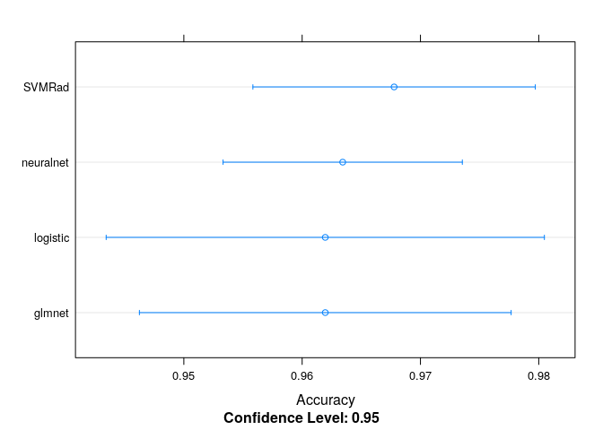
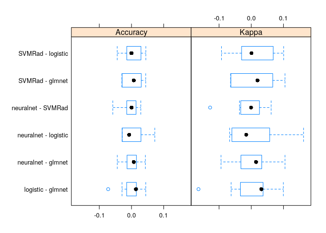

Machine Learning with Caret
================
Jesse Cambon
18 September, 2018

-   [References](#references)
-   [Setup](#setup)
-   [Build Model](#build-model)
-   [Glmnet (Elastic Net) Model](#glmnet-elastic-net-model)

Demonstrate a machine learning workflow with caret

References
----------

-   <https://topepo.github.io/caret/model-training-and-tuning.html>
-   <https://cran.r-project.org/web/packages/caretEnsemble/vignettes/caretEnsemble-intro.html>

Setup
-----

``` r
library(mlbench) # machine learning reference datasets
library(tidyverse)
library(broom)
library(caret)
library(skimr)
library(knitr)
library(kableExtra)

# Set seed for reproducibility
set.seed(45)
```

Build Model
-----------

``` r
data(BreastCancer)

skim(BreastCancer)

BC <- BreastCancer %>% as_tibble() %>%
  dplyr::select(-Id) %>%
  drop_na() # should really use imputation but we'll do this for now

# Use k-fold cross-validation
control <- trainControl(method="cv", number=10)

# Neural Network
nnet <- train(Class ~ .,  # decide out outcome variable
               BC, # our dataset
               trControl=control,
               method='nnet')
nnet

# SVM Radial
svmRad <- train(Class ~ .,  
               BC, 
               trControl=control,
               method='svmRadial')

svmRad

# Bayesian Logistic Regression
logistic <- train(Class ~ .,  # decide out outcome variable
               BC, # our dataset
               trControl=control,
               method='bayesglm')

logistic

glmnet <- train(Class ~ .,  
               BC, 
               trControl=control,
               method='glmnet')

glmnet
```

``` r
# Look at results of Glmnet model

glmOptLambda <- glmnet$finalModel$lambdaOpt

# Extract coefficients from optimal model
glm_coeff1 <- coef(glmnet$finalModel,glmOptLambda) %>% 
  as.matrix() %>% as.data.frame() %>%
  rownames_to_column('Variable') %>%
  as_tibble() %>%
  rename(Coefficient=2) %>%
  arrange(desc(abs(Coefficient)))


# glmterms <- tidy(glmnet$finalModel) %>%
#   # Pick closest model to optimal lambda
#   filter(abs(lambda - glmOptLambda) == min(abs(lambda-glmOptLambda))) %>%
#   arrange(desc(estimate)) 

# Combine variable importance data with coefficients
varImportance <- varImp(glmnet)$importance %>% 
  rownames_to_column('Variable') %>%
  rename(Importance=2) %>%
  arrange(desc(Importance)) %>%
  full_join(glm_coeff1,by='Variable') %>%
  filter(Coefficient != 0) 
```

``` r
resamps <- resamples(list(neuralnet=nnet,
                          SVMRad=svmRad,
                          logistic=logistic,
                          glmnet=glmnet))

# Accuracy comparison
dotplot(resamps, metric = "Accuracy")
```



``` r
# Difference in accuracy
bwplot(diff(resamps))
```



Glmnet (Elastic Net) Model
--------------------------

``` r
kable(varImportance,format='markdown') %>%
  kable_styling(bootstrap_options = c("striped",'border'))
```

| Variable        |   Importance|  Coefficient|
|:----------------|------------:|------------:|
| Cl.thickness.L  |  100.0000000|    1.4334465|
| Cell.shape.L    |   98.9959241|    1.4190536|
| Cell.size.L     |   96.0999432|    1.3775413|
| Marg.adhesion.L |   59.9424497|    0.8592429|
| Epith.c.size.L  |   58.7994816|    0.8428591|
| Cell.shape.Q    |   53.8521328|   -0.7719415|
| Bare.nuclei10   |   48.7846527|    0.6993019|
| Cell.size.Q     |   45.8138944|   -0.6567177|
| Cell.size.C     |   20.4244327|    0.2927733|
| Epith.c.size^5  |   19.8534568|   -0.2845887|
| Epith.c.size.Q  |   12.7810786|   -0.1832099|
| Epith.c.size^4  |    6.4488341|    0.0924406|
| Marg.adhesion.Q |    1.2788000|   -0.0183309|
| Cell.shape.C    |    0.8378617|    0.0120103|
| Bl.cromatin7    |    0.3533834|    0.0050656|
| (Intercept)     |           NA|    0.7439187|
