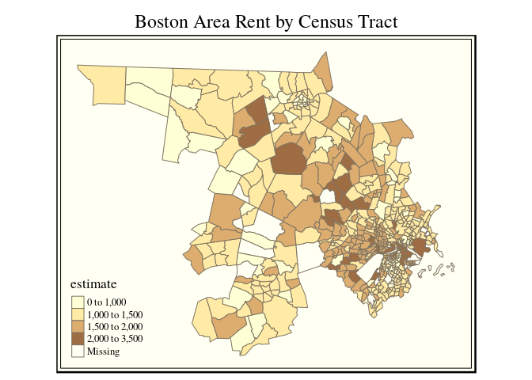
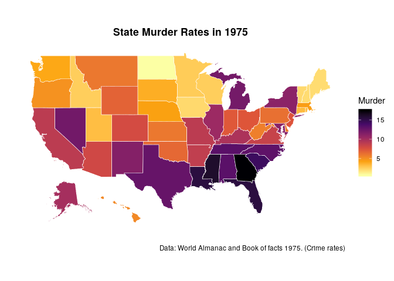
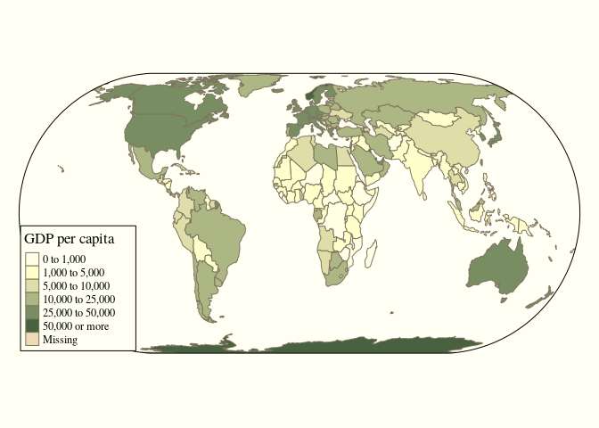

Geospatial Analysis
================
Jesse Cambon
15 August, 2018

-   [References](#references)
-   [Setup](#setup)
-   [Geographies](#geographies)
    -   [Locales](#locales)
    -   [United States](#united-states)
    -   [The World](#the-world)

References
----------

-   <https://github.com/mtennekes/tmap>
-   <https://ggplot2.tidyverse.org/reference/index.html>
-   <https://github.com/wmurphyrd/fiftystater>
-   <https://github.com/mtennekes/tmap/tree/master/demo/USChoropleth>
-   <https://mran.revolutionanalytics.com/snapshot/2016-03-22/web/packages/tmap/vignettes/tmap-nutshell.html>

Setup
-----

``` r
library(tidyverse)
library(tidycensus) # census data
library(ggplot2)
library(sf) # geospatial methods
library(tmap) # thematic mapping
library(viridis) # color scheme
#library(albersusa) # US country map
#library(ggthemes)
#library(spData)
library(wbstats) # world bank
#library(maps)
library(wesanderson) # colors
library(fiftystater) # US state geometries

options(tigris_use_cache = TRUE)
```

Geographies
===========

Locales
-------

``` r
# us_county_income <- get_acs(geography = "county", variables = "B19013_001", geometry = TRUE)
# 
# qtm(us_county_income, fill = "estimate")


# us <- get_acs(geography = "county", 
#               variables = 'B25064_001E', # median gross rent
#               geometry = TRUE) 
# 
# qtm(us, fill = "estimate")


# Rent in Boston
bos <- get_acs(geography = "tract", 
              variables = "B25064_001E",  # median gross rent
              state = "MA", 
              county = c("Suffolk",'Middlesex'), 
              geometry = TRUE)
```

    ## Please note: `get_acs()` now defaults to a year or endyear of 2016.

``` r
qtm(bos, fill = "estimate",fill.title='Median Rent',
    title='Boston Area Rent by Census Tract',
    scale=0.75) +
  tm_layout(inner.margins=c(0,0,.1,0),main.title.position='center',legend.position=c('left','bottom'))
```



``` r
#vars <- load_variables(2016,'acs1') # view census variables
```

<http://www.robinlovelace.net/presentations/spatial-tidyverse.html#11> <https://cran.r-project.org/web/packages/wbstats/vignettes/Using_the_wbstats_package.html>

United States
-------------

``` r
data("fifty_states") # fiftystater package

crimes <- data.frame(state = tolower(rownames(USArrests)), USArrests)

# map_id creates the aesthetic mapping to the state name column in your data
ggplot(crimes, aes(map_id = state)) + 
  # map points to the fifty_states shape data
  geom_map(aes(fill = Murder), 
           map = fifty_states, color='white',size=0.2) +  # geometry from fiftystater package
  expand_limits(x = fifty_states$long, y = fifty_states$lat) +
  coord_map() +
  theme(plot.title = element_text(lineheight=1, face="bold",hjust = 0.5)) + 
  scale_x_continuous(breaks = NULL) + 
  scale_y_continuous(breaks = NULL) +
  
  labs(x = "", y = "",title='State Murder Rates in 1975',
   caption='Data: World Almanac and Book of facts 1975. (Crime rates)') +
  theme(legend.position = "right", 
        panel.background = element_blank(),
        panel.border=element_blank())  +
  scale_fill_viridis_c(direction=-1,option='inferno') 
```



``` r
#  guides(color = guide_legend(title='Murders Per 100,000 Residents'))
```

The World
---------

``` r
data(World)
tm_shape(World, projection = "eck4" # Eckert IV 1906 project (preserves area)
         ) +
  tm_polygons("gdp_cap_est",
              palette = "Greens",
              breaks = c(0, 1000, 5000, 10000, 25000, 50000, Inf),
              title = "GDP per capita") +
  tm_style("grey",
           earth.boundary = c(-180, -87, 180, 87))  +
#  tm_format("World", inner.margins = 0.02, frame = FALSE) 
  tm_legend(position = "bottom", frame = TRUE, legend.outside=F) +
 tm_format("World",frame=F) 
```


