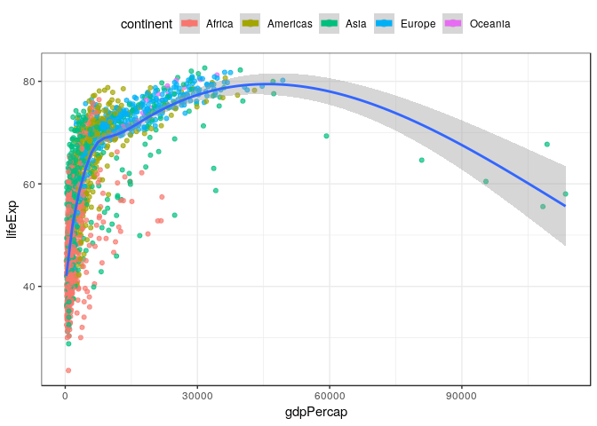
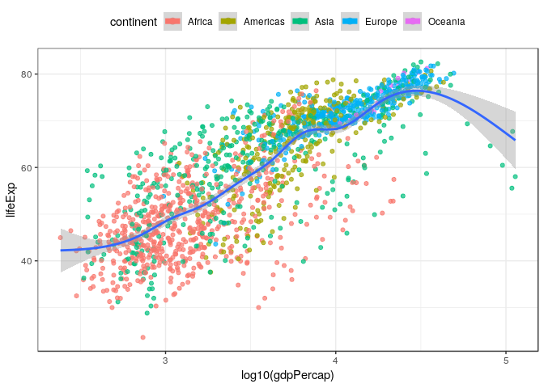
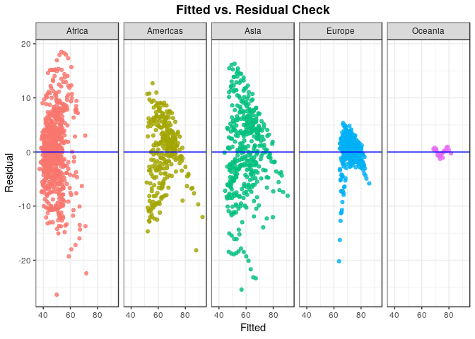
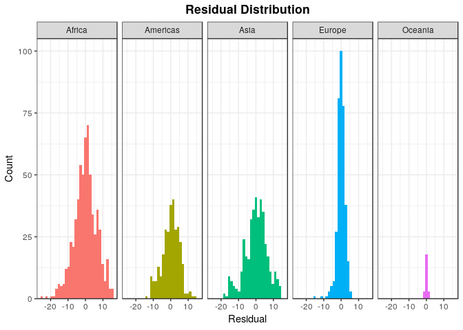

Modeling Workflow
================
Jesse Cambon
12 February, 2019

-   [References](#references)
-   [Setup](#setup)
-   [Exploration](#exploration)
-   [Grouped Models](#grouped-models)
-   [Nested Models](#nested-models)

Demonstrate model workflows with tidyverse, modelr, and broom. This notebook includes both a group\_by and a nested approach which offer similar results. However, the nested model workflow embeds the data into the dataframe along with objects such as models.

References
----------

-   <http://r4ds.had.co.nz/many-models.html>

Setup
-----

``` r
library(tidyverse)
library(gapminder)
library(broom)
#library(modelr)
library(knitr)
library(kableExtra)
```

Exploration
-----------

These graphs show why log transforming GDP per Capita makes it correlate more linearly to our response variable, life expectancy. Log transformations are often useful for highly skewed variables in regression.

``` r
ggplot(data=gapminder,
          aes(x = gdpPercap, y = lifeExp, color = continent,group=1)) +
geom_point(alpha=0.7) +
theme_bw() +
geom_smooth() +
theme(legend.position='top',
  plot.title = element_text(lineheight=1, face="bold",hjust = 0.5)) + 
guides(color=guide_legend(override.aes = list(size=2.5))) 
```

    ## `geom_smooth()` using method = 'gam' and formula 'y ~ s(x, bs = "cs")'



``` r
ggplot(data=gapminder,
          aes(x = log10(gdpPercap), y = lifeExp, color = continent,group=1)) +
geom_point(alpha=0.7) +
theme_bw() +
geom_smooth() +
theme(legend.position='top',
  plot.title = element_text(lineheight=1, face="bold",hjust = 0.5)) + 
guides(color=guide_legend(override.aes = list(size=2.5))) 
```

    ## `geom_smooth()` using method = 'gam' and formula 'y ~ s(x, bs = "cs")'



``` r
ggplot(data=gapminder,
          aes(x = log10(pop), y = lifeExp, color = continent,group=1)) +
geom_point(alpha=0.7) +
#facet_grid(~continent) +
theme_bw() +
geom_smooth() +
theme(legend.position='top',
  plot.title = element_text(lineheight=1, face="bold",hjust = 0.5)) + 
guides(color=guide_legend(override.aes = list(size=2.5))) 
```

    ## `geom_smooth()` using method = 'gam' and formula 'y ~ s(x, bs = "cs")'


Grouped Models
--------------

``` r
# One model per continent
models <- gapminder %>%
  group_by(continent) %>%
  do(fit=lm(lifeExp ~ log10(gdpPercap)+log10(pop) + year, data=.)) 

stats <- glance(models,fit) %>%
  arrange(desc(r.squared))

coefficients <- tidy(models,fit) %>%
  filter(term != '(Intercept)') %>%
  arrange(continent,p.value)

model_fit <- augment(models,fit)
```

``` r
ggplot(data=model_fit,
          aes(x = .fitted, y = .resid, color = continent,group=1)) +
geom_point(alpha=0.8) +
facet_grid(~continent) +
ggtitle('Fitted vs. Residual Check') +
theme_bw() +
geom_hline(yintercept=0,color='blue') + # horizontal line at 0 residual
theme(legend.position='none',
  plot.title = element_text(lineheight=1, face="bold",hjust = 0.5)) + 
guides(color=guide_legend(override.aes = list(size=2.5))) +
xlab('Fitted') +
ylab('Residual')
```



``` r
ggplot(data=model_fit,
          aes(.resid)) +
geom_histogram(aes(fill=continent)) +
facet_grid(~continent) +
ggtitle('Residual Distribution') +
theme_bw() +
scale_y_continuous(expand = c(0,0,0.05,0)) + 
theme(legend.position='none',
  plot.title = element_text(lineheight=1, face="bold",hjust = 0.5)) + 
guides(color=guide_legend(override.aes = list(size=2.5))) +
xlab('Residual') +
ylab('Count')
```

    ## `stat_bin()` using `bins = 30`. Pick better value with `binwidth`.



``` r
kable(stats,format='markdown',digits=2) %>%
  kable_styling(bootstrap_options = c("striped",'border'))
```

<table style="width:100%;">
<colgroup>
<col width="9%" />
<col width="9%" />
<col width="12%" />
<col width="5%" />
<col width="9%" />
<col width="7%" />
<col width="3%" />
<col width="8%" />
<col width="7%" />
<col width="7%" />
<col width="8%" />
<col width="10%" />
</colgroup>
<thead>
<tr class="header">
<th align="left">continent</th>
<th align="right">r.squared</th>
<th align="right">adj.r.squared</th>
<th align="right">sigma</th>
<th align="right">statistic</th>
<th align="right">p.value</th>
<th align="right">df</th>
<th align="right">logLik</th>
<th align="right">AIC</th>
<th align="right">BIC</th>
<th align="right">deviance</th>
<th align="right">df.residual</th>
</tr>
</thead>
<tbody>
<tr class="odd">
<td align="left">Oceania</td>
<td align="right">0.96</td>
<td align="right">0.96</td>
<td align="right">0.78</td>
<td align="right">172.97</td>
<td align="right">0</td>
<td align="right">4</td>
<td align="right">-26.03</td>
<td align="right">62.06</td>
<td align="right">67.95</td>
<td align="right">12.30</td>
<td align="right">20</td>
</tr>
<tr class="even">
<td align="left">Europe</td>
<td align="right">0.80</td>
<td align="right">0.80</td>
<td align="right">2.41</td>
<td align="right">487.82</td>
<td align="right">0</td>
<td align="right">4</td>
<td align="right">-825.98</td>
<td align="right">1661.96</td>
<td align="right">1681.39</td>
<td align="right">2073.54</td>
<td align="right">356</td>
</tr>
<tr class="odd">
<td align="left">Americas</td>
<td align="right">0.72</td>
<td align="right">0.72</td>
<td align="right">4.96</td>
<td align="right">255.52</td>
<td align="right">0</td>
<td align="right">4</td>
<td align="right">-903.93</td>
<td align="right">1817.85</td>
<td align="right">1836.37</td>
<td align="right">7274.08</td>
<td align="right">296</td>
</tr>
<tr class="even">
<td align="left">Asia</td>
<td align="right">0.70</td>
<td align="right">0.70</td>
<td align="right">6.50</td>
<td align="right">308.12</td>
<td align="right">0</td>
<td align="right">4</td>
<td align="right">-1301.08</td>
<td align="right">2612.15</td>
<td align="right">2632.06</td>
<td align="right">16558.14</td>
<td align="right">392</td>
</tr>
<tr class="odd">
<td align="left">Africa</td>
<td align="right">0.50</td>
<td align="right">0.50</td>
<td align="right">6.48</td>
<td align="right">207.77</td>
<td align="right">0</td>
<td align="right">4</td>
<td align="right">-2049.22</td>
<td align="right">4108.45</td>
<td align="right">4130.63</td>
<td align="right">26011.51</td>
<td align="right">620</td>
</tr>
</tbody>
</table>

``` r
kable(coefficients,format='markdown',digits=4) %>%
  kable_styling(bootstrap_options = c("striped",'border'))
```

| continent | term             |  estimate|  std.error|  statistic|  p.value|
|:----------|:-----------------|---------:|----------:|----------:|--------:|
| Africa    | year             |    0.2551|     0.0160|    15.8991|   0.0000|
| Africa    | log10(gdpPercap) |   11.0142|     0.7141|    15.4237|   0.0000|
| Africa    | log10(pop)       |   -0.5390|     0.4192|    -1.2857|   0.1990|
| Americas  | log10(gdpPercap) |   18.5492|     1.1513|    16.1118|   0.0000|
| Americas  | year             |    0.2690|     0.0179|    15.0519|   0.0000|
| Americas  | log10(pop)       |   -1.9190|     0.5545|    -3.4607|   0.0006|
| Asia      | log10(gdpPercap) |   12.6233|     0.7074|    17.8454|   0.0000|
| Asia      | year             |    0.2974|     0.0219|    13.5703|   0.0000|
| Asia      | log10(pop)       |    2.0425|     0.4854|     4.2077|   0.0000|
| Europe    | log10(gdpPercap) |   11.5695|     0.4930|    23.4667|   0.0000|
| Europe    | year             |    0.1005|     0.0091|    11.0939|   0.0000|
| Europe    | log10(pop)       |   -1.0054|     0.2244|    -4.4804|   0.0000|
| Oceania   | year             |    0.1737|     0.0384|     4.5299|   0.0002|
| Oceania   | log10(pop)       |    0.6644|     0.5984|     1.1102|   0.2801|
| Oceania   | log10(gdpPercap) |    4.1229|     4.9721|     0.8292|   0.4168|

Nested Models
-------------

Now we create a similar model with nesting

``` r
my_model <- function(df) {
  lm(lifeExp ~ log10(gdpPercap)+log10(pop) + year, data= df)
}

# Nest models by continent 

nested_models <- gapminder %>% 
  group_by(continent,country) %>% 
  nest() %>%
  # fit models
  mutate(fit = map(data, my_model)) %>%
  # calculate residuals
  mutate(augment = map(fit, augment),
    stats = map(fit,glance),
    terms = map(fit,tidy)) %>%
  ungroup()

# Dataset with predictions and residuals
nest_fit <- nested_models %>% unnest(augment)

nest_stats <- nested_models %>%
  unnest(stats,.drop=TRUE) %>%
  arrange(desc(r.squared)) 

nest_coefficients <- nested_models %>%
  unnest(terms,.drop=TRUE) %>%
  filter(term != '(Intercept)') %>%
  arrange(continent,country,desc(p.value))

most_important_vars <- nest_coefficients %>%
  group_by(country) %>% 
  slice(1)

summ_imp_vars <- most_important_vars %>%
  group_by(continent) %>%
  count(term) %>%
  arrange(continent,desc(n))
```
