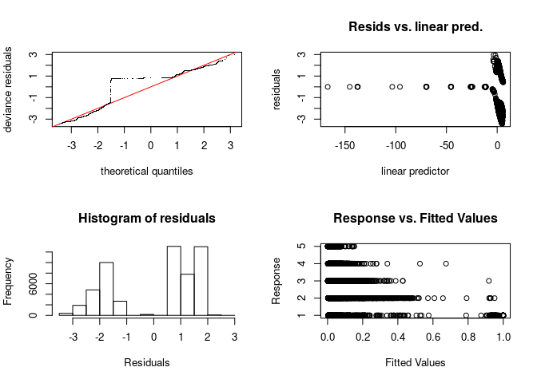
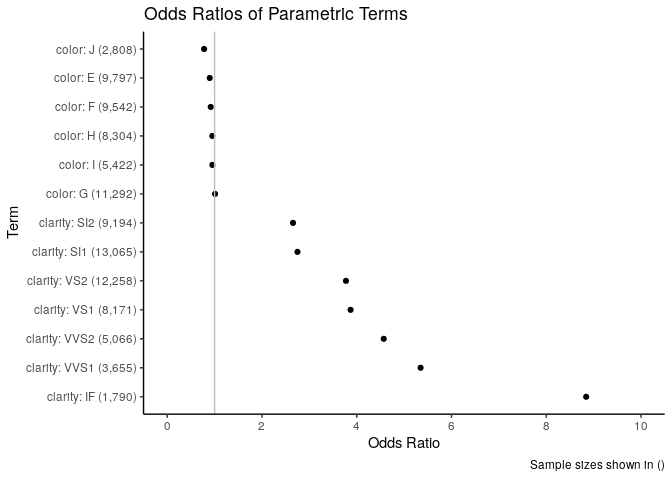

Ordinal Regression
================
Jesse Cambon
10 March, 2019

GAM ordinal regression:
<https://stat.ethz.ch/R-manual/R-devel/library/mgcv/html/ocat.html>
Example using polr:
<https://stats.idre.ucla.edu/r/dae/ordinal-logistic-regression/> Ordinal
doc:
<https://cran.r-project.org/web/packages/ordinal/vignettes/clm_article.pdf>

``` r
#library(Hmisc)
library(MASS) # polr()
library(mgcv) # gam model
```

    ## Loading required package: nlme

    ## This is mgcv 1.8-27. For overview type 'help("mgcv-package")'.

``` r
library(mgcViz) # gam visualization
```

    ## Loading required package: qgam

    ## Loading required package: ggplot2

    ## Loading required package: rgl

    ## 
    ## Attaching package: 'mgcViz'

    ## The following objects are masked from 'package:stats':
    ## 
    ##     qqline, qqnorm, qqplot

``` r
library(ordinal) # clm()
```

    ## 
    ## Attaching package: 'ordinal'

    ## The following objects are masked from 'package:nlme':
    ## 
    ##     ranef, VarCorr

``` r
library(broom)
library(tidyverse)
```

    ## ── Attaching packages ───────────────────────────────────────────────────────────────────────────────────────── tidyverse 1.2.1 ──

    ## ✔ tibble  2.0.1       ✔ purrr   0.3.0  
    ## ✔ tidyr   0.8.3       ✔ dplyr   0.8.0.1
    ## ✔ readr   1.3.1       ✔ stringr 1.4.0  
    ## ✔ tibble  2.0.1       ✔ forcats 0.4.0

    ## ── Conflicts ──────────────────────────────────────────────────────────────────────────────────────────── tidyverse_conflicts() ──
    ## ✖ dplyr::collapse() masks nlme::collapse()
    ## ✖ dplyr::filter()   masks stats::filter()
    ## ✖ dplyr::lag()      masks stats::lag()
    ## ✖ dplyr::select()   masks MASS::select()
    ## ✖ dplyr::slice()    masks ordinal::slice()

``` r
Mydiamonds <- diamonds %>% 
  # convert factor to numeric for gam model
  mutate(cutN=as.numeric(cut))

    # make wine show up in the R studio environment

outcomeVar <- 'cut'
predictors <- 'carat  + price + table'

# Construct formula from strings
lmformula <- as.formula(str_c(outcomeVar,' ~ ',predictors))

# train ordinal logistic models
clm_model <- clm(lmformula, data=diamonds)
polr_model <- polr(lmformula, data=diamonds)
# train ordinal GAM model (R is the number of outcome categories)
gam_model <- gam(cutN ~ carat + s(price,k=9) + s(table,k=12),family=ocat(R=5),data=Mydiamonds) 

gam.check(gam_model)
```

<!-- -->

    ## 
    ## Method: REML   Optimizer: outer newton
    ## full convergence after 7 iterations.
    ## Gradient range [-0.0006234015,0.007978845]
    ## (score 65689.64 & scale 1).
    ## Hessian positive definite, eigenvalue range [1.569822,16878.22].
    ## Model rank =  21 / 21 
    ## 
    ## Basis dimension (k) checking results. Low p-value (k-index<1) may
    ## indicate that k is too low, especially if edf is close to k'.
    ## 
    ##             k'   edf k-index p-value  
    ## s(price)  8.00  7.72    0.97   0.035 *
    ## s(table) 11.00  8.97    0.99   0.285  
    ## ---
    ## Signif. codes:  0 '***' 0.001 '**' 0.01 '*' 0.05 '.' 0.1 ' ' 1

``` r
# Evaluate models
clm_stats <- glance(clm_model)
clm_coef <- tidy(clm_model,exponentiate=T) 

polr_stats <- glance(polr_model)
polr_coef <- tidy(polr_model,exponentiate=T)

gam_stats <- glance(gam_model)
gam_Lcoef <-  tidy(gam_model,parametric=T) # get linear coefficients
gam_Scoef <-  tidy(gam_model,parametric=F) # get smooth term coefficients

# Extract probability predictions from GAM
gam_probs <- predict(gam_model,type='response') %>% 
  # remove "V" from column names so we now have the class labels
  as.data.frame() %>% rename_all(list(replace= ~str_replace_all(.,'V',''))) %>% 
  mutate(obs_num=1:nrow(.)) %>%
  gather(class,prob,-obs_num) %>%
  mutate(class=as.numeric(class)) %>% arrange(obs_num,class)

# Extract class predictions
gam_pred <- gam_probs %>% group_by(obs_num) %>%
  filter(prob==max(prob))

# Compare predictions of polr() and clm()
compare_models <- Mydiamonds %>% 
  # clm predictions returned as list for some reason
  # have to unlist it so we can put it in a column
  mutate(clm_pred=unlist(predict(clm_model,type='class')),
         polr_pred=predict(polr_model,type='class'),
         gam_pred=gam_pred %>% pull(class)) %>%
  mutate_all(as.numeric)  # convert from factor to numeric

# Make frequency tables
# freq_preds <- compare_models %>% count(polr_pred,clm_pred)
# freq_predcheck <- compare_models %>% count(cut,clm_pred)

# Chi square test
# chisq.test(freq_preds)
# chisq.test(freq_predcheck)

#Spearman correlations
cor(compare_models$cut,compare_models$clm_pred,method='spearman')
```

    ## [1] 0.4313114

``` r
cor(compare_models$cut,compare_models$polr_pred,method='spearman')
```

    ## [1] 0.431316

``` r
cor(compare_models$cut,compare_models$gam_pred,method='spearman')
```

    ## [1] 0.4808663

``` r
# Confusion matrixes 

check_gam <- compare_models %>% count(cut,gam_pred) %>%
  spread(cut,n,fill=0)

check_clm <- compare_models %>% count(cut,clm_pred) %>%
  spread(cut,n,fill=0)
```

Plot Smooth Terms

``` r
gam_viz <- getViz(gam_model)

plot(sm(gam_viz, 1)) +
  l_fitLine(colour = "red") + 
#  l_rug(mapping = aes(x=x, y=y), alpha = 0.8) +
    l_ciLine(mul = 5, colour = "blue", linetype = 2) + 
 #   l_points(shape = 19, size = 1, alpha = 0.1) +
  theme_classic()
```

<!-- -->

``` r
plot(sm(gam_viz, 2)) +
  l_fitLine(colour = "red") + 
  l_rug(mapping = aes(x=x, y=y), alpha = 0.8) +
  l_ciLine(mul = 5, colour = "blue", linetype = 2) + 
  l_points(shape = 19, size = 1, alpha = 0.1) +
  theme_classic()
```

<!-- -->

``` r
print(plot(gam_viz, allTerms = T), pages = 1)
```

<!-- -->
