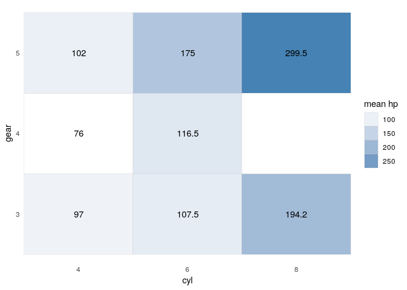
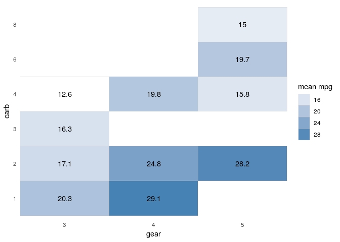

R Quotation Methods
================
Jesse Cambon
02 March, 2019

Demonstrate the use of the quo\_name() and enquo() functions to pass
variable names to functions and utilize both the variables and the
variable names

``` r
library(tidyverse)

# Create a heatmap with two axis variables
# of the mean of a given metric variable
car_heatmap <- function(data,axis1,axis2,metric) {
  # handle quotations
  
  # The dataset can be passed easily as a function argument
  # but we need to use enquo() and the !! operator (below) 
  # for variable names
  # If you were doing this outside of function you would use quo() instead of enquo()
  axis1 <- enquo(axis1)
  axis2 <- enquo(axis2)
  metric <- enquo(metric)
  
  
  print(quo_name(metric))

  cars_agg <- data %>%
    group_by(!!axis1,!!axis2) %>%
    summarize(fill_metric = mean(!!metric),n=n())
  
   ggplot(cars_agg, aes(factor(!!axis1), factor(!!axis2))) + 
     geom_tile(aes(fill = fill_metric), colour = "grey") + 
     scale_fill_gradient(low = "white",high = "steelblue") +
     geom_text(aes(label=round(fill_metric,1))) +
     theme_minimal() +
     theme(panel.grid = element_blank()) +
     scale_x_discrete(expand=c(0,0,0,0)) +
     # quo_name() access the character name of a variable
     guides(fill=guide_legend(title=str_c('mean ',quo_name(metric)))) +
     xlab(quo_name(axis1)) + ylab(quo_name(axis2))
}

car_heatmap(mtcars,cyl,gear,mpg)
```

    ## [1] "mpg"

<!-- -->

``` r
car_heatmap(mtcars,cyl,gear,hp)
```

    ## [1] "hp"

<!-- -->

``` r
car_heatmap(mtcars,gear,carb,mpg)
```

    ## [1] "mpg"

<!-- -->
