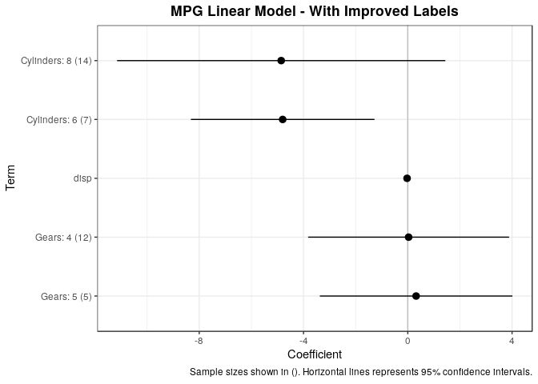

Regression Model Tidying
================
Jesse Cambon
25 March, 2019

Example of labeling categorical variables in a regression model

## Setup

``` r
library(broom)
library(tidyverse)
```

    ## ── Attaching packages ──────────────────────────────────────────────────────────────────────────────────────── tidyverse 1.2.1 ──

    ## ✔ ggplot2 3.1.0       ✔ purrr   0.3.0  
    ## ✔ tibble  2.1.1       ✔ dplyr   0.8.0.1
    ## ✔ tidyr   0.8.3       ✔ stringr 1.4.0  
    ## ✔ readr   1.3.1       ✔ forcats 0.4.0

    ## ── Conflicts ─────────────────────────────────────────────────────────────────────────────────────────── tidyverse_conflicts() ──
    ## ✖ dplyr::filter() masks stats::filter()
    ## ✖ dplyr::lag()    masks stats::lag()

``` r
# obtain character list of independent variables in a model object. 
obtain_model_varlist <- function(model_obj) {
    var_list_raw <- unlist(strsplit(as.character(formula(model_obj)[3]),split=' \\+ '))
    # Remove smooth terms (s())
    return(var_list_raw[!str_detect(var_list_raw,'^s\\(')])
}

# Find frequency counts for all categorical variables in var list
var_freq <- function(data,var) {
  var <- rlang::sym(var)
  print(var)

  if (is.factor(data %>% pull(!!var)) | is.character(data %>% pull(!!var))) {
  return(data %>% count(!!var) %>% mutate(term=quo_name(var)) %>%
          rename(level=!!var) %>%
          mutate(level=as.character(level), # convert to char
                 is_categorical=1) %>%
           select(term,everything()))
  } else {
    return(tibble())
  }
}

# Iterate through an entire dataset and return a dataset with sample
# sizes for all levels of categorical variables
find_all_freqs <- function(data,var_list) {
  all_freqs <- tibble()
  for (var in var_list) {
    all_freqs <- all_freqs %>%
      bind_rows(var_freq(data,var))
  }
  return(all_freqs)
}

# adds term_name field to a tidy dataframe which includes sample sizes
add_termnames <- function(data,term_freqs,var_list) {
  # Regexs to match the varname (when it begins a string)
  varregex <- paste(str_replace(var_list,'^','\\^'), collapse = "|")

  return(
  data %>%
  mutate(term_name = str_extract(term,varregex),
         level = case_when(!is.na(term_name) ~ str_replace(term,varregex,""))) %>%
  # add in frequency counts and labels
  left_join(term_freqs,by=c('term_name'='term','level')) %>%
  mutate(label=case_when(is_categorical == 1 ~ str_c(term_name,': ', level,' (',scales::comma(n),')'),
                TRUE ~ str_c(term_name)))
  )
}
```

## Build Linear Model

``` r
Mymtcars <- mtcars %>%
  mutate(Cylinders=factor(cyl),
         Gears=factor(gear))

car_model <- lm(mpg ~ Cylinders + disp + Gears,data=Mymtcars)

# obtain list of independent variables 
car_varlist <- obtain_model_varlist(car_model)
# sample sizes for categorical variable levels
car_freqs <- find_all_freqs(Mymtcars,car_varlist)
```

    ## Cylinders
    ## disp
    ## Gears

``` r
tidy_car <- tidy(car_model,conf.int=T) %>%
  add_termnames(car_freqs,car_varlist)

glance_car <- glance(car_model)
```

## Plot Coefficients

``` r
ggplot(data=tidy_car %>% filter(label != '(Intercept)'),
          aes(x = reorder(term,-estimate), y = estimate)) +
geom_point() +
scale_y_continuous() +
geom_hline(yintercept=0,color='grey') +
coord_flip() +
  theme_bw() +
  theme(plot.title = element_text(lineheight=1, face="bold",hjust = 0.5)) +
geom_pointrange(mapping=aes(ymin=conf.low, ymax=conf.high)) + 
labs(title='MPG Linear Model - Default Labels',
     caption='Sample sizes shown in (). Horizontal lines represents 95% confidence intervals.') +
xlab('Term') + ylab('Coefficient')
```

<!-- -->

``` r
ggplot(data=tidy_car %>% filter(label != '(Intercept)'),
          aes(x = reorder(label,-estimate), y = estimate)) +
geom_point() +
scale_y_continuous() +
geom_hline(yintercept=0,color='grey') +
coord_flip() +
  theme_bw() +
  theme(plot.title = element_text(lineheight=1, face="bold",hjust = 0.5)) +
geom_pointrange(mapping=aes(ymin=conf.low, ymax=conf.high)) + 
labs(title='MPG Linear Model - With Improved Labels',
     caption='Sample sizes shown in (). Horizontal lines represents 95% confidence intervals.') +
xlab('Term') + ylab('Coefficient')
```

<!-- -->
