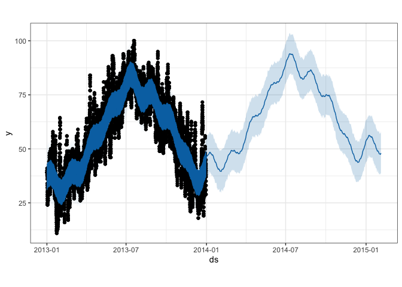

Time Series Modeling
================
Jesse Cambon
12 September, 2019

## References

  - <https://github.com/christophsax/tsbox>
  - <https://github.com/tidyverts/tsibble>
  - <http://pkg.robjhyndman.com/forecast/>
  - <https://business-science.github.io/sweep/index.html>
  - <https://cran.rstudio.com/web/packages/sweep/vignettes/SW01_Forecasting_Time_Series_Groups.html>
  - <https://www.r-bloggers.com/climate-change-modeling-140-years-of-temperature-data-with-tsibble-and-fable/>
  - <https://github.com/tidyverts/fable>
  - <https://feasts.tidyverts.org/>

## Setup

``` r
library(nycflights13) 
library(tsibbledata)
library(wesanderson) # color palettes
library(tidyverse)
```

    ## ── Attaching packages ───────────────────────────────────────────────────────────────────────────────────────────────────────────────────────── tidyverse 1.2.1 ──

    ## ✔ ggplot2 3.2.1     ✔ purrr   0.3.2
    ## ✔ tibble  2.1.3     ✔ dplyr   0.8.3
    ## ✔ tidyr   0.8.3     ✔ stringr 1.4.0
    ## ✔ readr   1.3.1     ✔ forcats 0.4.0

    ## ── Conflicts ──────────────────────────────────────────────────────────────────────────────────────────────────────────────────────────── tidyverse_conflicts() ──
    ## ✖ dplyr::filter() masks stats::filter()
    ## ✖ dplyr::lag()    masks stats::lag()

``` r
library(tsibble)
```

    ## 
    ## Attaching package: 'tsibble'

    ## The following object is masked from 'package:dplyr':
    ## 
    ##     id

``` r
#library(skimr)
#library(feasts) # Removed for now since it breaks the forecast package
library(lubridate)
```

    ## 
    ## Attaching package: 'lubridate'

    ## The following objects are masked from 'package:tsibble':
    ## 
    ##     interval, new_interval

    ## The following object is masked from 'package:base':
    ## 
    ##     date

``` r
library(forecast)
```

    ## Registered S3 method overwritten by 'xts':
    ##   method     from
    ##   as.zoo.xts zoo

    ## Registered S3 method overwritten by 'quantmod':
    ##   method            from
    ##   as.zoo.data.frame zoo

    ## Registered S3 methods overwritten by 'forecast':
    ##   method             from    
    ##   fitted.fracdiff    fracdiff
    ##   residuals.fracdiff fracdiff

``` r
library(tsbox)
library(prophet)
```

    ## Loading required package: Rcpp

    ## Loading required package: rlang

    ## 
    ## Attaching package: 'rlang'

    ## The following objects are masked from 'package:purrr':
    ## 
    ##     %@%, as_function, flatten, flatten_chr, flatten_dbl,
    ##     flatten_int, flatten_lgl, flatten_raw, invoke, list_along,
    ##     modify, prepend, splice

``` r
# Set default ggplot theme
theme_set(theme_bw() +
  theme(legend.position = "top",
            plot.subtitle= element_text(face="bold",hjust=0.5),
            plot.title = element_text(lineheight=1, face="bold",hjust = 0.5)))
```

\#Importing Data Import Data and Convert to Tsibble format

``` r
weather <- nycflights13::weather %>% 
  select(origin, time_hour, temp, humid, precip)

weather_tsbl <- as_tsibble(weather, key = origin, index = time_hour)
```

# Forecasting with Prophet

<https://facebook.github.io/prophet>

``` r
# convert to format needed by prophet (needs specific column names)
weather_ts <- weather_tsbl %>% filter(origin == 'EWR') %>% select(time_hour,temp) %>% 
  rename(ds=time_hour,y=temp)

# create prophet model
m <- prophet(weather_ts,yearly.seasonality=TRUE)

future <- make_future_dataframe(m, periods = 400)

# Create forecast
prophet_forecast <- predict(m, future)

# Plot
plot(m, prophet_forecast)
```

<!-- -->

``` r
prophet_plot_components(m, prophet_forecast)
```

<!-- -->

## Data Cleaning

Fill Missing Gaps in Data

``` r
nrow(ansett)
```

    ## [1] 7407

``` r
# Fill gaps and filter
ansett_fill <- ansett %>%
  filter(Airports == 'MEL-SYD') %>%
  fill_gaps(Passengers = 0)

nrow(ansett_fill)
```

    ## [1] 742

``` r
# Aggregate all classes together , limit to 1990 onward
ansett_summ <- ansett_fill %>% group_by %>%
  summarize(Passengers=sum(Passengers,na.rm=TRUE)) %>%
  filter_index("1990-01" ~ .) %>% as_tsibble(index = Week)
```

``` r
ggplot(ansett_fill,
          aes(x=Week,y=Passengers)) +
  geom_area(aes(fill = Class), alpha = 1.0) +
scale_fill_manual(values=wes_palette('Moonrise2')) +
scale_y_continuous(labels=scales::comma) +
labs(title='',
     caption='') +
theme(legend.title = element_blank(),
      legend.position='right') 
```

<!-- -->

Test forecast package

``` r
USAccDeaths %>% 
  stl(s.window='periodic') %>%
  forecast() %>%
  autoplot()
```

<!-- -->

``` r
AirPassengers %>%
  stlf(lambda=0) %>%
  autoplot()
```

<!-- -->

``` r
# Have to convert this dataset to time series format with tsbox::ts_ts()
ansett_summ %>% ts_ts(.) %>%
  stlf(lambda=0) %>%
  autoplot()
```

    ## [time]: 'Week' [value]: 'Passengers'

<!-- -->

Feasts package unfortunately breaks the forecast package
