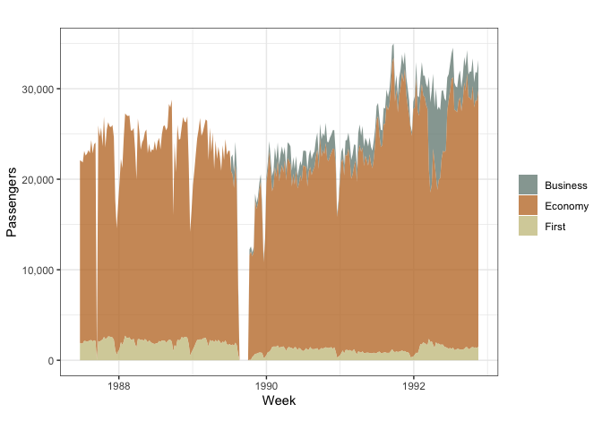
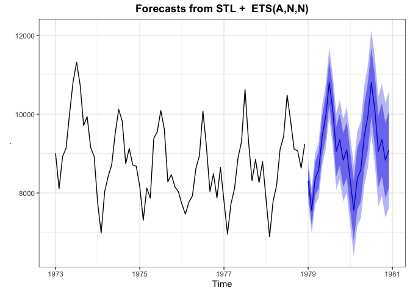
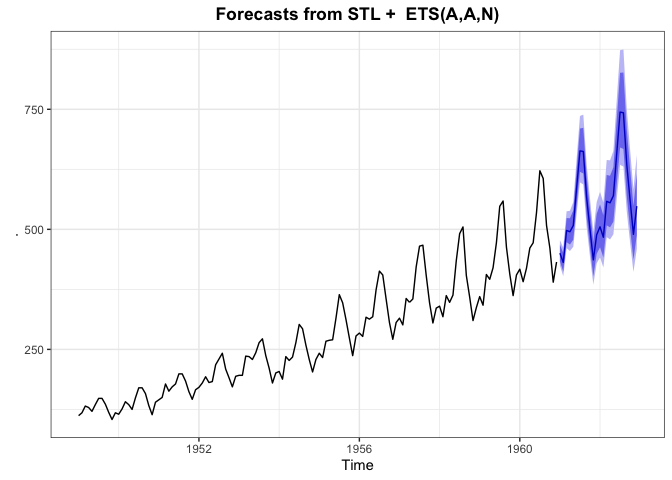

Time Series Modeling
================
Jesse Cambon
11 September, 2019

## References

  - <https://feasts.tidyverts.org/>
  - <https://github.com/tidyverts/tsibble>
  - <http://pkg.robjhyndman.com/forecast/>
  - <https://business-science.github.io/sweep/index.html>
  - <https://cran.rstudio.com/web/packages/sweep/vignettes/SW01_Forecasting_Time_Series_Groups.html>
  - <https://www.r-bloggers.com/climate-change-modeling-140-years-of-temperature-data-with-tsibble-and-fable/>

## Setup

``` r
library(nycflights13) 
library(tsibbledata)
library(wesanderson) # color palettes
library(tidyverse)
```

    ## ── Attaching packages ───────────────────────────────────────────────────────────────────────────────────────────────────────────────────────── tidyverse 1.2.1 ──

    ## ✔ ggplot2 3.2.0     ✔ purrr   0.3.2
    ## ✔ tibble  2.1.3     ✔ dplyr   0.8.3
    ## ✔ tidyr   0.8.3     ✔ stringr 1.4.0
    ## ✔ readr   1.3.1     ✔ forcats 0.4.0

    ## ── Conflicts ──────────────────────────────────────────────────────────────────────────────────────────────────────────────────────────── tidyverse_conflicts() ──
    ## ✖ dplyr::filter() masks stats::filter()
    ## ✖ dplyr::lag()    masks stats::lag()

``` r
library(tsibble)
```

    ## 
    ## Attaching package: 'tsibble'

    ## The following object is masked from 'package:dplyr':
    ## 
    ##     id

``` r
#library(skimr)
#library(feasts) # Removed for now since it breaks the forecast package
library(lubridate)
```

    ## 
    ## Attaching package: 'lubridate'

    ## The following objects are masked from 'package:tsibble':
    ## 
    ##     interval, new_interval

    ## The following object is masked from 'package:base':
    ## 
    ##     date

``` r
library(forecast)
```

    ## Registered S3 method overwritten by 'xts':
    ##   method     from
    ##   as.zoo.xts zoo

    ## Registered S3 method overwritten by 'quantmod':
    ##   method            from
    ##   as.zoo.data.frame zoo

    ## Registered S3 methods overwritten by 'forecast':
    ##   method             from    
    ##   fitted.fracdiff    fracdiff
    ##   residuals.fracdiff fracdiff

``` r
# Set default ggplot theme
theme_set(theme_bw() +
  theme(legend.position = "top",
            plot.subtitle= element_text(face="bold",hjust=0.5),
            plot.title = element_text(lineheight=1, face="bold",hjust = 0.5)))
```

Import Data and Convert to Tsibble format

``` r
weather <- nycflights13::weather %>% 
  select(origin, time_hour, temp, humid, precip)

weather_tsbl <- as_tsibble(weather, key = origin, index = time_hour)
```

Fill Missing Gaps

``` r
nrow(ansett)
```

    ## [1] 7407

``` r
# Fill gaps and filter
ansett_fill <- ansett %>%
  filter(Airports == 'MEL-SYD') %>%
  fill_gaps(Passengers = 0)

nrow(ansett_fill)
```

    ## [1] 742

``` r
ggplot(ansett_fill,
          aes(x=Week,y=Passengers)) +
  geom_area(aes(fill = Class), alpha = 0.8) +
scale_fill_manual(values=wes_palette('Moonrise2')) +
scale_y_continuous(labels=scales::comma) +
labs(title='',
     caption='') +
theme(legend.title = element_blank(),
      legend.position='right') 
```

<!-- -->

Test forecast package

``` r
USAccDeaths %>% 
  stl(s.window='periodic') %>%
  forecast() %>%
  autoplot()
```

<!-- -->

``` r
AirPassengers %>%
  stlf(lambda=0) %>%
  autoplot()
```

<!-- -->

Test feasts package

Feasts package unfortunately breaks the forecast package

``` r
# 
# aus_production %>% gg_subseries(Beer)+ theme(
#       legend.position='right') 
# 
# aus_production %>% STL(Beer ~ season(window = Inf)) %>% autoplot()
```
